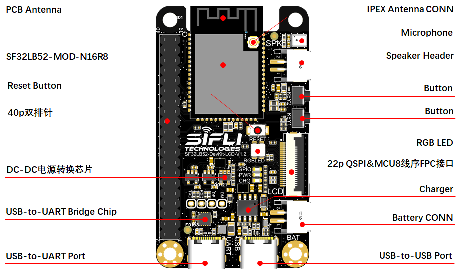

# SF32LB52-LCD_N16R8
Board `sf32lb52-lcd_n16r8` is based on [SF32LB52-DevKit-LCD board](https://wiki.sifli.com/board/sf32lb52x/SF32LB52-DevKit-LCD.html) and 
has module [SF32LB52-MOD-1-N16R8](https://wiki.sifli.com/silicon/%E6%A8%A1%E7%BB%84%E5%9E%8B%E5%8F%B7%E6%8C%87%E5%8D%97.html#sf32lb52-mod-1) on the board.

