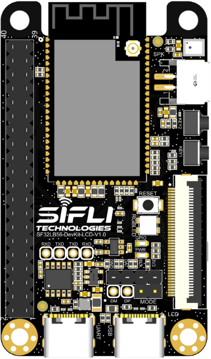

# SF32LB56-LCD_A128R12N1
`sf32lb56-lcd_a128r12n1` board is based on SF32LB56-DevKit-LCD board and 
has module [SF32LB56-MOD-A128R12N1](https://wiki.sifli.com/silicon/%E6%A8%A1%E7%BB%84%E5%9E%8B%E5%8F%B7%E6%8C%87%E5%8D%97.html#sf32lb56-mod) on the board.

