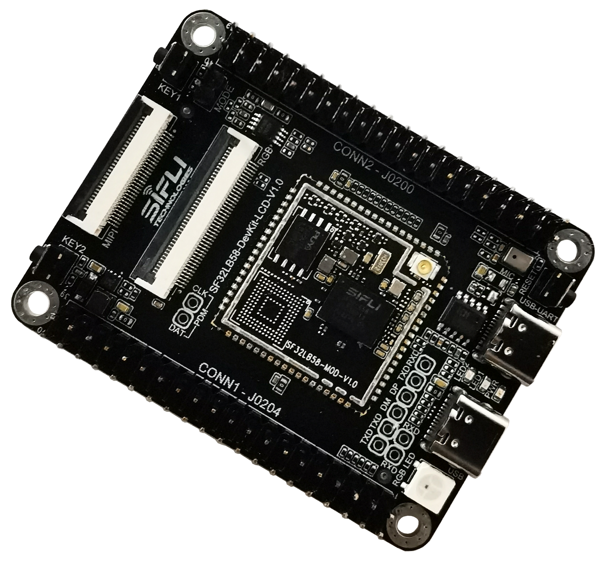

# SF32LB58-LCD_N16R32N1_DPI
`sf32lb58-lcd_n16r32n1_dpi` board is based on SF32LB58-DevKit-LCD board and 
has module [SF32LB58-MOD-N16R32N1](https://wiki.sifli.com/silicon/%E6%A8%A1%E7%BB%84%E5%9E%8B%E5%8F%B7%E6%8C%87%E5%8D%97.html#sf32lb58-mod) on the board. 
`7.0 rect RGB 1024x600 LCD(1024x600-HTM-H070A20-RGB-A01)` with DPI interface is used as default display.

