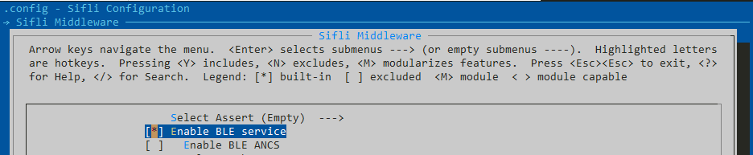

# 低功耗蓝牙服务

Silfi蓝牙分为两部分，一是Bluetooth LE(BLE)服务，为用户开发提供标准的Bluetooth LE API和增强服务； 另一个是经过全面测试的 BLE 5.2 协议栈，带有主机和控制器部分。
BLE 服务在 HCPU 或 LCPU 上运行。 它提供标准的通用访问配置文件 (GAP) API。 它还提供系列sibles BLE服务，帮助用户轻松开发GATT服务、客户端和GAP。 此外，蓝牙 LE 服务提供多项基于 GATT 的服务。 BLE 协议栈运行在蓝牙栈核心（LCPU）上，HCPU可以通过硬件邮箱等核心间通信机制与 BLE 服务进行通信。


```{toctree}
:maxdepth: 1
:titlesonly:

ble_gap.md
ble_service.md
ble_profile.md
```

## BLE服务配置

用户可以使用 menuconfig 工具启用蓝牙 LE 服务。 配置通常保存在 C 头文件中。 默认情况下，配置保存为 rtconfig.h。

以下示例显示了在一个项目头文件中定义的标志:
```c
#define BSP_BLE_SIBLES
```
配置完成后，用户需要在所有需要访问数据服务的源代码中包含头文件。 用户还可以使用 menuconfig 来启用 BLE 服务。


