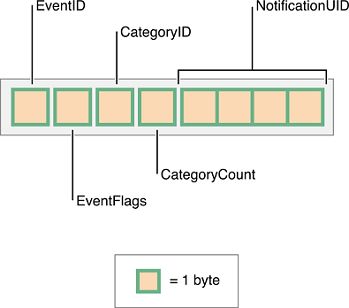
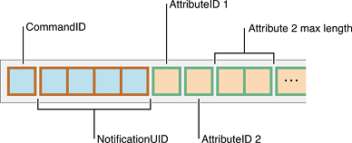
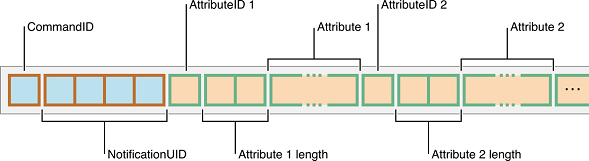
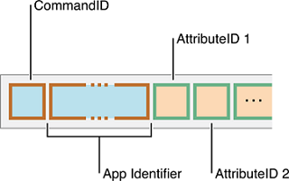
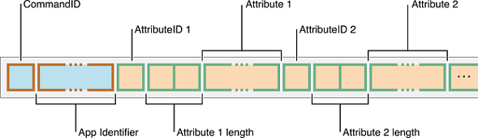

# ANCS客户端

## ANCS 介绍
Apple 通知中心服务（ANCS）是 IOS 设备中的 GATT 服务。 该服务可以通知配件在 IOS 设备中的通知，称为 Nofication Provider(NP)。
本地设备充当附件，称为通知消费者（NC）。

NP有3个特点：

- 1. 通知来源

    NC 启用 CCCD 后，通知源特性将发送带有 categoryID 和计数的通知。
    	
    事件 ID 通知 NC 是否添加、修改或删除通知。

    - EventFlags 通知通知的特殊性。 NC 可以决定是通知用户还是只是过滤。
    - CategoryID 通知通知的类别，如来电、新闻或消息。
    - CategoryCount 通知通知中心中存在的通知计数。
    - NotificationUID 是用于标识类别的 32 位 ID。


- 2. 控制点和数据源

  NC 可以向控制点写入命令以与 NP 交互以获取详细信息或执行操作。 有3个命令：

  - 获取通知属性。 此命令允许 NC 从 Notification 检索通知的模式详细信息。

  - - CommandID 应设置为 0
       - NotificationUID 来自通知源的通知。
       - AttributeIDs是NC想要获取更多详细信息的通知属性。

       
        

       - CommandID、Notification UID、Attribute_ID 都与 get Notification Attributes 命令相同。
       - 属性长度和属性是与属性ID 相关联的长度和数据。 数据包括详细信息。

       - 获取APP属性。 该命令允许 NC 检索已安装 APP 的详细信息。
          

       - CommandID 应设置为 1

       - APP Identifier 是从通知 APP_ID 属性中获取的字符串 ID。 表示在IOS中注册的APP ID。

       - APP AttributeIDs是NC想要获取更多详细信息的APP属性。
          

       - CommandID、APP Identifier 与 get APP Attributes 命令相同。

       - 属性长度和属性是与属性ID 相关联的长度和数据。 数据包括详细信息。

         

- 3. 执行通知操作 。 
     此命令允许 NC 对特定 IOS 通知执行预定操作。 有两个动作：

     - 1. 积极行动

     - 2. 消极行动

     ​    IOS 会根据动作执行行为，但UI 行为取决于IOS 和通知。 例如，如果通知是来电，则积极动作可能会接听它，而消极动作可能会拒绝它。 但行为可能会在其他通知中改变。


## 实施 ANCS NC

Sibles ANCS 提供 API 来搜索 IOS 设备中的 ANCS 并配置通知属性。 用户只需要执行以下操作：
	1. 配置预期的通知和 APP 属性和关联长度。
	2. 收到APP_ID属性信息后，使用相关API获取APP属性。
	3. 使用 perform action API 为指定的 attributeID 执行动作。

有关 ANCS API 的详细信息，请参阅 @ref ANCS .

这是示例代码：

```c

int app_ancs_event_handler(uint16_t event_id, uint8_t *data, uint16_t len, uint32_t context)
{

    switch (event_id)
    {
	// ANCS only allows paired device to access its service.
    case BLE_GAP_ENCRYPT_IND:
    {
        ble_gap_encrypt_ind_t *ind = (ble_gap_encrypt_ind_t *)data;
        rt_kprintf("encryt ind %d", ind->conn_idx);
		// configure attributes and its length.
		ble_ancs_attr_enable(BLE_ANCS_NOTIFICATION_ATTR_ID_APP_ID, 1, 0);
		ble_ancs_attr_enable(BLE_ANCS_NOTIFICATION_ATTR_ID_TITLE, 1, 50);
		ble_ancs_attr_enable(BLE_ANCS_NOTIFICATION_ATTR_ID_MESSAGE, 1, 100);
		// enable ANCS
        ble_ancs_enable(ind->conn_idx);
        break;
    }
    case BLE_ANCS_NOTIFICATION_IND:
    {
		// Go through all attributes data.
        ble_ancs_noti_attr_t *notify = (ble_ancs_noti_attr_t *)data;
        rt_kprintf("received_notify %d, attr_count %d\r\n", notify->evt_id, notify->attr_count);
        if (notify->evt_id == BLE_ANCS_EVENT_ID_NOTIFICATION_ADDED &&
                !(notify->evt_flag & BLE_ANCS_EVENT_FLAG_PRE_EXISTING)) // No need to shown pre-existing notifcations
        {
            ble_ancs_attr_value_t *value = notify->value;
            ble_ancs_dev_app_id_name_t *app_id_name;
            uint32_t i;
            for (i = 0; i < notify->attr_count; i++)
            {
                if (value->len == 0)
                {
                    value = (ble_ancs_attr_value_t *)((uint8_t *)value + sizeof(ble_ancs_attr_value_t));
                    continue;
                }
                if (value->attr_id == BLE_ANCS_NOTIFICATION_ATTR_ID_TITLE)
                {
					// Handle title content.
                }
                else if (value->attr_id  == BLE_ANCS_NOTIFICATION_ATTR_ID_APP_ID)
                {
					// Get APP attribute
                    ble_ancs_get_app_attr(app_id, value->len + 1);
 
                }
                else if (value->attr_id  == BLE_ANCS_NOTIFICATION_ATTR_ID_MESSAGE)
                {
					// Handle message content.
                }
                value = (ble_ancs_attr_value_t *)((uint8_t *)value + sizeof(ble_ancs_attr_value_t) + value->len);
            }
            break;
        }
        break;
    }
    case BLE_ANCS_GET_APP_ATTR_RSP:
    {
		// Handle APP display name
        break;
    }
    default:
        break;

    }

    return 0;
}

// Reigster event to listen ancs events.
BLE_EVENT_REGISTER(app_ancs_event_handler, NULL);

```