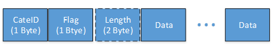

# 串口传输服务

串行传输服务允许用户通过 BLE 简单快速地传输串行数据。

服务 UUID 是 7369666c-695f-7364-0000-0000000000000。 它有两个特点：
	- 串口传输配置：UUID 7369666c-695f-7364-0001-0000000000000（须通知）。
	- 串口传输数据：UUID 7369666c-695f-7364-0002-0000000000000（可读可写可通知）

尚未使用配置特性。

数据特性用于传输串行数据。 其数据格式为：

	- CateID, is categoryID for differernt users.
	- Flag, is for fragmentation.
		- 0x00: Completed packet.
		- 0x01: First packet.
		- 0x02: Continue packet.
		- 0x03: Last packet.
	- Length Packet length, is only available when flag equal 0x00;
	- Data, is serial data.
	
## 实现传输串行数据

用户只需与客户端协商确认 categoryID 并确保该 ID 与设备中的其他用户不同。 然后就可以传输数据了。

有关串行传输 API 的详细信息，请参阅 @ref Serial_tran 。

这是示例代码：

```c

// Make sure the cagegoryID is different with other IDs in local.
#define APP_BLE_SERIAL_ID 0x1F

// Handle data from client.
void ble_app_serial_callback(uint8_t conn_idx, ble_serial_tran_data_t *data)
{
	int ret;
	ble_serial_tran_data_t send_data;
	uint8_t test_data[] = {0x01, 0x02, 0x03, 0x04};
	// The cateID should be same as registerdID APP_BLE_SERIAL_ID.
    LOG_I("cateID(%d), data(%d) %s\r\n", data->cateID, data->len, data->data);
	// Handle data from peer device start.
	
	// Handle data from peer device end.
	
	// Prepare send data to client
	send_data.cateID = APP_BLE_SERIAL_ID;
	send_data.len = sizeof(test_data);
	send_data.data = test_data;
	ret = ble_serial_tran_send_data(conn_idx, &send_data);
	LOG_I("result %d",ret);
}

// Register user defined cagegoryID and assoicated callback.
BLE_SERIAL_TRAN_EXPORT(APP_BLE_SERIAL_ID, ble_app_serial_callback);


```

*/