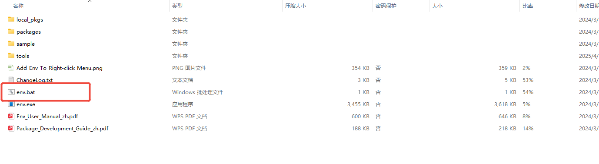
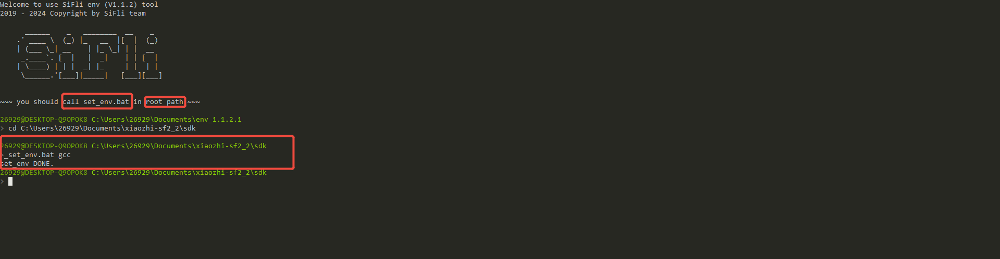

# 使用ENV工具安装环境

和全部使用脚本环境安装相比，也许你更喜欢或者更熟悉使用之前的 SiFli-ENV 工具来安装和管理 SiFli-SDK 的开发环境。虽然我们建议使用脚本安装，但 SiFli-ENV 仍然可以兼容使用。不过需要注意的是，SiFli-ENV 可能会在未来的版本中被废弃。

## 下载 SiFli-ENV 工具

目前 SiFli-ENV 工具的最新下载链接为：<https://downloads.sifli.com/sdk/env_1.1.2.zip>。

如果出现`Plase upgrate env to v1.1.2 or greater`的提示，说明你使用的ENV版本太久，请使用上述链接下载最新版本的 SiFli-ENV 工具。

下载完成后，解压缩到你希望存放 SiFli-ENV 的目录中。双击 `env.bat` 文件，可以打开命令行窗口。


根据提示，我们需要在sdk的根目录下输入设置环境命令



```{note}
SDK的下载方式请参考[获取 SiFli-SDK](./script/windows.md#sifli-sdk)。
```
