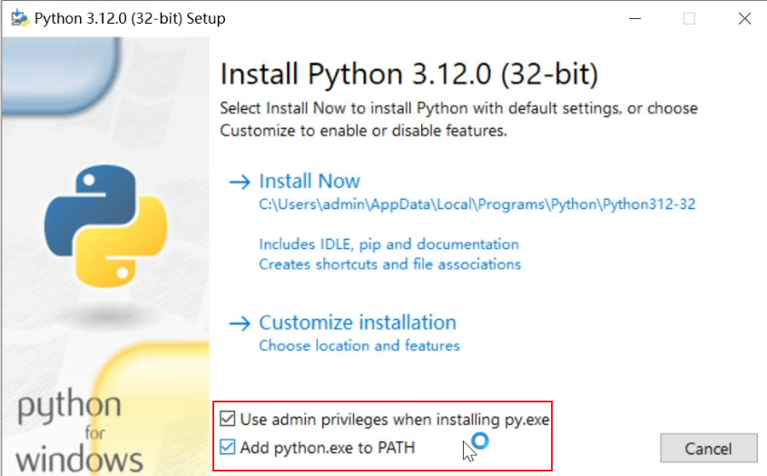
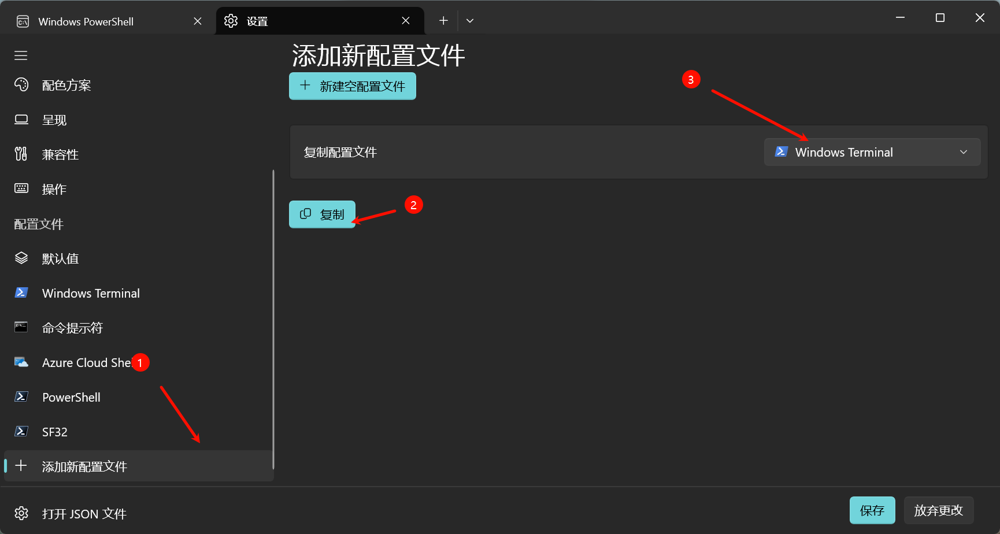
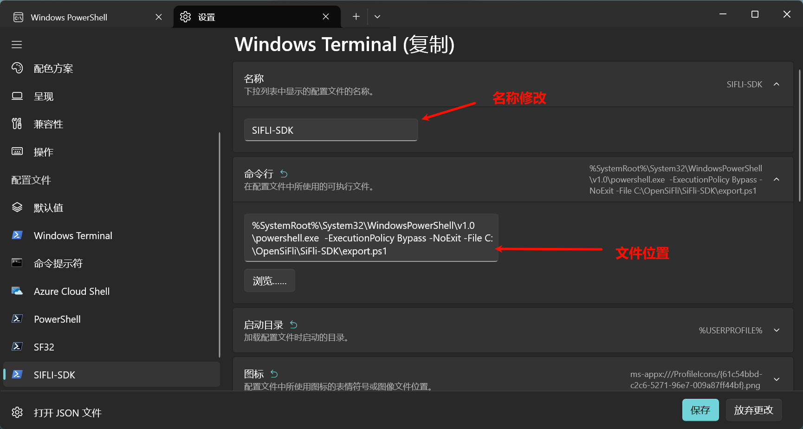
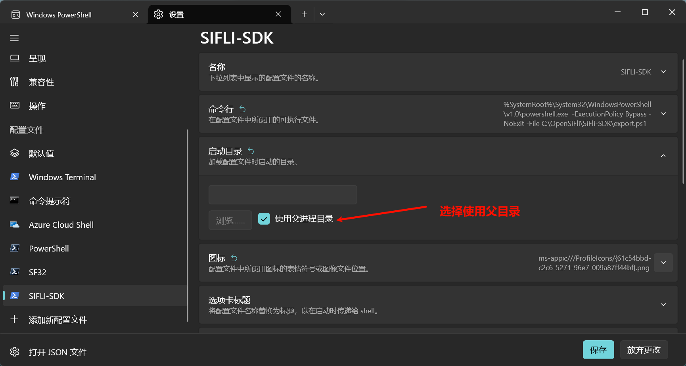
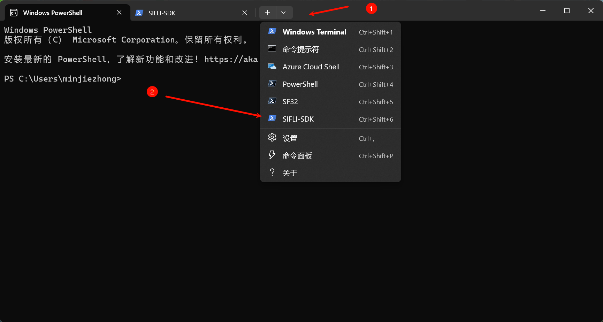

# Windows 安装流程

## 安装准备

### Python 环境

对 Windows 用户来说，需要保证环境变量中存在 `Python` 环境变量。

如果没有安装 Python，请参考 [Python 官网](https://www.python.org/downloads/) 下载并安装 Python 3.9 以上，3.14以下的版本。安装完成后，确保将 Python 添加到系统的环境变量中。



```{note}
对国内用户来说，可以使用如下国内镜像链接下载Python安装包：<https://mirrors.ustc.edu.cn/python/3.12.0/python-3.12.0.exe>
```

### Git 环境

如果没有安装 Git，请参考 [Git 官网](https://git-scm.com/download/win) 下载并安装 Git。安装完成后，确保将 Git 添加到系统的环境变量中。

```{note}
对于国内用户来说，可以使用如下国内镜像链接下载 Git 安装包：<https://mirrors.huaweicloud.com/git-for-windows/v2.47.0.windows.1/Git-2.47.0-64-bit.exe>。每次均保持默认安装选项即可。
```

### 终端设置

SiFli-SDK 脚本安装仅支持`powershell`，并推荐使用`PowerShell 7`版本。具体的安装流程可以参考微软文档 [PowerShell 安装](https://learn.microsoft.com/zh-cn/powershell/scripting/install/installing-powershell-on-windows?view=powershell-7.5)。

```{note}
对国内用户来说，可以从如下镜像链接直接下载 PowerShell 7 安装包：<https://mirror4.lzu.edu.cn/github-release/PowerShell/PowerShell/v7.4.10%20Release%20of%20PowerShell/PowerShell-7.4.10-win-x64.msi>
```

对于终端的选择，我们建议使用 [Windows Terminal](https://aka.ms/terminal) 或者 [Visual Studio Code](https://code.visualstudio.com/) 的集成终端。需要注意的是，在一些较新的 Windows 10/11 版本中，Windows Terminal 已经预装了。

想要打开`PowerShell`，可以使用如下方式：

- 按 Win键 或点击左下角Windows图标，输入 `powershell`，然后点击打开 PowerShell 终端。
- 按下 Win + R 组合键，打开运行窗口，输入 `powershell`，然后点击确定。

如果您使用的是 Windows Terminal，可以直接在终端中打开 PowerShell。想要打开终端，可以按 Win键 或点击左下角Windows图标，输入 `终端`，然后点击打开 Windows Terminal。

````{warning}
需要注意的是，如果您使用的是PowerShell 5，使用 Windows Terminal的时候运行 install 脚本有可能出现错误，提示不支持`PowerShell.exe`。这时候请升级为 PowerShell 7 或者使用 PowerShell 自带终端（打开之后一片蓝底那个）

查看 PowerShell 版本可以使用以下命令：

```powershell
$PSVersionTable.PSVersion
```

````

如果在接下来运行脚本的步骤中出现
`无法加载文件 C:\OpenSiFli\SiFli-SDK\export.ps1，因为在此系统上禁止运行脚本。` 的错误提示，或者你从未听说且从未运行过`.ps1`脚本，请使用 **管理员模式** 打开 PowerShell 终端，并运行以下命令：

```powershell
Set-ExecutionPolicy RemoteSigned
```

然后输入`Y`命令后，回车即可获得运行脚本的权限。

## 获取 SiFli-SDK

在围绕 SF32 构建应用程序之前，请先获取 SiFli 提供的软件库文件 [SiFli-SDK 仓库](https://github.com/OpenSiFli/SiFli-SDK)。

获取 SiFli-SDK 的本地副本：打开终端，切换到要保存 SiFli-SDK 的工作目录，使用 `git clone` 命令克隆远程仓库。一般来说，我们建议使用release分支上的代码以获取最新的稳定版本。

```{warning}

由于SiFli-SDK中包含子模块，不能通过下载zip包获取完整的代码。

```

打开 PowerShell 终端，运行以下命令：

```powershell
mkdir -p C:\OpenSiFli
cd C:\OpenSiFli
git clone --recursive -b release/v2.4 https://github.com/OpenSiFli/SiFli-SDK
```

````{note}
上面的SDK路径仅做示例，用户可以根据自己的需要选择路径。

如果在国内访问 GitHub 较慢，可以使用 `gitee` 镜像来克隆 SiFli-SDK。请使用以下命令：
```powershell
git clone --recursive -b release/v2.4 https://gitee.com/SiFli/sifli-sdk
```

需要注意，gitee的SiFli-SDK仓库的路径是全小写的，在后续出现`SiFli-SDK`时需要注意大小写。
````

````{note}
如果想要切换到其他分支（例如开发分支），可以使用 `checkout` 命令，例如：


```powershell
git checkout main
```
或者
```powershell
git checkout release/v2.3
```

````

````{note}
需要注意的是，SiFli-SDK中存在一些子模块，因此需要使用 `--recursive` 参数来克隆所有子模块。如果你在克隆时忘记了这个参数，可以在克隆后运行以下命令来初始化子模块：

```bash
git submodule update --init --recursive
```
````

## 安装工具

除了 SiFli-SDK 本身，还需要为支持 SF32 的项目安装 SiFli-SDK 使用的各种工具，比如编译器、调试器、Python 包等。

```powershell
cd C:\OpenSiFli\SiFli-SDK
.\install.ps1
```

国内用户可以使用如下命令通过国内镜像源安装工具包：

```powershell
cd C:\OpenSiFli\SiFli-SDK
$env:SIFLI_SDK_GITHUB_ASSETS="downloads.sifli.com/github_assets"
$env:PIP_INDEX_URL="https://mirrors.ustc.edu.cn/pypi/simple"
.\install.ps1
```

## 设置环境变量

通过以上步骤，SDK和相关工具就安装好了，但是他们的路径并不在环境变量里，没办法在任意目录使用。因此，必须设置一些环境变量。这可以通过 SiFli-SDK 提供的另一个脚本进行设置。

请在需要使用编译或下载命令的终端窗口运行以下命令：

```powershell
cd C:\OpenSiFli\SiFli-SDK
.\export.ps1
```

```{note}
每次使用 SiFli-SDK 前，都需要在SDK根目录下运行一次 `export.ps1` 脚本来设置环境变量。注意，必须要在SDK根目录下运行该脚本，否则会导致运行失败或者编译错误。
```

```{note}
目前的脚本可能有一些偶现的bug，如果在编译的时候提示找不到`arm-none-eabi-gcc`等命令，可以尝试运行两次`. export.ps1`解决。
```

### Windows Terminal 快捷配置

如果需要经常运行 SiFli-SDK，并且希望在每次打开终端时自动设置环境变量，可以新建一个 Windows Terminal 配置文件，具体步骤如下：

在 Windows Terminal 中按下 `Ctrl+,` 打开设置，点击添加新的配置文件，选择复制配置文件 `Windows PowerShell`，然后按照以下步骤进行操作：

1. 将名称改为SiFli-SDK
2. 把命令行的配置改为如下,最后的export.ps1文件位置改成你的SDK路径
```powershell
%SystemRoot%\System32\WindowsPowerShell\v1.0\powershell.exe  -ExecutionPolicy Bypass -NoExit -File  D:\SIFIL\SiFli-SDK\export.ps1
```


3. 启动目录改为使用父进程目录



4. 其他配置可以不改动
5. 点击保存

后续只需要在任意代码目录下打开Windows Terminal，点击右上角的下拉菜单，选择SiFli-SDK，就可以自动设置环境变量了。在新打开的窗口中就可以使用SDK的编译和下载命令了。


### 环境搭建是否成功
可以进行编译下载看看是否成功，编译下载可以参见[](../../build.md)