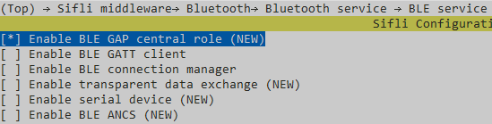

# BLE 周期广播同步示例

源码路径：example/ble/periodic_adv_sync

(Platform_peri_adv_sync)=
## 支持的平台
<!-- 支持哪些板子和芯片平台 -->
+ eh-lb52x
+ eh-lb56x
+ eh-lb58x

## 概述
<!-- 例程简介 -->
本例程演示周期性广播同步的使用方式。


## 例程的使用
<!-- 说明如何使用例程，比如连接哪些硬件管脚观察波形，编译和烧写可以引用相关文档。
对于rt_device的例程，还需要把本例程用到的配置开关列出来，比如PWM例程用到了PWM1，需要在onchip菜单里使能PWM1 -->
1. 开机后通过finsh命令"diss sync create"创建周期广播同步，如果创建成功可以在log看到"PER_ADV_SYNC created [idx]"的打印，其中idx为分配的handle。
2. 通过finsh命令"diss scan start [is_dup] [scan_interval] [scan_window] [duration]"开启scan来搜索周期广播。
    1) 命令示例如下："diss scan start 1 60 30 30000"。 该命令会持续Scan 30秒。
    2) 如果搜索到周期广播会打印"Periodic adv found addr_type [type], addr:0xXX:XX:XX:XX:XX:XX, adv_sid:[adv_sid]"。
3. 建立周期广播同步要用finsh命令"diss sync start [addr] [addr_type] [adv_sid] [sync_to]", addr，addr_type和adv_sid是上面搜索到周期广播后打印的地址和地址类型和广播SID；
   sync_to代表停止sync的时间，以10ms为单位
    1) 如下为一个示例："diss sync start be:56:44:33:22:c2 0 0 80"
    2) 由于建立周期广播同步必须要开启scan，前面的命令设置的30秒scan可能在建立周期广播已经停止，若scan已经停止可以在log中看到打印"Scan stopped"。scan停止情况下需要再重新开启scan。
    3) 周期广播同步建立后会打印"PER_ADV_SYNC established(addr)"以及"per_adv_data:"


### 硬件需求
运行该例程前，需要准备：
+ 一块本例程支持的开发板([支持的平台](#Platform_peri_adv_sync))。
+ 手机设备。

### menuconfig配置
1. 使能蓝牙(`BLUETOOTH`)：\

2. 使能GAP Central: \

3. 使能NVDS：\


### 编译和烧录
切换到例程project目录，运行scons命令执行编译：
```c
> scons --board=eh-lb525 -j32
```
切换到例程`project/build_xx`目录，运行`uart_download.bat`，按提示选择端口即可进行下载：
```c
$ ./uart_download.bat

     Uart Download

please input the serial port num:5
```
关于编译、下载的详细步骤，请参考[快速入门](/quickstart/get-started-gcc.md)的相关介绍。

## 例程的预期结果
<!-- 说明例程运行结果，比如哪几个灯会亮，会打印哪些log，以便用户判断例程是否正常运行，运行结果可以结合代码分步骤说明 -->
例程启动后：
1. 能够搜索到周期广播并建立周期广播同步。


## 异常诊断


## 参考文档
<!-- 对于rt_device的示例，rt-thread官网文档提供的较详细说明，可以在这里添加网页链接，例如，参考RT-Thread的[RTC文档](https://www.rt-thread.org/document/site/#/rt-thread-version/rt-thread-standard/programming-manual/device/rtc/rtc) -->

## 更新记录
|版本 |日期   |发布说明 |
|:---|:---|:---|
|0.0.1 |01/2025 |初始版本 |
| | | |
| | | |
