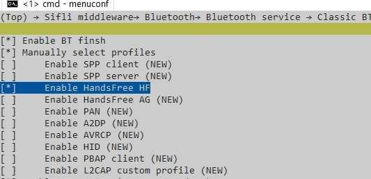

# BT handfree hf role 示例

源码路径：example/bt/hfp

{#Platform_bt_hfp}
## 支持的平台
<!-- 支持哪些板子和芯片平台 -->
+ eh-lb52x
+ eh-lb56x
+ eh-lb58x

## 概述
<!-- 例程简介 -->
HFP_HF通话获取状态信息的demo：
+ handfree profile相关at cmd 使用


## 例程的使用
<!-- 说明如何使用例程，比如连接哪些硬件管脚观察波形，编译和烧写可以引用相关文档。
对于rt_device的例程，还需要把本例程用到的配置开关列出来，比如PWM例程用到了PWM1，需要在onchip菜单里使能PWM1 -->
例程开机会默认使能蓝牙，并通过FINSH命令进行控制
1. 搜索蓝牙设备
通过命令hfp_cmd start_inquiry来搜索手机类蓝牙设备。
搜索到的设备会以log “device [%s] searched”和“device COD is [%d], addr is xx:xx:xx:xx:xx:xx”的形式打印。

2. 搜索蓝牙设备
通过命令hfp_cmd stop_inquiry来停止搜索手机类蓝牙设备

3. 连接蓝牙设备
通过命令hfp_cmd hfp_connect [addr]来进行连接，addr将上面搜到设备的地址（xx:xx:xx:xx:xx:xx）打印值复制即可。
如果已知晓手机类蓝牙设备地址，可以不用进行搜索蓝牙设备，直接连接即可。
连接结果打印："HFP HF connected"

4. 断开连接蓝牙设备
通过命令hfp_cmd hfp_disconnect [addr]来进行断开连接，addr将上面搜到设备的地址（xx:xx:xx:xx:xx:xx）打印值复制即可。
断开连接结果打印："HFP HF disconnected"

5. 查询本机号码
通过命令hfp_cmd local_phone_number来进行查询本机号码，收到本地号码会有"the remote phone local number + 电话号码"打印，
号码获取结束打印："get remote local phone number complete"

6. 拨打电话
通过命令hfp_cmd make_call [phone_number]来进行拨打电话，拨打电话结果打印："make a call complete " + 结果

7. 电话状态通知
电话拨打成功之后，会收到电话状态的变化，对应打印:"the remote phone call status type " + type (callsetup) + 状态（2/3）拨出中

8. 挂断电话
通过命令hfp_cmd handup_call 来进行挂断电话，挂断电话结果打印："hangup a call complete " + 结果, 接下来会有电话状态通知

9. 接听电话
通过命令hfp_cmd answer_call 来进行接听电话，接听电话结果打印："answer a call complete  " + 结果, 接下来会有电话状态通知

10. 连接通话音频
通过命令hfp_cmd audio_connect 来连接通话音频，通话音频建立成功打印:"HFP HF audio_connected"

11. 断开通话音频
通过命令hfp_cmd audio_disconnect 来断开通话音频，通话音频断开成功打印:"HFP HF audio_disconnected"

12. 调节对端蓝牙设备音量
通过命令hfp_cmd volume_control [val]来实现，val在0-15之间有效。通话音量调节结束打印:"change volume value complete"


### 硬件需求
运行该例程前，需要准备：
+ 一块本例程支持的开发板（[支持的平台](#Platform_bt_hfp)）。

### menuconfig配置
1. 使能蓝牙：

2. 使能handfree hf role：


### 编译和烧录
切换到例程project目录，运行scons命令执行编译：
```c
> scons --board=eh-lb525 -j32
```
切换到例程`project/build_xx`目录，运行`uart_download.bat`，按提示选择端口即可进行下载：
```c
$ ./uart_download.bat

     Uart Download

please input the serial port num:5
```
关于编译、下载的详细步骤，请参考[快速入门](/quickstart/get-started-gcc.md)的相关介绍。

## 例程的预期结果
<!-- 说明例程运行结果，比如哪几个灯会亮，会打印哪些log，以便用户判断例程是否正常运行，运行结果可以结合代码分步骤说明 -->
例程启动后：
手机端主动连接设备/设备通过命令连接手机，手机端拨打电话或者设备端拨打电话，能够获取到手机端电话的状态信息

## 异常诊断


## 参考文档
<!-- 对于rt_device的示例，rt-thread官网文档提供的较详细说明，可以在这里添加网页链接，例如，参考RT-Thread的[RTC文档](https://www.rt-thread.org/document/site/#/rt-thread-version/rt-thread-standard/programming-manual/device/rtc/rtc) -->

## 更新记录
|版本 |日期   |发布说明 |
|:---|:---|:---|
|0.0.1 |01/2025 |初始版本 |
| | | |
| | | |
