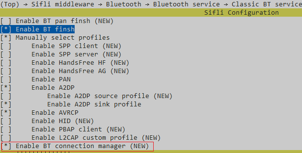

# BT music sink示例

源码路径：example/bt/music_sink

{#Platform_music_sink}
## 支持的平台
<!-- 支持哪些板子和芯片平台 -->
+ eh-lb52x
+ eh-lb56x
+ eh-lb58x

## 概述
<!-- 例程简介 -->
本例程演示在通过蓝牙连接手机等A2DP Source设备后，在本机播放source设备的音乐。


## 例程的使用
<!-- 说明如何使用例程，比如连接哪些硬件管脚观察波形，编译和烧写可以引用相关文档。
对于rt_device的例程，还需要把本例程用到的配置开关列出来，比如PWM例程用到了PWM1，需要在onchip菜单里使能PWM1 -->
例程开机会打开蓝牙的Inquiry scan和psage scan，用手机等A2DP source设备可以搜索到本机并发起连接，连上以后即可播放手机音乐。
本机的蓝牙名称默认是sifli_music_sink。


### 硬件需求
运行该例程前，需要准备：
+ 一块本例程支持的开发板（[支持的平台](#Platform_music_sink)）。
+ 喇叭。

### menuconfig配置

1. 使能AUDIO CODEC 和 AUDIO PROC：

2. 使能AUDIO(`AUDIO`)：

3. 使能AUDIO MANAGER.(`AUDIO_USING_MANAGER`)

4. 使能蓝牙(`BLUETOOTH`)：

5. 使能A2DP SNK和AVRCP：

6. 使能BT connection manager：

7. 使能NVDS


### 编译和烧录
切换到例程project目录，运行scons命令执行编译：
```c
> scons --board=eh-lb525 -j32
```
切换到例程`project/build_xx`目录，运行`uart_download.bat`，按提示选择端口即可进行下载：
```c
$ ./uart_download.bat

     Uart Download

please input the serial port num:5
```
关于编译、下载的详细步骤，请参考[快速入门](/quickstart/get-started.md)的相关介绍。

## 例程的预期结果
<!-- 说明例程运行结果，比如哪几个灯会亮，会打印哪些log，以便用户判断例程是否正常运行，运行结果可以结合代码分步骤说明 -->
例程启动后：
手机类A2DP source设备可以连接上本机并播放音乐

## 异常诊断


## 参考文档
<!-- 对于rt_device的示例，rt-thread官网文档提供的较详细说明，可以在这里添加网页链接，例如，参考RT-Thread的[RTC文档](https://www.rt-thread.org/document/site/#/rt-thread-version/rt-thread-standard/programming-manual/device/rtc/rtc) -->

## 更新记录
|版本 |日期   |发布说明 |
|:---|:---|:---|
|0.0.1 |01/2025 |初始版本 |
| | | |
| | | |
