# BT spp profile示例

源码路径：example/bt/spp

{#Platform_spp}
## 支持的平台
<!-- 支持哪些板子和芯片平台 -->
+ eh-lb52x
+ eh-lb56x
+ eh-lb58x

## 概述
<!-- 例程简介 -->
本例程演示spp的连接和断开，数据传输，文件发送和速度测试，包含：
+ spp server
+ spp client
+ spp server and spp client

### 硬件需求
运行该例程前，需要准备：
+ 一块本例程支持的开发板（[支持的平台](#Platform_spp)）。
+ 一个安卓手机（spp只支持安卓手机使用，ios手机无法使用spp），需要下载一个spp蓝牙串口工具APP（例如：spp蓝牙串口、e调试等）。


## 例程的使用
<!-- 说明如何使用例程，比如连接哪些硬件管脚观察波形，编译和烧写可以引用相关文档。
对于rt_device的例程，还需要把本例程用到的配置开关列出来，比如PWM例程用到了PWM1，需要在onchip菜单里使能PWM1 -->
例程开机会默认使能蓝牙，手机可以进入spp蓝牙串口工具APP进行搜索连接（以e调试app为例）：
1. 手机app连接开发板spp：
手机进入经典蓝牙设备搜索界面搜索开发板：
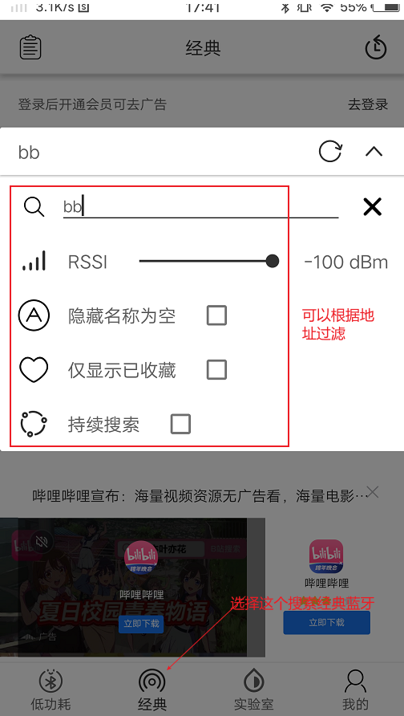
搜索到指定设备后，可以长按要连接的设备修改要连接的spp的uuid（默认是0x1101的UUID），<font color=red>本例程支持自定义spp的UUID来增加spp可连接数量，且和同一手机支持最多建立7条spp，用户可以通过实现bt_spp_srv_add_uuid_list接口来添加自定义UUID。同时，如果手机想要连接多条spp，可能需要分别在每一个app里进行一条spp连接。</font>

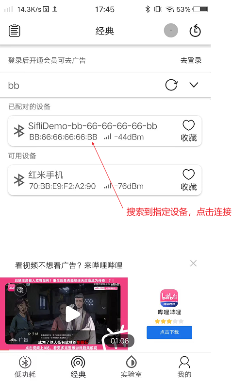
可以在串口打印中看到连接成功的log：
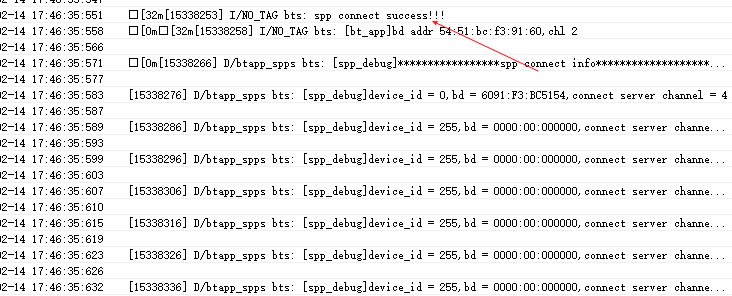

2. 手机往开发板发送数据
可以在手机app端往开发板发送数据，如下图所示：
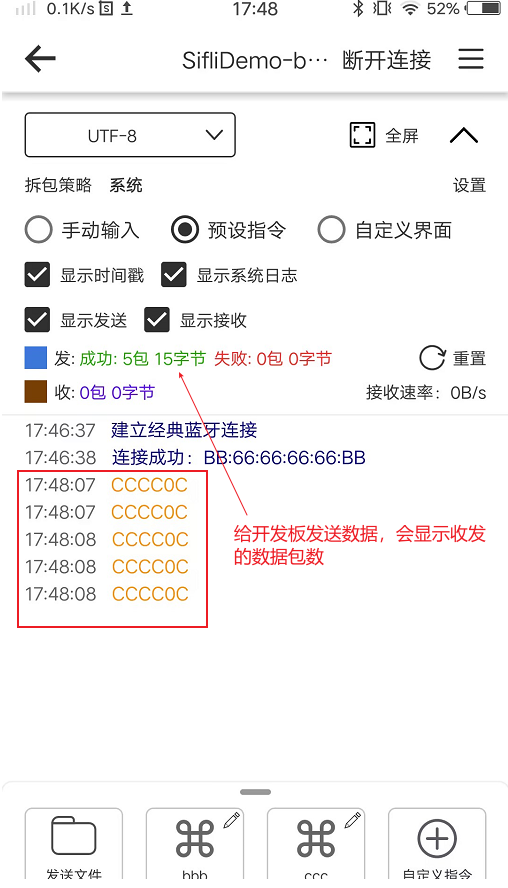
在开发板的串口log中会打印出收到的数据大小和速度：
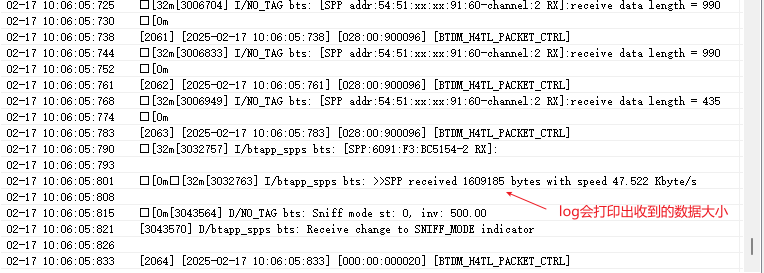

3. 开发板往手机端发送数据
通过命令spp send_data + 地址 + service channel可以往手机发送一条测试数据，其中service channel可以通过在串口打印中获取：
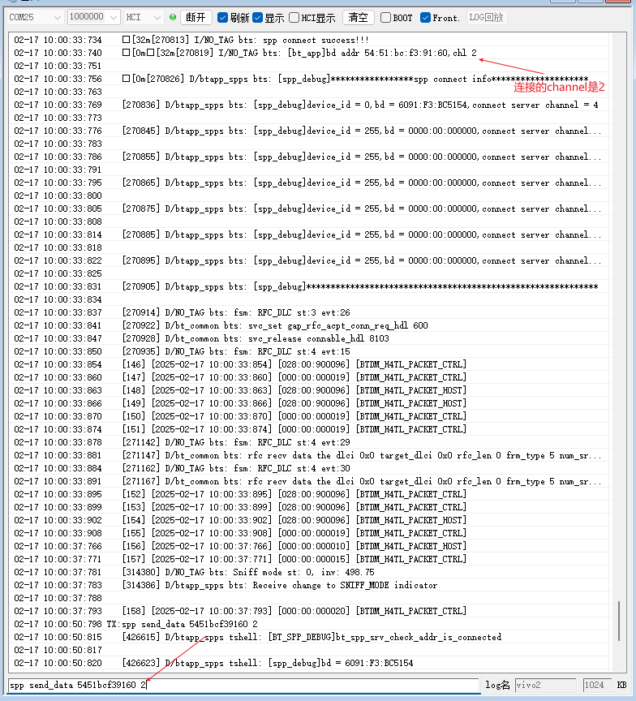
在手机app中会显示收到的数据：
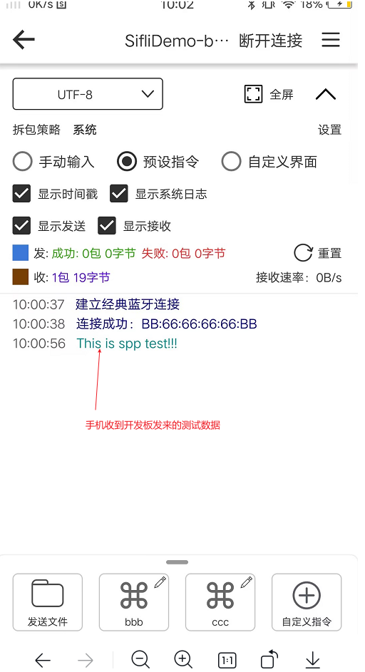

4. 手机往开发板发送文件
在手机app里可以选择往开发板发送一个文件：
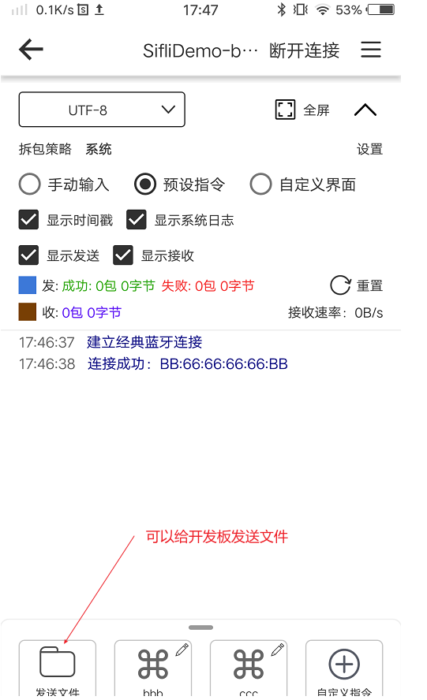
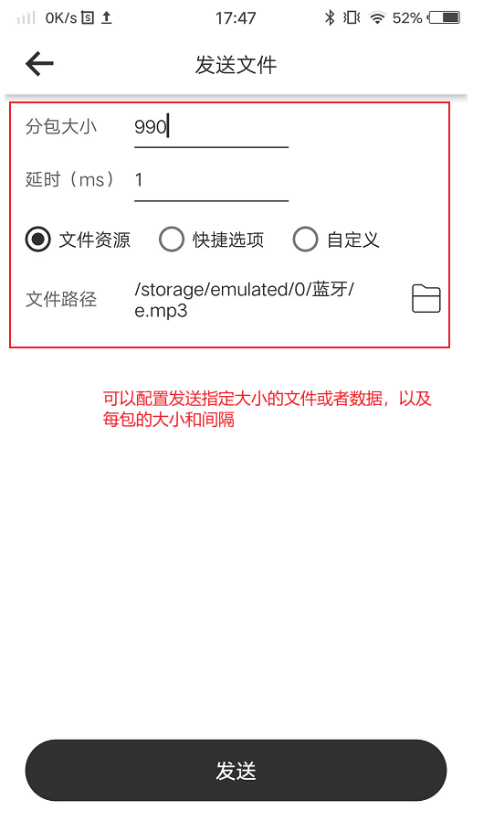
在开发板的串口log中会打印出收到的数据大小和速度，手机端也会显示发送进度：

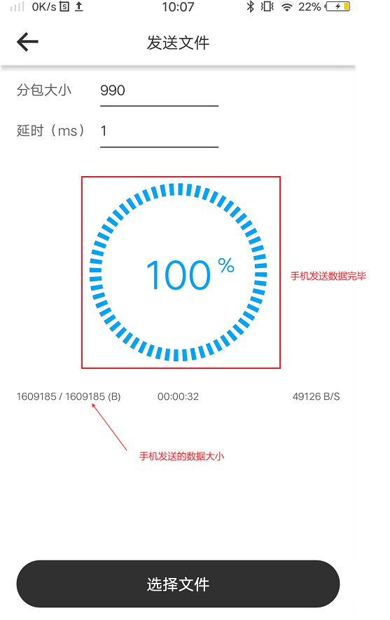

5. 开发板往手机发送文件
如果开发板里有文件则可以通过命令spp send_file + 地址 + service channel + 文件名往手机发送指定文件，其中service channel可以通过在串口打印中获取：


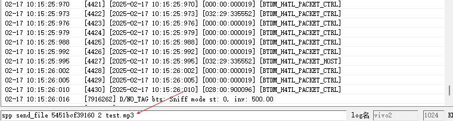
在手机端会显示收到的内容和数据大小：
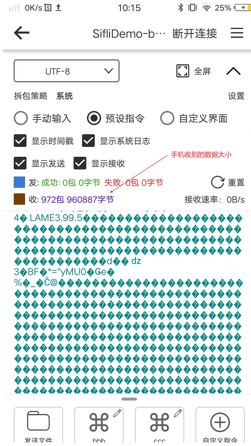

6. 开发板发起spp连接
开发板也可以发起spp的连接，但是由于很多手机只支持0x1101的spp，并且开发板主动连接上之后很快会被手机断开，所以可以选择开发板连接开发板的操作。
由于本例程支持自定义spp的UUID来增加spp可连接数量，可以分别在两个开发板上烧录此例程，这样就可以在开发板之间建立多条spp连接，其中一个充当手机的角色。
例如开发板A需要连接开发板B的0x3001的spp通道，则可以通过命令spp search + 地址 + uuid长度 + uuid先查询对端设备是否支持0x3001的spp：
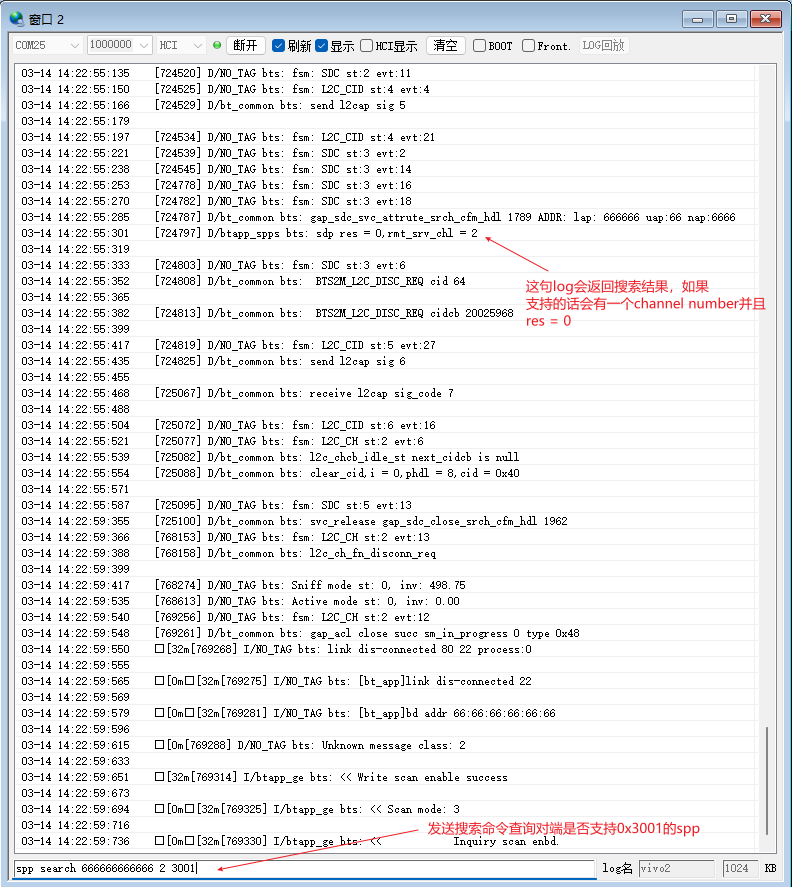
开发板A可以通过命令spp connect + 地址 + uuid长度 + uuid去连接对端设备的0x3001的spp：
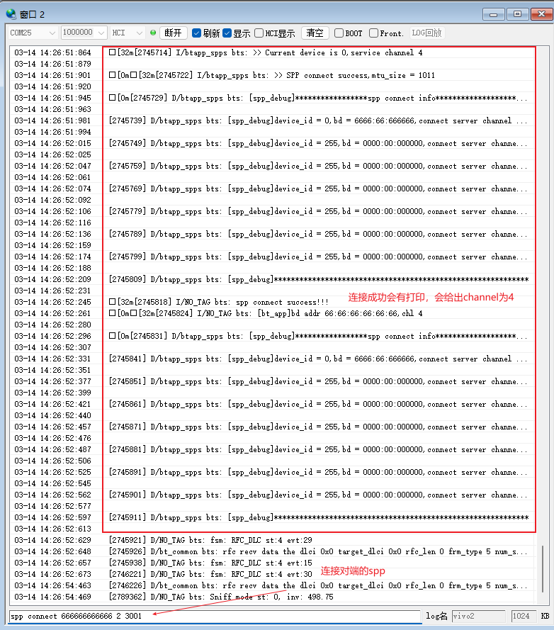

7. 开发板和开发板间的through-put测试
上面提到的功能在开发板和开发板之间的连接也是存在的，这里主要讲解一下开发板之间的through-put测试。开发板A可以通过命令spp through_put + 地址 + service channel + 传输的数据大小，往开发板B传输指定大小的随机数据，开发板B在接收完所有的数据后会统计出速率大小：
其中service channel可以通过在串口打印中获取：

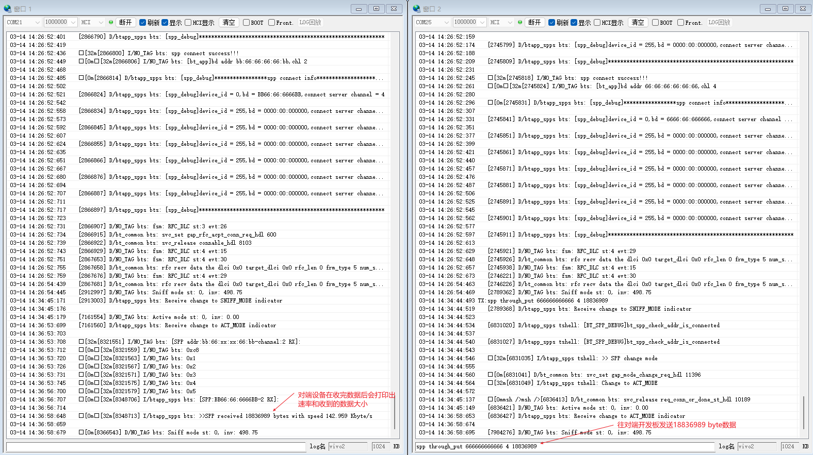

8. 断开指定的spp连接
开发板可以通过命令spp disc + 地址 + service channel来断开指定的spp连接：
其中service channel可以通过在串口打印中获取：

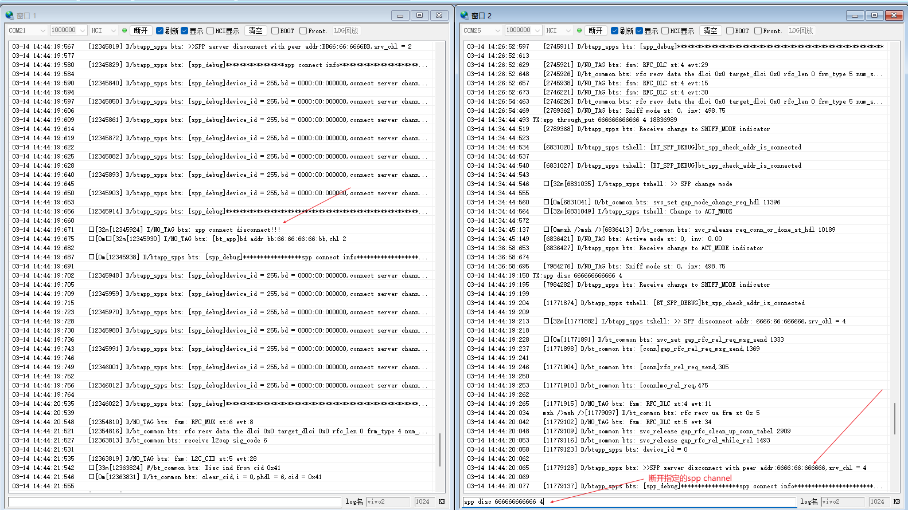

9. 断开所有连接的spp
开发板可以通过命令spp disc_all来断开所有的spp连接。

### menuconfig配置

1. 本例程需要读写文件，所以需要用到文件系统，配置`FAT`文件系统：


     ```{tip}
     mnt_init 中mount root分区。
     ```
2. 使能蓝牙(`BLUETOOTH`)：

3. 使能spp server和spp client：
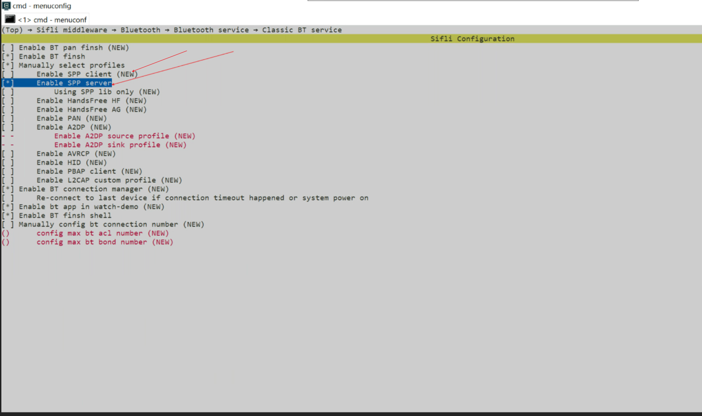
4. 使能BT connection manager：

5. 使能NVDS


### 编译和烧录
切换到例程project目录，运行scons命令执行编译：
```c
> scons --board=eh-lb525 -j32
```
切换到例程`project/build_xx`目录，运行`uart_download.bat`，按提示选择端口即可进行下载：
```c
$ ./uart_download.bat

     Uart Download

please input the serial port num:5
```
关于编译、下载的详细步骤，请参考[快速入门](/quickstart/get-started-gcc.md)的相关介绍。

## 例程的预期结果
<!-- 说明例程运行结果，比如哪几个灯会亮，会打印哪些log，以便用户判断例程是否正常运行，运行结果可以结合代码分步骤说明 -->
例程启动后：
1. spp的功能正常

## 异常诊断


## 参考文档
<!-- 对于rt_device的示例，rt-thread官网文档提供的较详细说明，可以在这里添加网页链接，例如，参考RT-Thread的[RTC文档](https://www.rt-thread.org/document/site/#/rt-thread-version/rt-thread-standard/programming-manual/device/rtc/rtc) -->

## 更新记录
|版本 |日期   |发布说明 |
|:---|:---|:---|
|0.0.1 |03/2025 |初始版本 |
| | | |
| | | |
