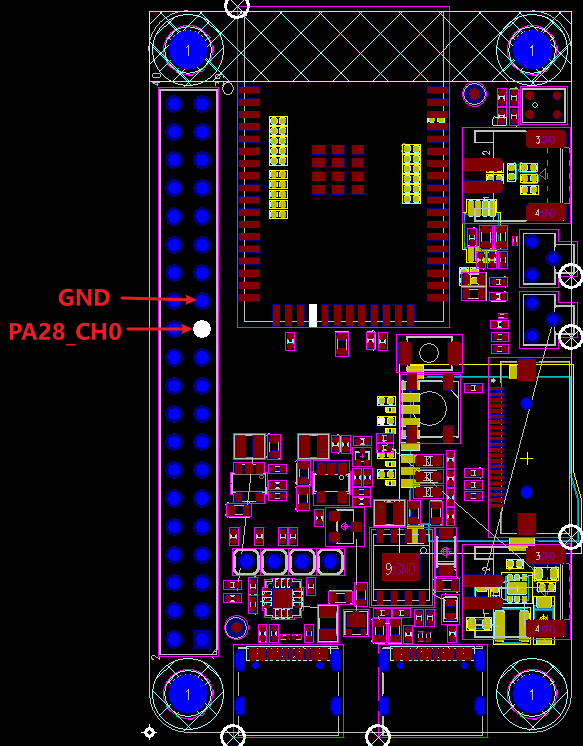
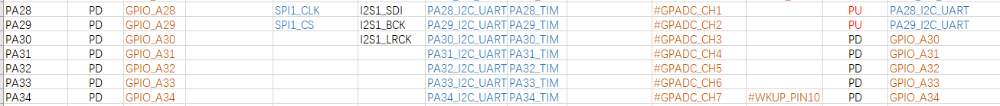

# ADC示例
源码路径：[example/hal/adc/multichannel](https://github.com/OpenSiFli/SiFli-SDK/tree/main/example/hal/adc/multichannel)
## 支持的平台
例程可以运行在以下开发板
* em-lb520
## 概述
* 操作Hal函数单路ADC或DMA六通道采样演示

## 例程的使用
### 编译和烧录
演示代码默认为单路ADC采样演示，如果要运行DMA六通道演示，请打开工程路径下`main.c`中的宏：  
```c
#define BSP_GPADC_USING_DMA 1
```
切换到例程project目录，运行scons命令执行编译：

> scons --board=em-lb525 -j8

切换到例程`project/build_xx`目录，运行`uart_download.bat`，按提示选择端口即可进行下载：

> build_em-lb525_hcpu\uart_download.bat

>Uart Download

>please input the serial port num:5

### 硬件连接
* PA28为ADC1 Channel 0的固定输出IO（DMA六通道演示为PA28-PA33，此处未做标注）  

#### 例程输出结果展示:
* 单路ADC方式log输出（PA28输入2.5V）:
```
    SFBL
    Serial:c2,Chip:4,Package:3,Rev:3  Reason:00000080
     \ | /
    - SiFli Corporation
     / | \     build on Nov  6 2024, 2.2.0 build 00000000
     2020 - 2022 Copyright by SiFli team
    mount /dev sucess
    [I/drv.rtc] PSCLR=0x80000100 DivAI=128 DivAF=0 B=256
    [I/drv.rtc] RTC use LXT RTC_CR=00000001
    [I/drv.rtc] Init RTC, wake = 0
    [I/drv.audprc] init 00 ADC_PATH_CFG0 0x606
    [I/drv.audprc] HAL_AUDPRC_Init res 0
    [I/drv.audcodec] HAL_AUDCODEC_Init res 0
    [32m][I/TOUCH] Regist touch screen driver, probe=1203c2d5 [0m]
    call par CFG1(35bb)
    fc 9, xtal 2000, pll 2050
    call par CFG1(35bb)
    fc 9, xtal 2000, pll 2050
    Start adc demo!
    ADC Get calibration res 0
    ADC reg value 3192 voltage 2519.12 mv
    adc demo end!
```
log中打印value值原始寄存器值，Voltage是转换后的mV电压
* DMA六通道方式log输出（PA28输入2.5V，PA29接GND，其他IO基于板内电压）:
```
   SFBL
   Serial:c2,Chip:4,Package:3,Rev:3  Reason:00000080
    \ | /
   - SiFli Corporation
    / | \     build on Nov  6 2024, 2.2.0 build 00000000
    2020 - 2022 Copyright by SiFli team
   mount /dev sucess
   [I/drv.rtc] PSCLR=0x80000100 DivAI=128 DivAF=0 B=256
   [I/drv.rtc] RTC use LXT RTC_CR=00000001
   [I/drv.rtc] Init RTC, wake = 0
   [I/drv.audprc] init 00 ADC_PATH_CFG0 0x606
   [I/drv.audprc] HAL_AUDPRC_Init res 0
   [I/drv.audcodec] HAL_AUDCODEC_Init res 0
   [32m][I/TOUCH] Regist touch screen driver, probe=1203c685 [0m]
   call par CFG1(35bb)
   fc 9, xtal 2000, pll 2050
   call par CFG1(35bb)
   fc 9, xtal 2000, pll 2050
   Start adc demo!
   ADC Get calibration res 0
   ADC reg value[0] 3199 voltage 2526.56 mv
   ADC reg value[1] 831 voltage 10.98 mv
   ADC reg value[2] 3950 voltage 3324.36 mv
   ADC reg value[3] 1757 voltage 994.69 mv
   ADC reg value[4] 1082 voltage 277.62 mv
   ADC reg value[5] 3951 voltage 3325.43 mv
   Loop 0 done ===
   adc demo end!
```
log中打印value[0]值为对应通道0原始寄存器值，Voltage是转换后的mV电压

#### ADC配置流程

* 设置对应ADC的IO口（单路ADC方式）
```c
    /* 52芯片默认通道0为PA28,设置PA28为模拟输入模式，关闭内部上下拉 */
    HAL_PIN_Set_Analog(PAD_PA28, 1);
```
* 设置对应ADC的IO口（DMA六通道方式）
```c
    /* 52芯片演示采用通道0-5,都配置为模拟输入模式，关闭内部上下拉 */
    HAL_PIN_Set_Analog(PAD_PA28, 1);  /* channel 0 */
    HAL_PIN_Set_Analog(PAD_PA29, 1);
    HAL_PIN_Set_Analog(PAD_PA30, 1);
    HAL_PIN_Set_Analog(PAD_PA31, 1);
    HAL_PIN_Set_Analog(PAD_PA32, 1);
    HAL_PIN_Set_Analog(PAD_PA33, 1);  /* channel 5 */
```
**注意**: 
1. ADC的输入口为固定的IO口，如下图:<br>52芯片ADC CH1-7分布，对应软件配置的Channel0-6,最后一路CH8(Channel 7)，内部已经连接到电池Vbat检测，未映射到外部IO<br>

2. `HAL_PIN_Set` `HAL_PIN_Set_Analog` 最后一个参数为hcpu/lcpu选择, 1：选择hcpu，0：选择lcpu<br>
* 打开对应的ADC的时钟源（默认代码开启，此处不是必须）
```
    /* 2, open adc clock source  */
    HAL_RCC_EnableModule(RCC_MOD_GPADC);
```
* ADC的初始化设置
1. ADC通道的修改<br>
```c
   #define ADC_DEV_CHANNEL     0           /* 单通道ADC方式 ADC channel */
    /* 52芯片默认通道0为PA28,设置PA28为模拟输入模式，关闭内部上下拉 */
    HAL_PIN_Set_Analog(PAD_PA28, 1);
```
```c
    /* 选择DMA采样哪几路通道  */
    /* set pinmux of channel 0 to analog input */
    HAL_PIN_Set_Analog(PAD_PA28, 1);  /* channel 0 */
    HAL_PIN_Set_Analog(PAD_PA29, 1);
    HAL_PIN_Set_Analog(PAD_PA30, 1);
    HAL_PIN_Set_Analog(PAD_PA31, 1);
    HAL_PIN_Set_Analog(PAD_PA32, 1);
    HAL_PIN_Set_Analog(PAD_PA33, 1);  /* channel 5 */
    /* ADC共有8路slot，可以用于同时采样8通道ADC，channel 0对应slot0，要同时采样哪几个通道就启动对应的哪几路slot */
    ADC_ChanConf.Channel = 0; /* channel 0 */
    ADC_ChanConf.pchnl_sel = 0; /* channel 0 */
    ADC_ChanConf.slot_en = 1; /* 使能slot 0 采样 channel 0 */
    ADC_ChanConf.acc_num = 0;
    HAL_ADC_ConfigChannel(&hadc, &ADC_ChanConf);
```
* ADC校准
1. 为了提高ADC精度，SiFli系列芯片出厂都进行了ADC校准（校准参数写入了芯片内的OTP区域），不同系列校准方法会有区别，  
为了确保ADC精确度，每次上电，需要调用一次，如下是校准函数，该校准函数会通过读取OTP的参数，计算出斜率`adc_vol_ratio`和偏移量`adc_vol_offset`

```c
static int utest_adc_calib(void)
```
2. ADC采用得到寄存器原始值后，调用函数`example_adc_get_float_mv`并根据校验得到的斜率`adc_vol_ratio`和偏移量`adc_vol_offset`算出最终的电压值
3. 52系列芯片 CH8(Channel 7)内部通过2个相等的电阻分压后,连接到Vbat,要得到Vbat值,需要通过换算得到,为了减少分压电阻的误差,出厂已经对两颗电阻进行了校准,
```c
static float adc_vbat_factor = 2.01; /* 校准52芯片内部CH8(Channel 7)内部两到Vbat的两个分压电阻 */
static void example_adc_vbat_fact_calib(uint32_t voltage, uint32_t reg)
{
    float vol_from_reg;

    // get voltage calculate by register data
    vol_from_reg = (reg - adc_vol_offset) * adc_vol_ratio / ADC_RATIO_ACCURATE;
    adc_vbat_factor = (float)voltage / vol_from_reg;
}
/* 采样CH8(Channel 7) 换算为Vbat电压值方法,参考 sifli_get_adc_value函数内代码 */
    float fval = sifli_adc_get_float_mv(fave) * 10; // mv to 0.1mv based
    *value = (rt_uint32_t)fval;
    if (channel == 7)   // for 52x, channel fix used for vbat with 1/2 update(need calibrate)
        *value = (rt_uint32_t)(fval * adc_vbat_factor); /* 采样的实际ADC电压,换算为Vbat电压值*/
```
## 异常诊断
* ADC采样的电压值不对
1. 检查ADC硬件是否连接正确，ADC采样的通道为固定IO口，不能任意指定，具体CH0-7为哪个IO，参照芯片手册  
2. ADC输入电压范围为0V - 参考电压（52默认为3v3），不能超出输入范围  
3. 采用Ozone或者LightWork等调试工具，在启动ADC采样后，在线连接，对照芯片手册，查看对应的寄存器配置状态
* ADC精确度不够
1. ADC校准参数是否获取和使用
2. 分压电阻的精度是否达到要求
3. ADC参考电压是否稳定和是否有过大纹波(具体参考ADC电压参考芯片手册) 

  
## 参考文档
* EH-SF32LB52X_Pin_config_V1.3.0_20231110.xlsx
* DS0052-SF32LB52x-芯片技术规格书 V0p3.pdf
## 更新记录
|版本 |日期   |发布说明 |
|:---|:---|:---|
|0.0.1 |10/2024 |初始版本 |
| | | |
