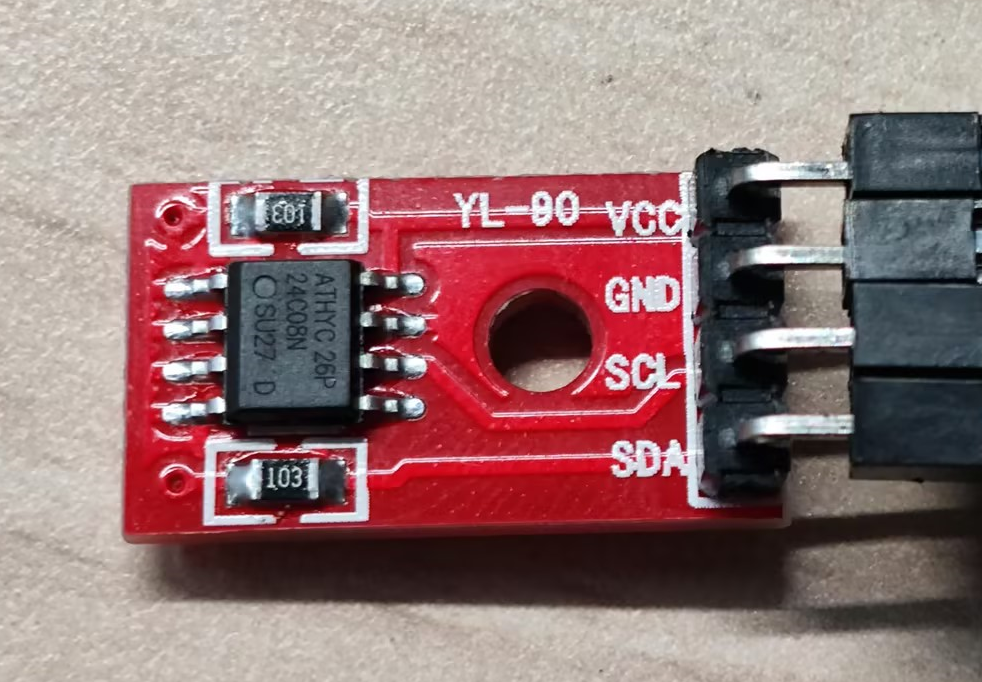
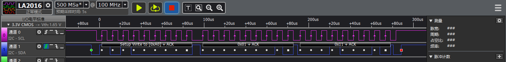

# I2C EEPROM示例
源码路径：example/hal/i2c/eeprom
## 支持的平台
例程可以运行在以下开发板.
* em-lb525
* em-lb587

## 概述
* 通过对EEPROM芯片AT24CO8SC模块的读写操作进行I2C Hal函数演示

## 例程的使用

### 硬件连接
AT24CO8SC的VCC,GND分别连接5v和GND供电\
AT24CO8SC的SDA,SCK分别按照下表，根据开发板型号进行连接

|开发板    |SDA管脚|SDA管脚名称|SCL管脚|SCL管脚名称|
|:---     |:---    |:---     |:---   |:---      |
|em-lb525 |3       |PA42     |5      |PA41      |
|em-lb587 |3       |PB29     |5      |PB28      |

* 更详细的引脚定义请参考\
`[em-lb525]()`\
`[em-lb587]()`

* AT24C08SC



### 编译和烧录
#### SF525工程代码编译
切换到例程project目录，运行scons命令执行编译：

```
scons --board=em-lb525 -j8
```

运行`build_em-lb525_hcpu\uart_download.bat`，按提示选择端口即可进行下载：

```
build_em-lb525_hcpu\uart_download.bat

Uart Download

please input the serial port num:5
```

#### SF587工程代码编译
切换到例程project目录，运行scons命令执行编译：

```
scons --board=em-lb587 -j8
```

`build_em-lb525_hcpu\download.bat`，程序通过JLink自动下载：

```
build_em-lb587_hcpu\download.bat
```

### 例程输出结果展示:
* log输出:
```
    SFBL
    Serial:c2,Chip:4,Package:3,Rev:3  Reason:00000000
    \ | /
   - SiFli Corporation
    / | \     build on Nov 29 2024, 2.1.7 build 91ecc2d9
    Copyright by SiFli team
    mount /dev sucess
    [I/drv.rtc] PSCLR=0x80000100 DivAI=128 DivAF=0 B=256
    [I/drv.rtc] RTC use LXT RTC_CR=00000001
    [I/drv.rtc] Init RTC, wake = 0
    [I/drv.audprc] init 00 ADC_PATH_CFG0 0x606
    [I/drv.audprc] HAL_AUDPRC_Init res 0
    [I/drv.audcodec] HAL_AUDCODEC_Init res 0
    [32m][I/TOUCH] Regist touch screen driver, probe=1203ba81 [0m]
    call par CFG1(35bb)
    fc 9, xtal 2000, pll 2123
    call par CFG1(35bb)
    fc 7, xtal 2000, pll 1698
    Start i2c_eeprom demo!
    EEPROM_init0
    i2c write addr:0x1,data:0x11,ret:0
    i2c write addr:0x2,data:0x22,ret:0
    i2c write addr:0x3,data:0x33,ret:0
    i2c write addr:0x4,data:0x44,ret:0
    i2c read reg:0x1,pdata:0x11,ret:0
    i2c read reg:0x2,pdata:0x22,ret:0
    i2c read reg:0x3,pdata:0x33,ret:0
    i2c read reg:0x4,pdata:0x44,ret:0
    i2c_eeprom end!
```
### I2C读写波形
#### AT24C08SC芯片手册上要求的i2c读写波形
* i2c写的波形\

* i2c读的波形\

#### 逻辑分析仪抓取部分波形
* i2c写的波形

* i2c读的波形

#### I2C参数修改
* 见EEPROM_init函数内注释
```c
/// @brief Initialization work before power on EEPROM 
/// @param  
void EEPROM_init(void)
{
    uint8_t slaveAddr = EEPROM_I2C_ADDRESS; // 7bit address of device
    HAL_StatusTypeDef ret;
    //1. pin mux
#ifdef SF32LB52X
    HAL_RCC_EnableModule(RCC_MOD_I2C2); // enable i2c2 
    #define EXAMPLE_I2C I2C2 // i2c number of cpu
    #define EXAMPLE_I2C_IRQ I2C2_IRQn // i2c number of interruput when using interrupte mode 
    HAL_PIN_Set(PAD_PA41, I2C2_SCL, PIN_PULLUP, 1); // i2c io select
    HAL_PIN_Set(PAD_PA42, I2C2_SDA, PIN_PULLUP, 1);
#elif defined(SF32LB58X)
    #define EXAMPLE_I2C I2C6 // i2c number of cpu
    #define EXAMPLE_I2C_IRQ I2C6_IRQn // i2c number of interruput when using interrupte mode 
    HAL_PIN_Set(PAD_PB28, I2C6_SCL, PIN_PULLUP, 1); // i2c io select
    HAL_PIN_Set(PAD_PB29, I2C6_SDA, PIN_PULLUP, 1);
#endif

    // 2. i2c init
    i2c_Handle.Instance = EXAMPLE_I2C;
    i2c_Handle.Mode = HAL_I2C_MODE_MASTER; // i2c master mode
    i2c_Handle.Init.AddressingMode = I2C_ADDRESSINGMODE_7BIT; // i2c 7bits device address mode
    i2c_Handle.Init.ClockSpeed = 400000; // i2c speed (hz)
    i2c_Handle.Init.GeneralCallMode = I2C_GENERALCALL_DISABLE;
    ret = HAL_I2C_Init(&i2c_Handle);
    rt_kprintf("EEPROM_init%d\n", ret);
}
```
* AT24C08SC设备地址\


#### I2C寄存器读方式修改
EEPROM_read_data函数中
```c
void EEPROM_read_data(uint8_t addr, uint8_t *pdata)
{
    HAL_StatusTypeDef ret;
    uint8_t buf = 0;

    __HAL_I2C_ENABLE(&i2c_Handle);  // for master, enable it before transmit

    // 5. Read register value after write

    // device need stop condition before read
    // ret = HAL_I2C_Master_Transmit(&i2c_Handle, EEPROM_I2C_ADDRESS, &addr, 1, 1000);
    // ret = HAL_I2C_Master_Receive(&i2c_Handle, EEPROM_I2C_ADDRESS, (uint8_t *)pdata, 2, 1000);

    // device can read without stop condition, restart condition instead
    ret = HAL_I2C_Mem_Read(&i2c_Handle, EEPROM_I2C_ADDRESS, addr, 1, &buf, 2, 1000);
    *pdata = buf;

    rt_kprintf("i2c read reg:0x%x,pdata:0x%x,ret:%d\n", addr, *pdata, ret);

    __HAL_I2C_DISABLE(&i2c_Handle); // for master, disable it after transmit to reduce error status
}
```
有些I2C外设,在读指定寄存器,送完寄存器地址后需要一个STOP信号,这需要
```c
ret = HAL_I2C_Mem_Read(&i2c_Handle, EEPROM_I2C_ADDRESS, addr, 1, &buf, 2, 1000);
```
修改为如下方式
```c
ret = HAL_I2C_Master_Transmit(&i2c_Handle, EEPROM_I2C_ADDRESS, &addr, 1, 1000);
ret = HAL_I2C_Master_Receive(&i2c_Handle, EEPROM_I2C_ADDRESS, (uint8_t *)pdata, 2, 1000);
```

**注意**: 
1. 除55x芯片外,可以配置到任意带有PA*_I2C_UART功能的IO输出I2C的SDA,SCLK波形
2.  HAL_PIN_Set 最后一个参数为hcpu/lcpu选择, 1:选择hcpu,0:选择lcpu 
## 异常诊断
* I2C无波形输出
1. 对照芯片手册检查CPU的I2C是否选择正确
2. 检查IO配置和连接是否正确
* 连写失败，I2C波形正常，无应答信号
1. AT24C08SC写输入时需要至多5ms Write Cycle Time等待数据烧录 


## 参考文档
* [AT24C08SC](./assets/at24c02sc.pdf)

## 更新记录
|版本  |日期    |发布说明 |
|:---  |:---    |:---    |
|0.0.1 |12/2024 |初始版本 |
|      |        |        |
