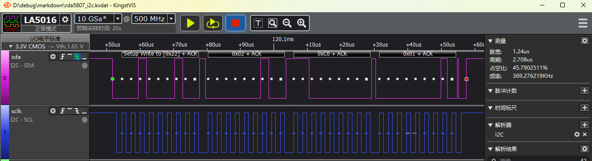
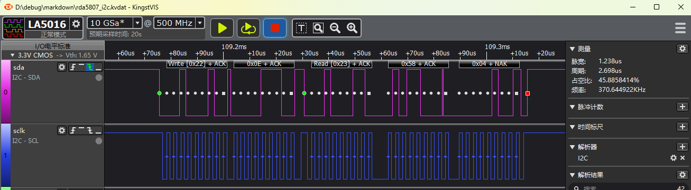

# I2C FM示例
源码路径：[example/hal/i2c/fm](https://github.com/OpenSiFli/SiFli-SDK/tree/main/example/hal/i2c/fm)
## 支持的平台
例程可以运行在以下开发板.
* em-lb520

## 概述
* 通过对RDA5802E FM模块的操作进行I2C Hal函数演示

## 例程的使用
### 编译和烧录
切换到例程project目录，运行scons命令执行编译：

> scons --board=em-lb525 -j8

切换到例程`project/build_xx`目录，运行`uart_download.bat`，按提示选择端口即可进行下载：

> build_em-lb525_hcpu\uart_download.bat

>Uart Download

>please input the serial port num:5

### 硬件连接
PA39连接到RDA5802E FM模块的SDA脚\
PA40连接到RDA5802E FM模块的SCLK脚\
RDA5802E FM模块的VCC,GND分别连接3v3和GND供电\
ANT连接一条50cm的线当作天线


#### 例程输出结果展示:
* log输出:
```
   Serial:c2,Chip:4,Package:3,Rev:3  Reason:00000080
    \ | /
   - SiFli Corporation
    / | \     build on Oct 16 2024, 2.1.7 build 8ad5dbdd
    2020 - 2022 Copyright by SiFli team
   mount /dev sucess
   [I/drv.rtc] PSCLR=0x80000100 DivAI=128 DivAF=0 B=256
   [I/drv.rtc] RTC use LXT RTC_CR=00000001
   [I/drv.rtc] Init RTC, wake = 0
   [I/drv.audprc] init 00 ADC_PATH_CFG0 0x606
   [I/drv.audprc] HAL_AUDPRC_Init res 0
   [I/drv.audcodec] HAL_AUDCODEC_Init res 0
   [32m][I/TOUCH] Regist touch screen driver, probe=1203b7dd [0m]
   call par CFG1(35bb)
   fc 9, xtal 2000, pll 2050
   call par CFG1(35bb)
   fc 9, xtal 2000, pll 2050
   Start i2c demo!
   i2c write reg:0x2,data:0x0,ret:0
   i2c read reg:0xe,pdata:0x5804,ret:0
   fm chipid:0x5804
   i2c write reg:0x2,data:0xc001,ret:0
   i2c write reg:0x2,data:0xc001,ret:0
   i2c write reg:0x3,data:0x0,ret:0
   i2c write reg:0x4,data:0x400,ret:0
   i2c write reg:0x5,data:0x86ef,ret:0
   i2c write reg:0x3,data:0x1150,ret:0
   i2c write reg:0x3,data:0x1210,ret:0
   i2c read reg:0xb,pdata:0x4580,ret:0
   fm 94.2Mhz is 1
   i2c end!
```
* rda5807规格书上要求的i2c读写波形

* i2c写的波形

* i2c读的波形

#### I2C参数修改
* 见RDAFM_init函数内注释
```c
unsigned char RDAFM_init(void)
{

    uint8_t slaveAddr = RDA_I2C_ADDRESS; /* I2C高7bit器件地址修改 */
    HAL_StatusTypeDef ret;

    //----------------------------------------------
    //1. pin mux
#define EXAMPLE_I2C I2C2 /* 修改CPU中使用的I2C */
#define EXAMPLE_I2C_IRQ I2C2_IRQn
    HAL_PIN_Set(PAD_PA40, I2C2_SCL, PIN_PULLUP, 1); /* 修改I2C2使用的IO口 */
    HAL_PIN_Set(PAD_PA39, I2C2_SDA, PIN_PULLUP, 1);

    //----------------------------------------------
    // 2. i2c init

    i2c_Handle.Instance = EXAMPLE_I2C;
    i2c_Handle.Mode = HAL_I2C_MODE_MASTER; /* I2C 主模式 */
    i2c_Handle.Init.AddressingMode = I2C_ADDRESSINGMODE_7BIT; /* I2C 7bit地址模式 */
    i2c_Handle.Init.ClockSpeed = 400000; /* I2C速率设置为400Khz */
    i2c_Handle.Init.GeneralCallMode = I2C_GENERALCALL_DISABLE;
    ret = HAL_I2C_Init(&i2c_Handle);
    return ret;

}
```
#### I2C寄存器读方式修改
RDAFM_read_data函数中
```c
void RDAFM_read_data(uint8_t addr,uint16_t *pdata)
{
    HAL_StatusTypeDef ret;
    uint8_t buf[2];

    __HAL_I2C_ENABLE(&i2c_Handle);  // for master, enable it before transmit
    
    // 5. Read register value after write
    /* start 0x22,reg0,stop start 0x23,data0,data1 stop 用下面两句中间有STOP信号 */
//    ret = HAL_I2C_Master_Transmit(&i2c_Handle, RDA_I2C_ADDRESS, &addr, 1, 1000);
//    ret = HAL_I2C_Master_Receive(&i2c_Handle, RDA_I2C_ADDRESS, (uint8_t *)pdata, 2, 1000);

    /* start 0x22,reg0, restart 0x23,data0,data1 stop  用下面函数中间无STOP,而是restart信号 */
    ret = HAL_I2C_Mem_Read(&i2c_Handle, RDA_I2C_ADDRESS, addr, 1, buf, 2, 1000);
    *pdata = (uint16_t)buf[0] << 8 |  ((uint16_t)buf[1] & 0x00ff);

    rt_kprintf("i2c read reg:0x%x,pdata:0x%x,ret:%d\n",addr,*pdata,ret);

    __HAL_I2C_DISABLE(&i2c_Handle); // for master, disable it after transmit to reduce error status

}
```
有些I2C外设,在读指定寄存器,送完寄存器地址后需要一个STOP信号,这需要
```c
 ret = HAL_I2C_Mem_Read(&i2c_Handle, RDA_I2C_ADDRESS, addr, 1, buf, 2, 1000);
```
修改为如下方式
```c
ret = HAL_I2C_Master_Transmit(&i2c_Handle, RDA_I2C_ADDRESS, &addr, 1, 1000);
ret = HAL_I2C_Master_Receive(&i2c_Handle, RDA_I2C_ADDRESS, (uint8_t *)pdata, 2, 1000);
```

**注意**: 
1. 除55x芯片外,可以配置到任意带有PA*_I2C_UART功能的IO输出I2C的SDA,SCLK波形
2.  HAL_PIN_Set 最后一个参数为hcpu/lcpu选择, 1:选择hcpu,0:选择lcpu 
## 异常诊断
* I2C无波形输出
1. 对照芯片手册检查CPU的I2C是否选择正确
2. 检查IO配置和连接是否正确
* I2C波形正常后FM无ACK信号
1. 检查I2C的器件地址和寄存器地址是否跟FM设备要求相符
2. 波形和地址跟FM设备完全相符的情况下,需要检查FM设备的供电和I2C硬件连接是否正确

## 参考文档
* RDA5807N系列编程指南V3_7CH.pdf
* RDA5807_drv_V5.0.rar

## 更新记录
|版本 |日期   |发布说明 |
|:---|:---|:---|
|0.0.1 |10/2024 |初始版本 |
| | | |
