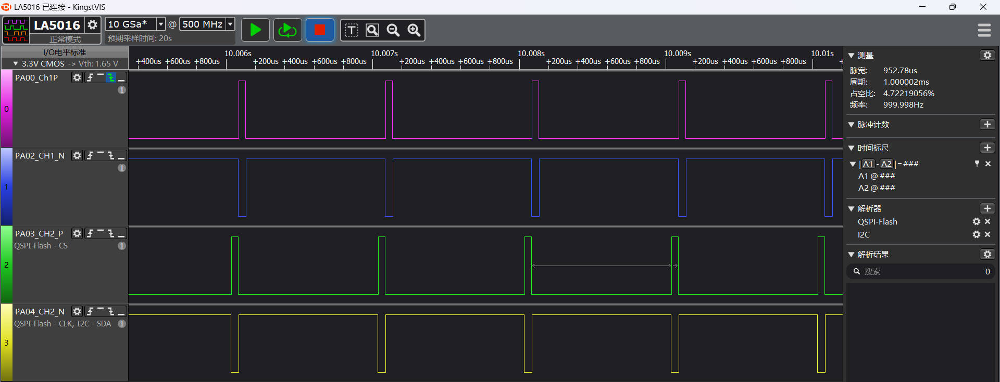
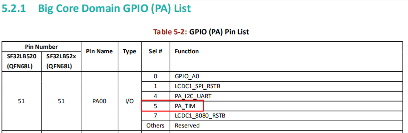
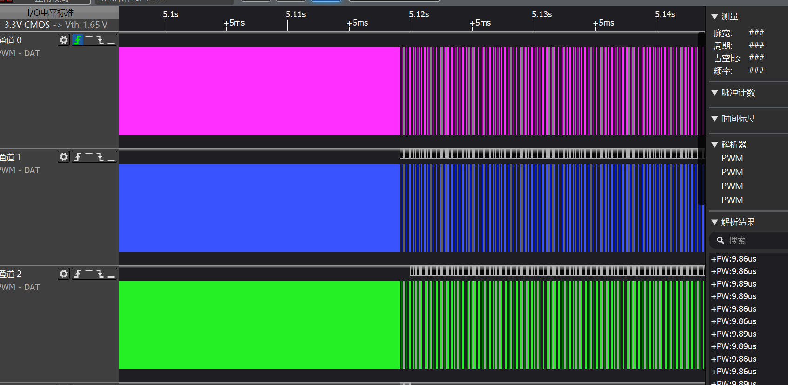
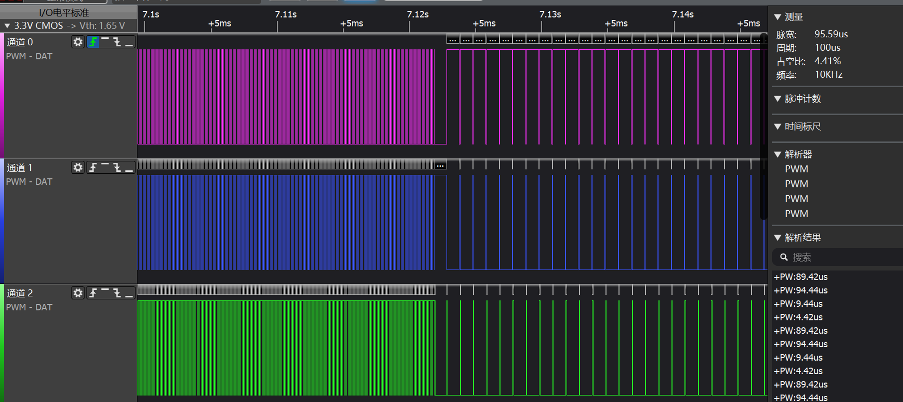

# PWM示例
源码路径：example/hal/pwm
## 支持的平台
例程可以运行在以下开发板.
* sf32lb52-lcd_n16r8
* sf32lb58-lcd_n16r64n4
## 概述
* 包含了GPtimer通过IO口输出PWM的示例
* 包含了采用Atimer通过IO输出互补PWM的示例


## 例程的使用
### 编译和烧录
切换到例程project目录，运行scons命令执行编译(board=版型)：
```
scons --board=sf32lb52-lcd_n16r8 -j8
```
`build_sf32lb52-lcd_n16r8_hcpu\uart_download.bat`，按提示选择端口即可进行下载：

```
build_sf32lb52-lcd_n16r8_hcpu\uart_download.bat

Uart Download

please input the serial port num:5
```

关于编译、下载的详细步骤，请参考[](/quickstart/get-started.md)的相关介绍。
### GPtimer输出PWM
#### 例程输出结果展示:
* log输出:
```
SFBL
Start gtimer pwm demo!
GPT_clock 24000000,psc 2, Period 60000,Pulse 12000
gtimer pwm demo end!
msh />
```
* PA09输出PWM波形(默认200Hz,20%占空比)

#### PWM参数修改
* IO输出修改

物理位置指管脚在板子上实际引出的排针位置
|版型名称  | PWM       | CHX     |   引脚(物理位置)  |
|--------|------------|--------|---------|
|525    | GPTIM2     | CH1    |    PA09 （37）     |
|587  | GPTIM1     | CH2  |      PA51    （CONN2 28）    |
```c
    #define PAD_PA_09 PAD_PA09 /* 52系列默认PA09输出(物理位置37) */
    HAL_PIN_Set(PAD_PA_09, cfg->pad_func, PIN_PULLUP, 1);/*PA09配置为GPTIM2_CH1功能*/


    #define PAD_PA_51 PAD_PA51/* 587系列默认PA51输出(物理位置CONN2 28) */
    HAL_PIN_Set(PAD_PA_51, cfg->pad_func, PIN_PULLUP, 1);/*PA51配置为GPTIM1_CH2功能*/
```
**注意**: 
1. 除55x芯片外,可以配置到任意带有PA_TIM功能的IO输出PWM波形（想查询引脚复用表可在项目路径下文件中查找对应版型的引脚复用如：bf0_pin_const.c）
2.  HAL_PIN_Set 最后一个参数为hcpu/lcpu选择, 1:选择hcpu,0:选择lcpu 
* PWM周期period,脉宽pulse修改

```c
#if defined(BSP_USING_BOARD_EM_LB525XXX)
    T_haltest_pwm_cfg testcfg[] =
{
    {hwp_gptim2, CORE_ID_HCPU, GPTIM2_CH1, GPT_CHANNEL_1, 5000000, 1000000, 0},
};  //period:0.5s  pulse:0.25s
#elif defined BSP_USING_BOARD_EM_LB587XXX
    T_haltest_pwm_cfg testcfg[] =
{
    {hwp_gptim1, CORE_ID_HCPU, GPTIM1_CH2, GPT_CHANNEL_2, 5000000, 1000000, 0},
};  //period:0.5s  pulse:0.25s
#endif
```
1. 参数:5000000 单位为ns,对应周期为1/0.005s=200Hz
2.  参数:1000000 单位为ns,表示一个周期内PWM输出1的脉宽,不能大于上面的参数,
- 1000000/5000000=1/5=20%的占空比
### ATtimer输出互补PWM
#### 例程输出结果展示:
* log输出:
```c
Start atimer pwm demo!
ATIM1_Init
frequency:50000,percentage1:50,percentage2:30
channel1 atim1 plck freq:120000000,PWM_PERIOD:20000,PWM_PULSE:10000
atim1 GPT_clock:120,period:2400,psc:1
atim1 pulse:1200
channel2 atim1 plck freq:120000000,PWM_PERIOD:20000,PWM_PULSE:6000
atim1 GPT_clock:120,period:2400,psc:1
frequency:10000,percentage1:5,percentage2:90
channel1 atim1 plck freq:120000000,PWM_PERIOD:100000,PWM_PULSE:5000
atim1 GPT_clock:120,period:12000,psc:1
atim1 pulse:600
channel2 atim1 plck freq:120000000,PWM_PERIOD:100000,PWM_PULSE:90000
atim1 GPT_clock:120,period:12000,psc:1
frequency:1000,percentage1:95,percentage2:5
channel1 atim1 plck freq:120000000,PWM_PERIOD:1000000,PWM_PULSE:950000
atim1 GPT_clock:120,period:120000,psc:1
atim1 pulse:114000
channel2 atim1 plck freq:120000000,PWM_PERIOD:1000000,PWM_PULSE:50000
atim1 GPT_clock:120,period:120000,psc:1
ATIM1_Stop!
atimer pwm demo end!
```
物理位置指管脚对应在板子上的引脚排针位置
|版型名称  | pwm       | 输出Channel1     | 输出Channel2   |    
|--------|------------|---------------|-------------------|
|525    | ATIM1     | PAD_PA00（物理位置32）,PAD_PA02（物理位置36）   | PAD_PA03（物理位置40）,PAD_PA03（物理位置38）    |   
|587  | ATIM2     | PAD_PA84（conn2 21）,PAD_PA86（conn2 24） |PAD_PA90（conn2 27）,PAD_PA91（conn2 26）  |
* 52系列：PA00,PA02输出Channel1互补PWM波形,PA03,PA04输出Channel2互补PWM波形:
* 587系列：PA84,PA86输出Channel1互补PWM波形,PA90,PA91输出Channel2互补PWM波形:

#### PWM参数修改
* ATIM的修改：52系列选择的是ATIM1,587选择的是ATIM2
```c
    #if defined(BSP_USING_BOARD_EM_LB525XXX)
    atim_Handle.Instance = (GPT_TypeDef *)hwp_atim1;

    #elif defined (BSP_USING_BOARD_EM_LB587XXX)
    atim_Handle.Instance = (GPT_TypeDef *)hwp_atim2;
    #endif
```
* IO输出修改
除55x芯片外,可以配置到任意带有PA_TIM功能的IO输出PWM波形

```c
#if defined(BSP_USING_BOARD_EM_LB525XXX)
	HAL_PIN_Set(PAD_PA00, ATIM1_CH1,  PIN_PULLUP, 1);
    HAL_PIN_Set(PAD_PA02, ATIM1_CH1N, PIN_PULLUP, 1);
    HAL_PIN_Set(PAD_PA03, ATIM1_CH2,  PIN_PULLUP, 1);
    HAL_PIN_Set(PAD_PA04, ATIM1_CH2N, PIN_PULLUP, 1);

#elif defined(BSP_USING_BOARD_EM_LB587XXX)
    HAL_PIN_Set(PAD_PA84, ATIM2_CH1,  PIN_PULLUP, 1);
    HAL_PIN_Set(PAD_PA86, ATIM2_CH1N, PIN_PULLUP, 1);
    HAL_PIN_Set(PAD_PA90, ATIM2_CH2,  PIN_PULLUP, 1);
    HAL_PIN_Set(PAD_PA91, ATIM2_CH2N, PIN_PULLUP, 1);
#endif
```
* PWM周期period,脉宽pulse修改,使用延时函数保持波形2s
```c
    freq = 50000;   /* 50000为pwm频率（单位hz）最小1Hz,最大200000Hz */
    percentage1=50; /* 50 为Channel 1的占空比50%（单位%）最小0(0%),最大100(100%)*/
    percentage2=50; /* 50为Channel 2的占空比50%（单位%）最小0(0%),最大100(100%)*/
    HAL_Delay(2000)
    freq = 10000;   /* 10000 is frequence of pwm（10000hz）*/
    percentage1 = 5; /* 5 is the duty cycle of Channel 1（5%）*/
    percentage2 = 90; /* 90 is the duty cycle of Channel 2（90%）*/
    HAL_Delay(2000)
    freq = 1000; //hz
    percentage1 = 95;
    percentage2 = 5;
    HAL_Delay(2000)
```
* 不同参数之间的波形变化图





## 异常诊断
如果未能出现预期的log和PWM波形输出，可以从以下方面进行故障排除：
* 硬件连接是否正常
* 管脚配置是否正确 
* 管脚对应的通道是否匹配 

## 参考文档

## 更新记录
|版本 |日期   |发布说明 |
|:---|:---|:---|
|0.0.1 |10/2024 |初始版本 |
|0.0.2 |12/2024 |2.0 |
```