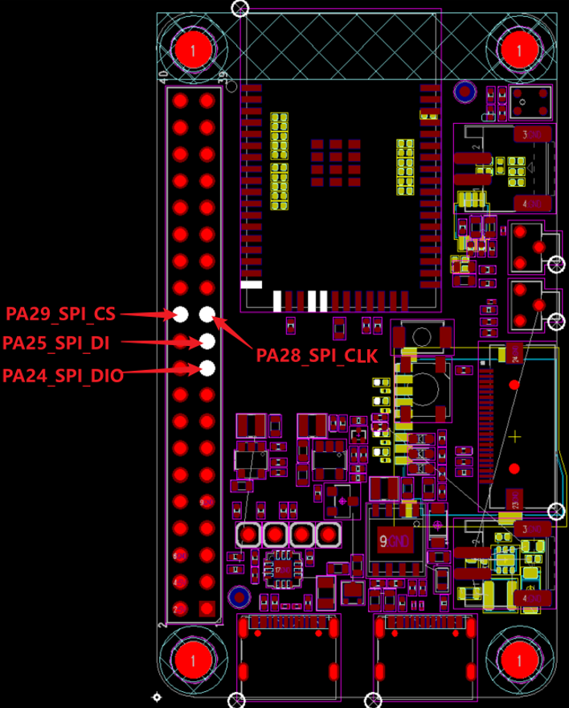
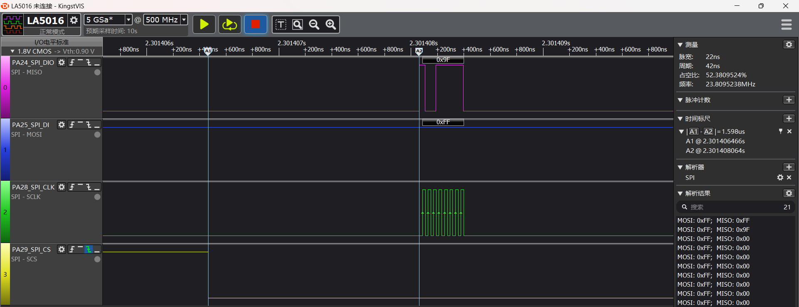

# SPI示例
源码路径:example/hal/spi
## 支持的平台
例程可以运行在以下开发板.
* em-lb525
* em-lb587

## 概述
* 操作SPI Hal函数进行读写nor flash演示

## 例程的使用
### 编译和烧录
#### 以 em-lb525 开发板为例
* 切换到例程project目录，运行scons命令执行编译对应命令：
```
scons --board=em-lb525 -j8
```
运行`build_em-lb525_hcpu\uart_download.bat`，按提示选择端口即可进行下载：
```
> build_em-lb525_hcpu\uart_download.bat

     Uart Download

please input the serial port num:5
```
关于编译、下载的详细步骤，请参考[](/quickstart/get-started.md)的相关介绍。
### 硬件连接

```{eval-rst}
+---------+--------+------------+------------+-----------------+
|开发板   |功能引脚|本端设备引脚|对端设备引脚|物理引脚（CONN2）|   
+=========+========+============+============+=================+ 
|em-lb52x |PA_24   |dio         |SPI_MOSI    |19               |
|         +--------+------------+------------+-----------------+     
|         |PA_25   |di          |SPI_MISO    |21               |     
|         +--------+------------+------------+-----------------+
|         |PA_28   |clk         |SPI_CLK     |23               |   
|         +--------+------------+------------+-----------------+  
|         |PA_29   |cs          |SPI_CS      |24               |
+---------+--------+------------+------------+-----------------+
|em-lb58x |PA_21   |do          |SPI_MOSI    |8                |    
|         +--------+------------+------------+-----------------+ 
|         |PA_20   |di          |SPI_MISO    |10               |     
|         +--------+------------+------------+-----------------+
|         |PA_28   |clk         |SPI_CLK     |5                |   
|         +--------+------------+------------+-----------------+  
|         |PA_29   |cs          |SPI_CS      |3                |   
+---------+--------+------------+------------+-----------------+
```

      
em-lb525硬件原理图参考如下图：


#### 例程输出结果展示:
* log输出:
```
    Serial:c2,Chip:4,Package:3,Rev:3  Reason:00000080
     \ | /
    - SiFli Corporation
     / | \     build on Oct 25 2024, 2.2.0 build 00000000
     2020 - 2022 Copyright by SiFli team
    mount /dev sucess
    [I/drv.rtc] PSCLR=0x80000100 DivAI=128 DivAF=0 B=256
    [I/drv.rtc] RTC use LXT RTC_CR=00000001
    [I/drv.rtc] Init RTC, wake = 0
    [I/drv.audprc] init 00 ADC_PATH_CFG0 0x606
    [I/drv.audprc] HAL_AUDPRC_Init res 0
    [I/drv.audcodec] HAL_AUDCODEC_Init res 0
    [I/TOUCH] Regist touch screen driver, probe=1203be19 
    call par CFG1(35bb)
    fc 9, xtal 2000, pll 2051
    call par CFG1(35bb)
    fc 9, xtal 2000, pll 2052
    Start spi demo!
    ret:0,spi read:0x85,0x20,0x18,0x85,0x20,0x18,0x85,0x20,0x18,0x85,0x20,0x18,0x85,0x20,0x18,0x85,
    spi demo end!
```
下图为其中抓取的HAL_SPI_Transmit(&spi_Handle, (uint8_t *)cmd, 1, 1000);部分波形：


#### SPI1配置流程

* 以em-lb525为例，设置对应spi1的IO口
```c
    /* 1, pinmux set to spi1 mode */
    HAL_PIN_Set(PAD_PA24, SPI1_DIO, PIN_PULLDOWN, 1);       // SPI1 (Nor flash)
    HAL_PIN_Set(PAD_PA25, SPI1_DI,  PIN_PULLUP, 1);
    HAL_PIN_Set(PAD_PA28, SPI1_CLK, PIN_NOPULL, 1);
    HAL_PIN_Set(PAD_PA29, SPI1_CS,  PIN_NOPULL, 1);
```
**注意**: 
1. CLK，CS为输出口，不需要配置为上下拉状态
2. DIO，DI口为输入口，需要配置上下拉，如果外设没有特别需要，采用此默认值
3. HAL_PIN_Set 最后一个参数为hcpu/lcpu选择, 1：选择hcpu，0：选择lcpu 
4. Hcpu的PA口不能配置为Lcpu的spi外设，比如spi3，spi4输出
* 打开对应的spi1的时钟源
```
    /* 2, open spi1 clock source  */
    HAL_RCC_EnableModule(RCC_MOD_SPI1);
```
* spi1的初始化设置
```
    uint32_t baundRate = 20000000; /*spi clk的速率,单位：hz */

    spi_Handle.Instance = SPI1; /* SPI1会对应到register.h中hwp_spi1的寄存器操作地址 */
/** SPI_DIRECTION_2LINES：SPI读写为不同IO口；
*   SPI_DIRECTION_1LINE：SPI读写都在DIO一条IO口 */
    spi_Handle.Init.Direction = SPI_DIRECTION_2LINES; 
    spi_Handle.Init.Mode = SPI_MODE_MASTER; /* spi主模式 */
    spi_Handle.Init.DataSize = SPI_DATASIZE_8BIT; /* 常用8bit，16bit，9bit模式 */
    
#if   (SPI_MODE == 0)
    spi_Handle.Init.CLKPhase  = SPI_PHASE_1EDGE; /* clk在cs拉低后第一个时钟沿采样 */
    spi_Handle.Init.CLKPolarity = SPI_POLARITY_LOW; /* clk在在空闲时为低电平 */
#elif (SPI_MODE == 1)
    spi_Handle.Init.CLKPhase = SPI_PHASE_2EDGE; /* clk在cs拉低后第二个时钟沿采样 */
    spi_Handle.Init.CLKPolarity = SPI_POLARITY_LOW;
#elif (SPI_MODE == 2)
    spi_Handle.Init.CLKPhase = SPI_PHASE_1EDGE;
    spi_Handle.Init.CLKPolarity = SPI_POLARITY_HIGH; /* clk在空闲时为高电平 */
#else //(SPI_MODE == 3)
    spi_Handle.Init.CLKPhase = SPI_PHASE_2EDGE;
    spi_Handle.Init.CLKPolarity = SPI_POLARITY_HIGH;
#endif

    spi_Handle.core = CORE_ID_HCPU; /* hcpu还是lcpu核的spi */
...
/* 由于不同CPU，不同核的频率不一样，时钟可能不一样，hal代码可以参考drv_spi.c驱动层 sifli_spi_init初始化代码，或者参考芯片手册 */
    spi_Handle.Init.BaudRatePrescaler = (SPI_APB_CLOCK + baundRate / 2) /baundRate;

```
spi mode 0-3对应下图，需要对应外设规格书进行选择
1. CLKPolarity（CPOL）：对应clk在空闲时候的电平状态
2. CLKPhase （CPHA)： 对应cs拉低后第几个沿进行采样

* SPI1 收发数据
```
    // 3.1. spi tx rx
    /* 发送单字节0xff数据 */
    cmd[0] = 0xff;
    ret = HAL_SPI_Transmit(&spi_Handle, (uint8_t *)cmd, 1, 1000);
    /* 从DIO发送0x9f后，从DI读16个byte */
    cmd[0] = 0x9f;
     __HAL_SPI_TAKE_CS(&spi_Handle); /* 多byte操作时，需要手动操作CS脚，否则spi的fifo空后，就会拉高CS脚 */
    ret = HAL_SPI_TransmitReceive(&spi_Handle, (uint8_t *)&cmd, (uint8_t *)&read_data, 16, 1000);
    __HAL_SPI_RELEASE_CS(&spi_Handle); /* 发完一串后，释放CS脚，CS会从低变高 */
    HAL_Delay_us(5);
 /* 用另一种方式演示了发0x9f后，收16个byte的调用方式，灵活性会更高 */   
    __HAL_SPI_TAKE_CS(&spi_Handle);
    ret = HAL_SPI_Transmit(&spi_Handle, (uint8_t *)cmd, 1, 1000);
    ret = HAL_SPI_Receive(&spi_Handle, (uint8_t *)read_data, 16, 1000);
    __HAL_SPI_RELEASE_CS(&spi_Handle);
```
## 异常诊断
* SPI1无波形输出或者不符合预期
1. 参考配置流程一步一步检查，是否都配置成功
2. 每一个步骤都能通过相关寄存器查看确认是否生效
* SPI1读数据为全0xFF或者0x00
1. 检查SPI1发送的时序和命令跟外设的用户手册是否相符
2. 检查与外设连接是否正确、IO电平是否一致、外设供电是否正常


## 参考文档
* EH-SF32LB52X_Pin_config_V1.3.0_20231110.xlsx
* DS0052-SF32LB52x-芯片技术规格书 V0p3.pdf
* PY25Q128HA_datasheet_V1.1.pdf

## 更新记录
|版本 |日期   |发布说明 |
|:---|:---|:---|
|0.0.1 |10/2024 |初始版本 |
| | | |
