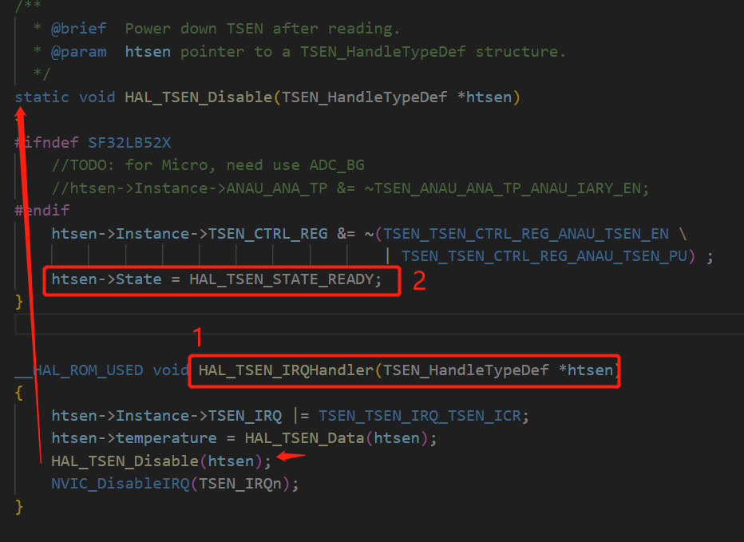
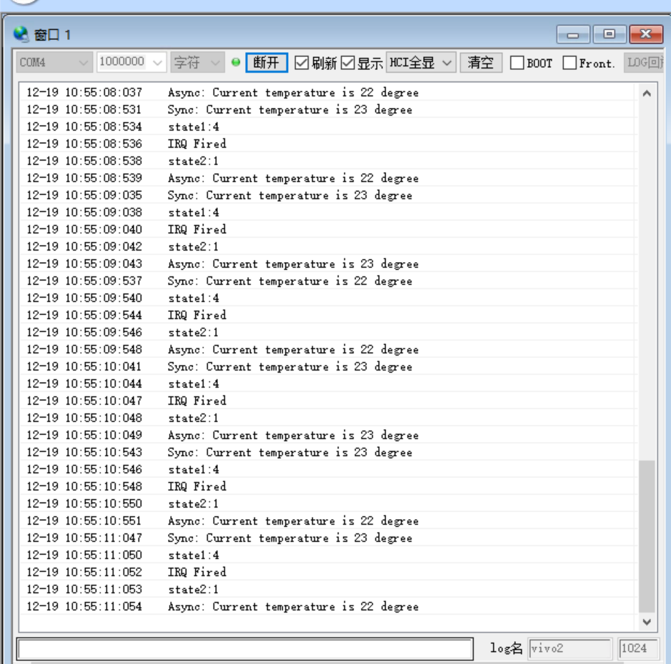

# tsen示例
源码路径 example\tsen\src
## 支持的平台
* em-lb525
* em-lb587

## 概述
用于表示 "Temperature Sensor"（温度传感器）的硬件模块。具体来说，TSEN 是一种集成温度传感器，设计用于测量片上温度，以帮助实现温度监控和温度相关的系统功能。

## 例程的使用
### 编译和烧录
```c
> scons --board=em-lb525 -j8
```
切换到例程`project/build_xx`目录，运行`uart_download.bat`，按提示选择端口即可进行下载：

> build_em-lb525_hcpu\uart_download.bat

>Uart Download

>please input the serial port num:5

关于编译、下载的详细步骤，请参考[快速上手](quick_start)的相关介绍。
## 使用 TSEN 的方法
以下是使用 TSEN 的一般步骤：

### 初始化 TSEN：
初始化函数内部会开启tsen，启动温度测量：
```c
 HAL_TSEN_Init(TSEN_HandleTypeDef *htsen)
```
### 读取温度数据：
#### 方法1：同步读取
```c
temperature = HAL_TSEN_Read(&TsenHandle);
```

#### 方法2：异步读取（中断）
```c
HAL_TSEN_Read_IT(&TsenHandle)
```
#### 中断函数内容
```c
void TSEN_IRQHandler(void)
{

    printf("IRQ Fired\n");
    HAL_TSEN_IRQHandler(&TsenHandle);
}

__HAL_ROM_USED void HAL_TSEN_IRQHandler(TSEN_HandleTypeDef *htsen)
{
    htsen->Instance->TSEN_IRQ |= TSEN_TSEN_IRQ_TSEN_ICR;
    htsen->temperature = HAL_TSEN_Data(htsen);
    HAL_TSEN_Disable(htsen);
    NVIC_DisableIRQ(TSEN_IRQn);
}
```
#### 中断函数内容跳转改变state值
中断方法中通过 `while (HAL_TSEN_GetState(&TsenHandle) != HAL_TSEN_STATE_READY)`来监测是否产生新数据




## 代码部分
```c
static TSEN_HandleTypeDef   TsenHandle;

void TSEN_IRQHandler(void)
{

    printf("IRQ Fired\n");
    HAL_TSEN_IRQHandler(&TsenHandle);
}


static void testcase(void)
{
    // HAL_StatusTypeDef   status;
    int temperature;

    /*##-1- Initialize TSEN peripheral #######################################*/
    TsenHandle.Instance = hwp_tsen;
    if (HAL_TSEN_Init(&TsenHandle) == HAL_OK)
    {
        temperature = HAL_TSEN_Read(&TsenHandle);                                   /* Read synchronized*/
        printf("Sync: Current temperature is %d degree\n", temperature);

        HAL_NVIC_SetPriority(TSEN_IRQn, 5, 0);                                      /* Set interrupt priority*/
        if (HAL_TSEN_Read_IT(&TsenHandle) == HAL_TSEN_STATE_BUSY)                   /* Read Async, interrupt will be enabled*/
        {
            printf("state1:%d\n",TsenHandle.State);
            while (HAL_TSEN_GetState(&TsenHandle) != HAL_TSEN_STATE_READY);
        }
        printf("state2:%d\n",TsenHandle.State);    
        printf("Async: Current temperature is %d degree\n", TsenHandle.temperature);
    }
}
```
### 例程输出结果展示:
```c
Start tsen demo!
Sync: Current temperature is 19 degree
state1:4
IRQ Fired
state2:1
Async: Current temperature is 19 degree
```


## 异常诊断
如果未能出现预期的log温度变化，可以从以下方面进行故障排除：
* 硬件连接是否正常
* 中断处理函数是否正常
* state值是否转变为HAL_TSEN_STATE_READY

## 更新记录
|版本 |日期   |发布说明 |
|:---|:---|:---|
|0.0.1 |10/2024 |初始版本 |
|0.0.2 |12/2024 |2.0 |
```

