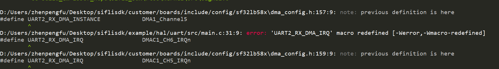
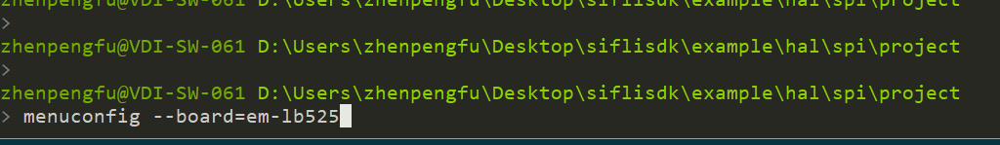
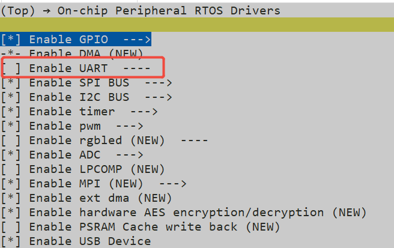
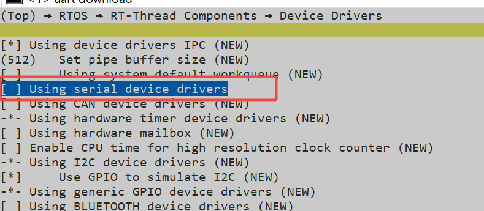
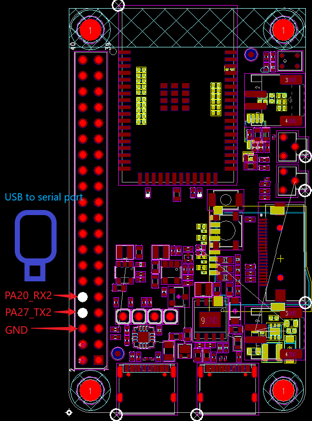
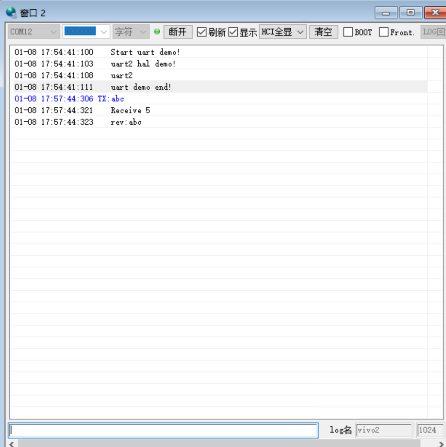

# UART示例
源码路径:example/hal/uart
## 支持的平台
例程可以运行在以下开发板.
* em-lb525
* em-lb587

## 概述
* 操作UART hal函数采用RX DMA方式,操作UART2检验其串口的收发能力
* 注意:开发板复位之后uart2打印log同下方图片一致即为成功
* 注意:电脑端串口已经关闭,此串口将不会有log打印
## 例程的使用
### 编译和烧录
关于编译、下载的详细步骤，请参考[](/quickstart/get-started.md)的相关介绍。

确认rtconfig.h中不能包含下面两个宏，否则rt-thread系统驱动也会初始化一次RT系统的uart，
导致uart重复定义
```c
#define CONFIG_BSP_USING_UART 1
#define CONFIG_RT_USING_SERIAL is set 1
```



注意：直接在rtconfig.h中修改宏还是会无效，我们需要通过menuconfig如下命令进行打开，在烧录界面下输入以下命令（board=板子型号）


> menuconfig --board=em-lb525



菜单内的资源勾选是针对rt-thread系统驱动使用的，这里我们是hal所以取消勾选你要使用的资源防止重复定义(勾选后或取消勾选都按D+Enter回车进行保存)



切换到例程project目录，运行scons命令执行编译：（board=板子型号）

```
scons --board=em-lb525 -j8
```

运行`build_em-lb525_hcpu\uart_download.bat`，按提示选择端口即可进行下载：

```
build_em-lb525_hcpu\uart_download.bat

Uart Download

please input the serial port num:5
```

### 硬件连接
物理位置指管脚对应在板子上的引脚排针位置
|版型名称  | UART       | TX(物理位置)     | RX(物理位置)   |    
|--------|------------|---------------|-------------------|
|525    | UART2     | PAD_PA27（8）    | PAD_PA20（10）    |   
|587  | UART2     | PAD_PA28 (CONN2 5)  |PAD_PA29 (CONN2 3)  |


* PA27软件配置为UART2的TX，连接到电脑usb转串口的RX
* PA20软件配置为UART2的RX，连接到电脑usb转串口的TX
* GND连接到usb转串口的GND，如下图：




#### 例程输出结果展示:
* log输出:
  log结尾收到uart2发送的
  ```
  Start uart demo!
  uart2 hal demo!
  uart2
  uart demo end!
  ```
* 向uart2发送`abc`,接收到`abc`字符、换行符，回车符，共5个字符ASCII码,打印以下内容
    ```
    TX:abc
    Receive 5
    rev:abc
    ```


#### 例程输出结果展示:



log结尾收到的`rev: `为接收到的电脑usb转串口TX发来的字符
```
Start uart demo!
uart2 hal demo!
uart2
uart demo end!
TX:abc
Receive 5
rev:abc
```

#### uart2配置流程
* 注意版型不同对应的DMAC1_CHX_IRQHandler可能不一样
* 配置对应的Uart2和RX DMA中断，可以参考`dma_config.h`和`uart_config.h`中`BSP_USING_UART2`宏和`UART2_RX_DMA_INSTANCE`宏内的定义

```c
#if defined(BSP_USING_BOARD_EM_LB525XXX)
#define UART2_DMA_RX_IRQHandler          DMAC1_CH6_IRQHandler
#elif defined (BSP_USING_BOARD_EM_LB587XXX)
#define UART2_DMA_RX_IRQHandler          DMAC1_CH5_IRQHandler
#endif

#define UART2_RX_DMA_RCC                 0
#define UART2_RX_DMA_INSTANCE            DMA1_Channel6
#define UART2_RX_DMA_REQUEST             DMA_REQUEST_7
#define UART2_RX_DMA_IRQ                 DMAC1_CH6_IRQn

#define UART_INSTANCE           hwp_usart2
#define UART_INTERRUPT          USART2_IRQn
#define UART_IRQ_HANDLER        USART2_IRQHandler
#define UART_RX_DMA_INSTANCE    UART2_RX_DMA_INSTANCE
#define UART_RX_DMA_REQUEST     UART2_RX_DMA_REQUEST
#define UART_RX_DMA_IRQ         UART2_RX_DMA_IRQ
#define UART_RX_DMA_IRQ_HANDLER UART2_DMA_RX_IRQHandler
```


* 设置对应的Uart2对应的IO口
```c
   #if defined(BSP_USING_BOARD_EM_LB525XXX)
    HAL_PIN_Set(PAD_PA20, USART2_RXD, PIN_PULLUP, 1);
    HAL_PIN_Set(PAD_PA27, USART2_TXD, PIN_PULLUP, 1);
    #elif defined (BSP_USING_BOARD_EM_LB587XXX)
    HAL_PIN_Set(PAD_PA29, USART2_RXD, PIN_PULLUP, 1);
    HAL_PIN_Set(PAD_PA28, USART2_TXD, PIN_PULLUP, 1);
    #endif
```
**注意**: 
1. 除55x芯片外,可以配置到任意带有PA*_I2C_UART功能的IO输出UART2波形（想查询引脚复用表可在项目路径下文件中查找对应版型的引脚复用如：bf0_pin_const.c）
2.  HAL_PIN_Set 最后一个参数为hcpu/lcpu选择, 1:选择hcpu,0:选择lcpu 
3.  Hcpu的PA口不能配置为Lcpu的uart外设，比如uart5,uart6输出 
* 打开对应的uart2的时钟源
```c
    /* 2, open uart2 clock source  */
    HAL_RCC_EnableModule(RCC_MOD_USART2);
```
* uart2波特率的设置，例程波特率为1000000
```c
    UartHandle.Init.BaudRate   = 1000000;
```
* uart2 DMA的配置
```c
    // Start RX DMA
    __HAL_LINKDMA(&(UartHandle), hdmarx, dma_rx_handle);
    dma_rx_handle.Instance = UART_RX_DMA_INSTANCE;
    dma_rx_handle.Init.Request = UART_RX_DMA_REQUEST;
 /**
 buffer：配置为DMA接收到的内存地址；
 BUFF_LEN为DMA的buffer长度；
 DMA_PERIPH_TO_MEMORY：表示DMA从UART外设搬到配置的内存buffer内；
 */   
    HAL_UART_DmaTransmit(&UartHandle, buffer, BUFF_LEN, DMA_PERIPH_TO_MEMORY);

    /* 设置DMA优先级和使能DMA中断 */
    HAL_NVIC_SetPriority(UART_RX_DMA_IRQ, 0, 0);
    HAL_NVIC_EnableIRQ(UART_RX_DMA_IRQ);

    {
// For RX DMA, also need to enable UART IRQ.
/* UART_IT_IDLE：配置为uart2空闲中断，即接收完一串数据后才产生uart中断 */
        __HAL_UART_ENABLE_IT(&UartHandle, UART_IT_IDLE);
        HAL_NVIC_SetPriority(UART_INTERRUPT, 1, 0);/*配置uart2的中断优先级*/
        HAL_NVIC_EnableIRQ(UART_INTERRUPT);/* 打开uart2中断 */
    }
```
* uart2 发送数据
```c
    /* 通过printf从uart2发送数据 */
    printf("uart2 hal demo!\n");
     /* 通过HAL_UART_Transmit接口从uart2发送数据 */
    uint8_t ptr[] = {'u','a','r','t','2','\n'};
    int len = 6 ;
    HAL_UART_Transmit(&UartHandle, ptr, len, 0xFFFF);
```
## 异常诊断
* UART2无波形输出
1. 参考配置流程一步一步检测，是否都配置成功
2. 检测硬件连接，包括uart2输出电平跟电脑uart电平是否一致
3. menuconfig中是否重复定义


## 参考文档
* EH-SF32LB52X_Pin_config_V1.3.0_20231110.xlsx
* DS0052-SF32LB52x-芯片技术规格书 V0p3.pdf
* DS0058-SF32LB58x-芯片技术规格书 V1p8.pdf

## 更新记录
|版本 |日期   |发布说明 |
|:---|:---|:---|
|0.0.1 |10/2024 |初始版本 |
|0.0.2 |12/2024 |2.0  |
| | | |
