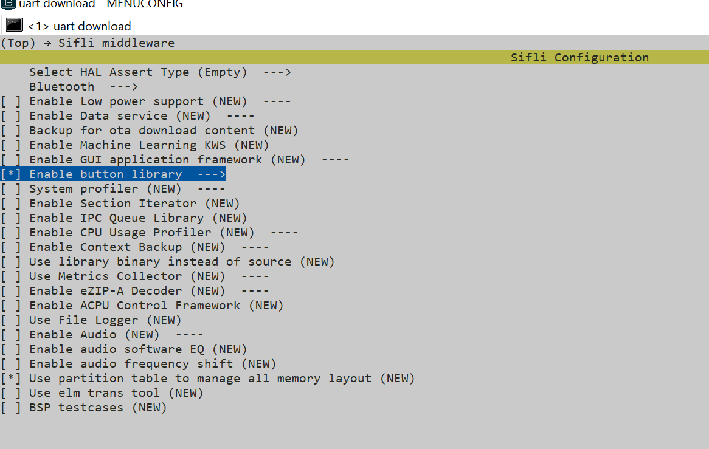
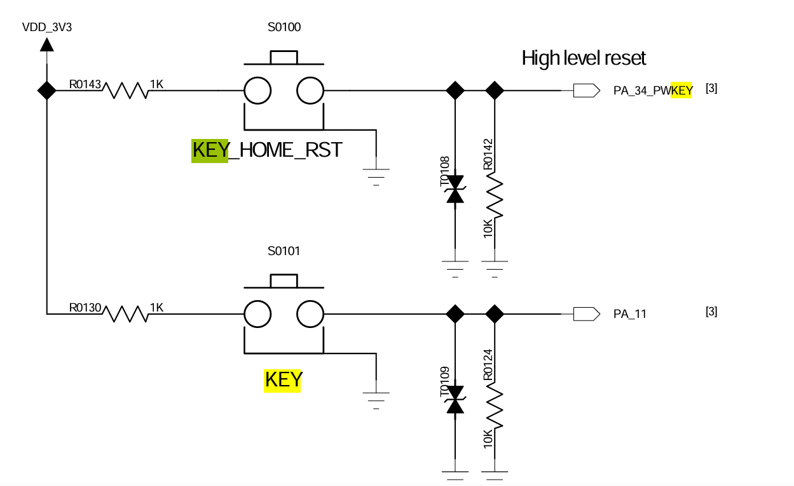
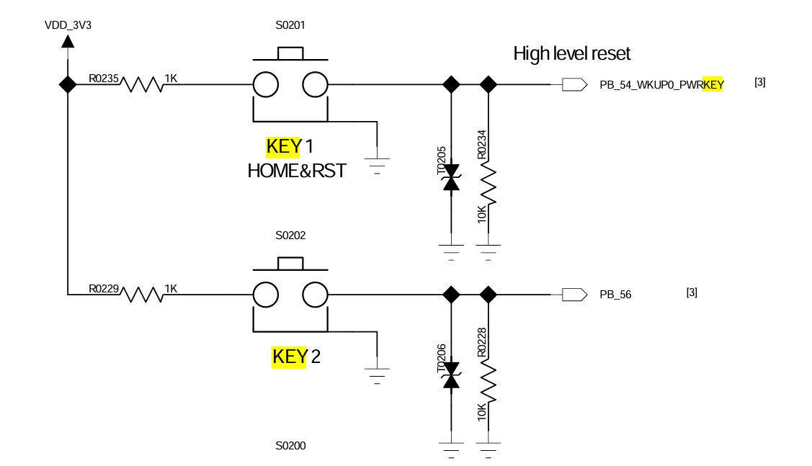
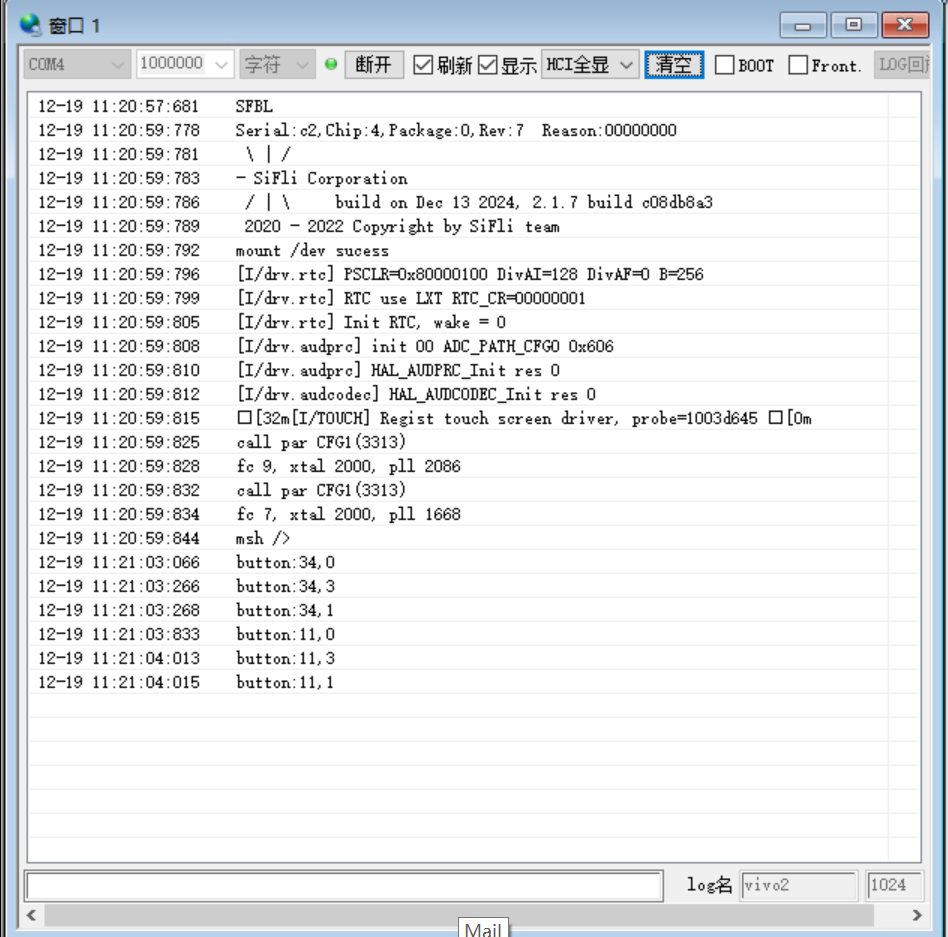

(example-button)=

# 按键
源码路径：example/misc/button
## 支持的平台
* sf32lb52-lcd_n16r8
* sf32lb58-lcd_n16r64n4


## 概述
按钮库使用引脚设备来检测各种按钮动作。 它使用一个计时器来处理去抖动，而另一个计时器来检测长按动作。

它支持以下操作
- 按下：按钮被按下
- 释放：按钮被释放
- 长按：按钮被按下并保持由 `BUTTON_ADV_ACTION_CHECK_DELAY` 指定的时间
- 点击：按钮被按下和释放，中间不会触发长按动作

用户可以注册每个按钮的处理程序以在发生任何操作时获得通知。 按钮活动状态是可配置的。
## 例程的使用
### 编译和烧录

切换到例程project目录，运行scons命令执行编译(board=版型)：
```
scons --board=sf32lb52-lcd_n16r8 -j8
```

运行`build_sf32lb52-lcd_n16r8_hcpu\uart_download.bat`，按提示选择端口即可进行下载：

```
build_sf32lb52-lcd_n16r8_hcpu\uart_download.bat

Uart Download

please input the serial port num:5
```

确认rtconfig.h中包含下面两个宏
支持的最大按键数和长按动作检测阈值由以下宏配置
```c
#define BUTTON_MAX_NUM 2
#define BUTTON_ADV_ACTION_CHECK_DELAY 3000
```
它们可以在 `SiFli Middleware->Enable button library` 下配置。 可以在编译界面输入`menuconfig`进入



## 使用按钮库
在下面的示例中，它首先初始化按钮，即将按钮与 pin 设备绑定并注册按钮动作处理程序。 然后启用按钮检测，即启用引脚 IRQ。
### 硬件连接
* 注意:587引脚分A,B组,B组管脚数要加上96

54+96->150\
56+96->152\

button52

button587



#### button配置流程
```c
static void button_event_handler(int32_t pin, button_action_t action)
{
    printf("button:%d,%d\n", pin, action);
}


button_cfg_t cfg;

#if defined(BSP_USING_BOARD_EM_LB525XXX)
    cfg.pin = 34;
#elif defined (BSP_USING_BOARD_EM_LB587XXX)
    cfg.pin = 152;
#endif
    cfg.active_state = BUTTON_ACTIVE_HIGH;
    cfg.mode = PIN_MODE_INPUT;
    cfg.button_handler = button_event_handler;
    int32_t id = button_init(&cfg);
    RT_ASSERT(id >= 0);
    RT_ASSERT(SF_EOK == button_enable(id));


#if defined(BSP_USING_BOARD_EM_LB525XXX)
    cfg.pin = 11;
#elif defined (BSP_USING_BOARD_EM_LB587XXX)
    cfg.pin = 150;
#endif
    cfg.active_state = BUTTON_ACTIVE_HIGH;
    cfg.mode = PIN_MODE_INPUT;
    cfg.button_handler = button_event_handler;
    id = button_init(&cfg);
    RT_ASSERT(id >= 0);
    RT_ASSERT(SF_EOK == button_enable(id));
```
#### 按键引脚参数修改

```c
#if defined(BSP_USING_BOARD_EM_LB525XXX)
    HAL_PIN_Set(PAD_PA34, GPIO_A34, PIN_PULLDOWN, 1);
    HAL_PIN_Set(PAD_PA11, GPIO_A11, PIN_PULLDOWN, 1);
#elif defined (BSP_USING_BOARD_EM_LB587XXX)
    HAL_PIN_Set(PAD_PB56, GPIO_B56, PIN_PULLDOWN, 1);
    HAL_PIN_Set(PAD_PB54, GPIO_B54, PIN_PULLDOWN, 1);
#endif

```

#### 例程输出结果展示:

* log输出:

```c
button:34,0
button:34,3
button:34,1
button:11,0
button:11,3
button:11,1
```

* 0,1,2,3状态的action代表的含义：
```c
    action:
    BUTTON_PRESSED  = 0,    Indicates that a button is pressed
    BUTTON_RELEASED = 1,    Indicates that a button is released
    BUTTON_LONG_PRESSED = 2, Indicates that a button is long released
    BUTTON_CLICKED  = 3,     Indicates that a button is clicked
```
**注意**: 
1. 中断处理函数可以在startup_bf0_hcpu.S中查看
2.  HAL_PIN_Set 最后一个参数为hcpu/lcpu选择, 1:选择hcpu,0:选择lcpu 

## 异常诊断
按键按下没有预期打印结果，可以从以下方面进行故障排除：
* 硬件连接是否正常
* 管脚配置（尤其是管脚的模式配置）是否正确 


## 更新记录
|版本 |日期   |发布说明 |
|:---|:---|:---|
|0.0.1 |10/2024 |初始版本 |
|0.0.2 |12/2024 |2.0 |
```
