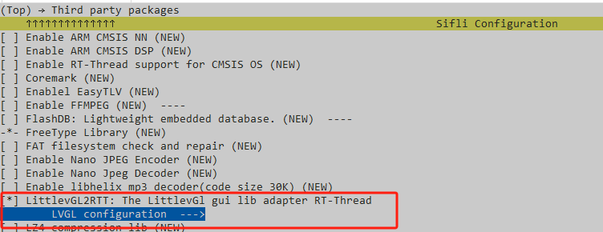
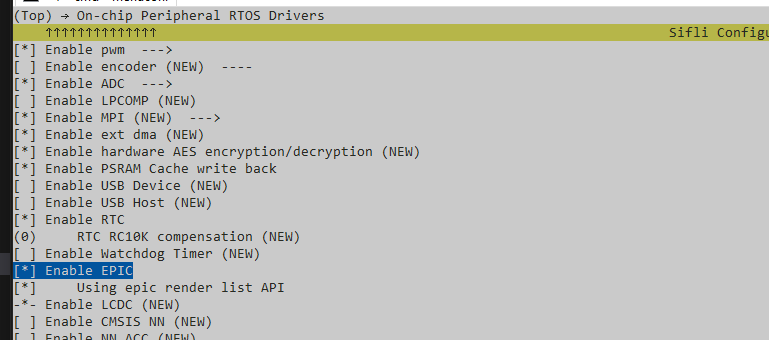
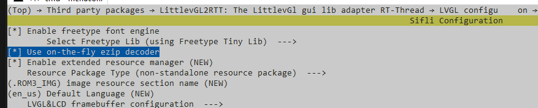

# AGif示例

源码路径：example/multimedia/agif/lvgl

## 支持的平台
<!-- 支持哪些板子和芯片平台 -->
+ eh-lb525

## 概述
<!-- 例程简介 -->
本例程包含两个带gif动画的表盘，用于示例基于agif + lvgl的动画实现，包含：
+ .gif通过eZIP.exe转成.c：
    - 放置位置：`src/resource/images/common/gif/`
    - 资源处理：`src/resource/images/SConscript`会对上述路径下的.gif进行编译，编译生成的.c可在`project/build_xxx/src/resource/images/common/gif`路径中查看。
    ```{tip}
    资源也可以手动调用`/tools/png2ezip/eZIP.exe`处理，命令格式可以通过运行eZIP.exe查看帮助。
    ```
+ gif显示
    - `src/gui_apps/clock/app_clock_agif.c`:
        * 资源声明：
        ```c
        /* Image decalration */
        LV_IMG_DECLARE(agif_icon);
        ```
        * gif控件创建和配置：
        ```c
        /* Create agif. */
        lv_color_t bg_color;
        p_clk_agif->gif = lv_gif_dec_create(parent, LV_EXT_IMG_GET(agif_icon), &bg_color, LV_COLOR_DEPTH);
        RT_ASSERT(p_clk_agif->gif);
        lv_obj_align(p_clk_agif->gif, LV_ALIGN_CENTER, 0, 0);

        /* loop is enabled by default. */
        lv_gif_dec_loop(p_clk_agif->gif, 1, 16);
        /* This callback function is executed at the end of GIF playback. */
        lv_gif_dec_end_cb_register(p_clk_agif->gif, agif_loop_end_func);
        ```
        * gif刷新暂停、恢复：
        ```c
        static rt_int32_t resume_callback(void)
        {
            /* Resume gif animation refresh */
            lv_gif_dec_task_resume(p_clk_agif->gif);
            return RT_EOK;
        }

        static rt_int32_t pause_callback(void)
        {
            /* Pause gif animation refresh */
            lv_gif_dec_task_pause(p_clk_agif->gif, 0);
            return RT_EOK;
        }
        ```
        * gif销毁
        ```c
        /* Release gif context. */
        lv_gif_dec_destroy(p_clk_agif->gif);
        p_clk_agif->gif = NULL;
        ```
    - `src/gui_apps/clock/app_clock_agif_2.c`:  
        `lv_gif_dec_create`会自动创建lv timer用于gif周期刷新，此处示例是停掉（`lv_gif_dec_task_pause`）自动创建的lv timer，外部创建lv timer进行刷新。刷新代码如下：
        ```c
        static void agif_refresh_timer_cb(struct _lv_timer_t * t)
        {
            /* Next frame. */
            int ret = lv_gif_dec_next_frame(p_clk_agif->gif);

            /* if ret == 0, it means that reach the last frame. */
            if (0 == ret)
            {
                /* Playback complete. */
                agif_loop_end_func();
                /* Replay it. */
                lv_gif_dec_restart(p_clk_agif->gif);
            }
        }
        ```


## 例程的使用
<!-- 说明如何使用例程，比如连接哪些硬件管脚观察波形，编译和烧写可以引用相关文档。
对于rt_device的例程，还需要把本例程用到的配置开关列出来，比如PWM例程用到了PWM1，需要在onchip菜单里使能PWM1 -->

### 硬件需求
运行该例程前，需要准备：
+ 一块本例程支持的开发板（[支持的平台](quick_start)）。


### menuconfig配置

1. 使能LVGL：  

2. 使能EPIC/EZIP：  


3. 根据使用的LCD配置屏驱。  

### 编译和烧录
切换到例程project目录，运行scons命令执行编译：
```c
> scons --board=eh-lb525 -j32
```
切换到例程`project/build_xx`目录，运行`uart_download.bat`，按提示选择端口即可进行下载：
```c
$ ./uart_download.bat

     Uart Download

please input the serial port num:5
```
关于编译、下载的详细步骤，请参考[快速上手](quick_start)的相关介绍。

## 例程的预期结果
<!-- 说明例程运行结果，比如哪几个灯会亮，会打印哪些log，以便用户判断例程是否正常运行，运行结果可以结合代码分步骤说明 -->
例程启动后：
+ 默认进入到`agif`表盘，`agif_icon.gif`循环刷新显示。
+ 左右滑动可以在`aigf`和`agif02`表盘中切换。
+ `agif.h`中也有提供一些其它控制API，可以基于例程修改看效果。

## 异常诊断

+ 编译报错，gif资源找不到：可如`概述`中所述，确认gif的.c是否正常生成。

## 参考文档
<!-- 对于rt_device的示例，rt-thread官网文档提供的较详细说明，可以在这里添加网页链接，例如，参考RT-Thread的[RTC文档](https://www.rt-thread.org/document/site/#/rt-thread-version/rt-thread-standard/programming-manual/device/rtc/rtc) -->

## 更新记录
|版本 |日期   |发布说明 |
|:---|:---|:---|
|0.0.1 |05/2025 |初始版本 |
| | | |
| | | |
