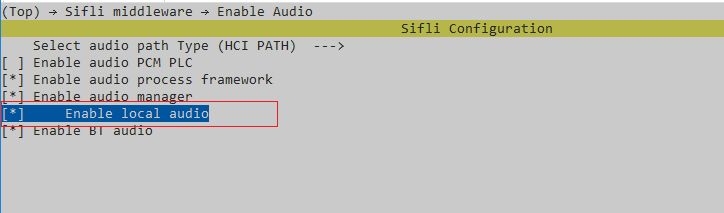

# Local music示例

源码路径：example/multimedia/audio/local_music

## 支持的平台
<!-- 支持哪些板子和芯片平台 -->
+ em-lb525
+ eh-lb525

## 概述
<!-- 例程简介 -->
本例程演示本地音乐播放，包含：
+ 预置一首wav音频文件在root分区。
+ 播放预置的wav文件。


## 例程的使用
<!-- 说明如何使用例程，比如连接哪些硬件管脚观察波形，编译和烧写可以引用相关文档。
对于rt_device的例程，还需要把本例程用到的配置开关列出来，比如PWM例程用到了PWM1，需要在onchip菜单里使能PWM1 -->

### 硬件需求
运行该例程前，需要准备：
+ 一块本例程支持的开发板（[支持的平台](quick_start)）。
+ 喇叭。

### menuconfig配置

1. 本例程需要读写文件，所以需要用到文件系统，配置`FAT`文件系统：


     ```{tip}
     mnt_init 中mount root分区。
     ```
2. 使能AUDIO CODEC 和 AUDIO PROC：

3. 使能AUDIO(`AUDIO`)：

4. 使能AUDIO MANAGER.(`AUDIO_USING_MANAGER`)

5. (`AUDIO_LOCAL_MUSIC`)

6. 预置音频文件(也支持MP3)，放到如下\disk\目录下即可预置下载：  
* 音频文件在multimedia/audio/local_music/disk下
### 编译和烧录
切换到例程project目录，运行scons命令执行编译：
```c
> scons --board=eh-lb525 -j32
```
切换到例程`project/build_xx`目录，运行`uart_download.bat`，按提示选择端口即可进行下载：
```c
$ ./uart_download.bat

     Uart Download

please input the serial port num:5
```
关于编译、下载的详细步骤，请参考[快速上手](quick_start)的相关介绍。

## 例程的预期结果
<!-- 说明例程运行结果，比如哪几个灯会亮，会打印哪些log，以便用户判断例程是否正常运行，运行结果可以结合代码分步骤说明 -->
例程启动后：
播放一次预置的16k.wav音频文件。预期正常播放完成。

```{tip}
如果需要播放MP3文件，可以预置一首MP3文件(需要注意音频文件大小是否超出文件系统容量)，配置播放路径即可：
```c
#define MUSIC_FILE_PATH "/Cloudy_Day.mp3"
```
```

## 异常诊断


## 参考文档
<!-- 对于rt_device的示例，rt-thread官网文档提供的较详细说明，可以在这里添加网页链接，例如，参考RT-Thread的[RTC文档](https://www.rt-thread.org/document/site/#/rt-thread-version/rt-thread-standard/programming-manual/device/rtc/rtc) -->

## 更新记录
|版本 |日期   |发布说明 |
|:---|:---|:---|
|0.0.1 |10/2024 |初始版本 |
| | | |
| | | |
