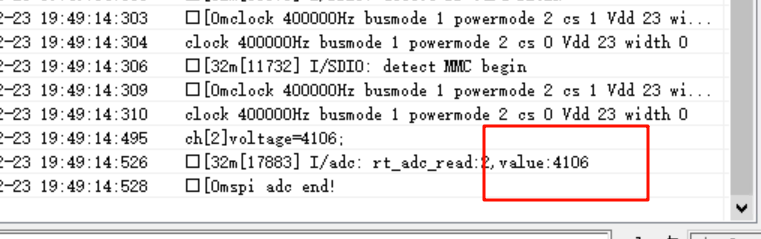

# ADC_battery示例
源码路径：example/rt_device/adc/adc_battery
## 支持的平台
例程可以运行在以下开发板.
* sf32lb52-lcd_n16r8

## 概述
* 在RT-Thread操作系统下，adc单路采样读取vbat电池电压

## 例程的使用
### 编译和烧录
* 此例程中用到了adc，在采用RT-Thread操作系统，adc外设会虚拟成了一个rt_device来进行读写操作，此时需要确认所在路径下`rtconfig.h`文件中是否包含了下面2个宏：

```c
#define BSP_USING_ADC 1
#define BSP_USING_ADC1 1
#define RT_USING_ADC 1
```

只有包含了上面三个宏，在`sifli_adc_init`函数中才会通过`rt_hw_adc_register`函数注册`"bat1"`这个`rt_device`，后面该设备才能`rt_device_find`和`rt_device_control`成功。<br>
**注意**<br>
SiFli系列MCU支持定时器中断来触发多通道同时采样的，可以参考宏`BSP_GPADC_SUPPORT_MULTI_CH_SAMPLING`内定义和芯片用户手册
* 如果缺失上面三个宏，就需要通过`menuconfig`如下命令进行打开  

> menuconfig --board=sf32lb52-lcd_n16r8       525开发板

> menuconfig --board=sf32lb52-lcd_52d       52d开发板


如下图，选择GPADC1,保存并退出menuconfig，查看`rtconfig.h`宏是否生成

* 切换到例程project目录，运行scons命令执行编译：

```
scons --board=em_lb525 -j8
```

* 运行`build_sf32lb52-lcd_n16r8_hcpu\uart_download.bat`，按提示选择端口即可进行下载：

```
build_sf32lb52-lcd_52d_hcpu\uart_download.bat

Uart Download

please input the serial port num:5
```

#### 例程输出结果展示:
* 接入电池前读取的电压log



* 接入电池后读取的电压log


log中打印value值原始寄存器值，Voltage是转换后的mV电压


#### ADC配置流程

* 设置电池Vbat接口对应的通道7


**注意**  
1. ADC的输入口为固定的IO口，如下图:<br>52芯片ADC CH1-7分布，对应软件配置的Channel0-6,最后一路CH8(Channel 7)，内部已经连接到电池Vbat检测，未映射到外部IO<br>

1. `HAL_PIN_Set` `HAL_PIN_Set_Analog` 最后一个参数为hcpu/lcpu选择, 1：选择hcpu，0：选择lcpu<br>


* 先后`rt_device_find`,`rt_device_control`分别查找、配置`bat1`设备接口函数，
`rt_adc_ops`中没有定义`rt_device_open`，不执行`rt_device_open`，并不会影响adc功能，只是会影响`list_device`中`bat1`是否显示打开状态
```c
#define ADC_DEV_NAME        "bat1"      /* ADC1的设备，在rt_hw_adc_register函数内已注册，不能随便修改 */
#define ADC_DEV_CHANNEL     7           /* ADC通道选择 vbat固定为CH8(Channel 7) */
//#define REFER_VOLTAGE       330         /* ADC参考电压，52芯片可以选择1v8或者3v3，目前接口没有开放，固定为3V3 */
static rt_device_t s_adc_dev; /* 定义一个rt_device设备 */
static rt_adc_cmd_read_arg_t read_arg;

void adc_example(void)
{
    rt_err_t r;

    /* 把PA28配置为模拟输入IO，并且不能使能内部上下拉 */
    //HAL_PIN_Set_Analog(PAD_PA28, 1);

    /* 找到bat1设备，如果没有打开 BSP_USING_ADC1，会找不到设备，出现死机 */
    s_adc_dev = rt_device_find(ADC_DEV_NAME);

    /* 配置采样通道为 channel 0*/
    read_arg.channel = ADC_DEV_CHANNEL;

    r = rt_adc_enable((rt_adc_device_t)s_adc_dev, read_arg.channel);
    
    /* 这个接口会调用 sifli_adc_control 函数,只读取一次,用户可以自行对数据进行处理 */   
    r = rt_device_control(s_adc_dev, RT_ADC_CMD_READ, &read_arg.channel);
    /* log打印的value值，单位为0.1mV，20846等于2084.6mV或者2.0846V  */
    LOG_I("adc channel:%d,value:%d",read_arg.channel,read_arg.value); /* (0.1mV), 20846 is 2084.6mV or 2.0846V */

    /* 这里演示另一种方式进行ADC采样，这个接口会调用到sifli_get_adc_value函数,会进行默认22次平均  */
    rt_uint32_t value = rt_adc_read((rt_adc_device_t)s_adc_dev, ADC_DEV_CHANNEL);
    /* log打印的value值，单位为0.1mV，20700等于2070.0mV或者2.0700V  */
    LOG_I("rt_adc_read:%d,value:%d",read_arg.channel,value); /* (0.1mV), 20700 is 2070mV or 2.070V */

    /* 采样完成后，关闭 adc */
    rt_adc_disable((rt_adc_device_t)s_adc_dev, read_arg.channel);

}
```


## 异常诊断
* 程序运行死机，log如下
```c
   Start adc demo!
   Assertion failed at function:rt_adc_enable, line number:144 ,(dev)
   Previous ISR enable 0
```
原因：  
`BSP_USING_ADC1`没有定义，导致`rt_hw_adc_register`函数没有注册`"bat1"`，`rt_device_find`该设备时Assert死机  
确保`rtconfig.h`文件中包含了下面3个宏：
```c
#define BSP_USING_ADC 1
#define BSP_USING_ADC1 1
#define RT_USING_ADC 1
```
* ADC采样的电压值不对

1. `list_device`命令查看`bat1`设备是不是存在，`adc`驱动在没有`rt_device_open`打开`bat1`设备情况下，不影响adc功能
```
    msh />
 TX:list_device
    list_device
    device           type         ref count
    -------- -------------------- ----------
    audcodec Sound Device         0       
    audprc   Sound Device         0       
    rtc      RTC                  0       
    pwm3     Miscellaneous Device 0       
    pwm2     Miscellaneous Device 0       
    touch    Graphic Device       0       
    lcdlight Character Device     0       
    lcd      Graphic Device       0       
    bat1     Miscellaneous Device 0       
    i2c4     I2C Bus              0       
    i2c1     I2C Bus              0       
    spi1     SPI Bus              0       
    lptim1   Timer Device         0       
    btim1    Timer Device         0       
    gptim1   Timer Device         0       
    uart2    Character Device     0       
    uart1    Character Device     2       
    pin      Miscellaneous Device 0       
    msh />
```
2. 检查ADC硬件是否连接正确，ADC采样的通道为固定IO口，不能任意指定，具体CH0-7为哪个IO，参照芯片手册  
3. ADC输入电压范围为0V - 参考电压（52默认为3v3），不能超出输入范围  
* ADC精确度不够
1. ADC校准参数是否获取和使用
2. 分压电阻的精度是否达到要求
3. ADC参考电压是否稳定和是否有过大纹波(具体参考ADC电压参考芯片手册) 


## 参考文档
* EH-SF32LB52X_Pin_config_V1.3.0_20231110.xlsx
* DS0052-SF32LB52x-芯片技术规格书 V0p3.pdf
* [RT-Thread官网](https://www.rt-thread.org/document/site/#/rt-thread-version/rt-thread-standard/programming-manual/device/adc/adc)<br>
https://www.rt-thread.org/document/site/#/rt-thread-version/rt-thread-standard/programming-manual/device/adc/adc
## 更新记录
|版本 |日期   |发布说明 |
|:---|:---|:---|
|0.0.1 |11/2024 |初始版本 |
| | | |
