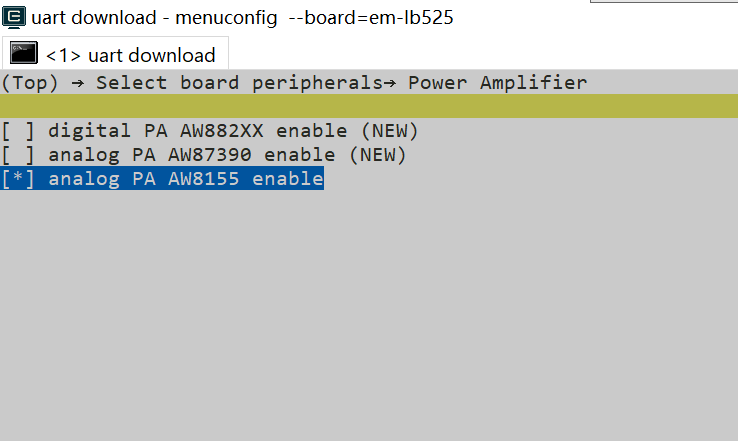

# Audprc示例

源码路径：example/rt_device/audprc

## 支持的平台
<!-- 支持哪些板子和芯片平台 -->
+ eh-lb525
+ sf32lb52-lcd_n16r8
+ ec-lb587

## 概述
<!-- 例程简介 -->
本例程中，Audprc配合Audcodec使用，包含：
+ mic录音。
+ 通过speaker播放录音。
+ Loopback（边录边播）。


## 例程的使用
<!-- 说明如何使用例程，比如连接哪些硬件管脚观察波形，编译和烧写可以引用相关文档。
对于rt_device的例程，还需要把本例程用到的配置开关列出来，比如PWM例程用到了PWM1，需要在onchip菜单里使能PWM1 -->

### 硬件需求
运行该例程前，需要准备：
+ 一块本例程支持的开发板（[支持的平台](quick_start)）。
+ 喇叭。

### menuconfig配置

1. 使能AUDIO CODEC 和 AUDIO PROC：


2. 例程用到了FINSH功能，需要使能`RT_USING_FINSH`。
3. 使能外设（PA，根据实际板子型号对应选择）

### 编译和烧录
切换到例程project目录，运行scons命令执行编译：
```c
> scons --board=eh-lb525 -j32
```
切换到例程`project/build_xx`目录，运行`uart_download.bat`，按提示选择端口即可进行下载：
```c
$ ./uart_download.bat

     Uart Download

please input the serial port num:5
```
关于编译、下载的详细步骤，请参考[快速上手](quick_start)的相关介绍。

## 例程的预期结果
<!-- 说明例程运行结果，比如哪几个灯会亮，会打印哪些log，以便用户判断例程是否正常运行，运行结果可以结合代码分步骤说明 -->
本例程中通过FINSH命令来操作录音和播放：
用途 | 命令 | 示例 |备注
|---|--|--|--|
录音|audprc rx [channels:1/2] [采样率] [采样位数]|`audprc rx 1 16000 16` |录音存放到ram buffer（录音满1M后自动停止录音）
播放录音|audprc tx [channels:1/2] [采样率] [采样位数]|`audprc tx 1 16000 16`| 播放数据来ram buffer（需要先录音）
Loopback|audprc rxtx [rx channels:1/2] [rx采样率] [rx采样位数] [tx channels:1/2] [tx采样率] [tx采样位数]|`audprc rxtx 1 16000 16 1 16000 16`|边录（mic）边播放（speaker）（执行录音、播放命令前，如正在运行Loopback，需先停止。）
停止Loopback|audprc txrxstop|`audprc txrxstop`|停止Loopback

串口打印如下：
```
// 输入命令，开始录音
01-23 11:04:27:099 TX:audprc rx 1 16000 16
01-23 11:04:27:105    audprc_rx_entry
01-23 11:04:27:136    codec input parameter:sub_type=4 channels 1, rate 16000, bits 16mic input:rx channel 0, channels 1, rate 16000, bitwidth 16get_mic_volume = 0db
01-23 11:04:27:141    get_mic_volume = 0db
01-23 11:04:27:143    start_rx
01-23 11:04:27:147    [I/drv.audcodec] pll config state:1, samplerate:0 


// 录音ram buffer满1M，停止录音
01-23 11:04:59:936    Record finished.
01-23 11:04:59:939    RX finished.
01-23 11:04:59:941    stop_rx
01-23 11:04:59:943    [I/drv.audcodec] bf0_audio_stop 0x401
01-23 11:04:59:954    [I/drv.audcodec] audcodec close adc
01-23 11:04:59:957    [I/drv.audcodec] bf0_audio_stop 0x401 done
01-23 11:04:59:958    [I/drv.audprc] bf0_audio_stop 0x1001
01-23 11:04:59:960    [I/drv.audprc] audprc close adc/dac
01-23 11:04:59:962    [I/drv.audprc] bf0_audio_stop 0x1001 done


// 输入命令，播放录音文件
01-23 11:05:38:083 TX:audprc tx 1 16000 16
01-23 11:05:38:096    audprc_tx_entry
01-23 11:05:38:097    prc_codec : sub_type=1 channel 1, samplerate 16000, bits 16speaker OUTPUTSRC channel=1 in_rate=16000 out_rate=16000speaker select=0x5050 mixer=0x5150tx[0]: sub_type 0, ch 1, samrate 16000, bits 16
01-23 11:05:38:099    init volume=-18[I/drv.audcodec] dac set volume: prc=0 codec=-18
01-23 11:05:38:100    start_tx
01-23 11:05:38:102    [I/drv.audcodec] codec dac mute set:1
01-23 11:05:38:103    [I/drv.audcodec] pll config state:1, samplerate:0 
01-23 11:05:38:105    [I/drv.audprc] samplerate = 16000, select voice eq
01-23 11:05:38:106    [I/drv.audprc] -----tx dma size = 320
01-23 11:05:38:108    sifli_aw8155 to do power handle 
01-23 11:05:38:110    sifli_aw8155_start,mode:1 10
01-23 11:05:38:126    [I/drv.audcodec] codec dac mute set:0


// 播放完成
01-23 11:06:10:858    Play finished.
01-23 11:06:10:861    Play finished.
01-23 11:06:10:863    stop_tx
01-23 11:06:10:864    [I/drv.audcodec] bf0_audio_stop 0x100
01-23 11:06:10:866    [I/drv.audcodec] audcodec close dac
01-23 11:06:10:867    [I/drv.audcodec] bf0_audio_stop 0x100 done
01-23 11:06:10:869    [I/drv.audprc] bf0_audio_stop 0x100
01-23 11:06:10:870    [I/drv.audprc] audprc close adc/dac
01-23 11:06:10:871    [I/drv.audprc] bf0_audio_stop 0x100 done
01-23 11:06:10:875    sifli_aw8155_stop 


// 输入命令，开始loopback
01-23 11:06:14:524 TX:audprc txrx 1 16000 16 1 16000 16
01-23 11:06:14:533    example_audprc_tx_rx
01-23 11:06:14:540    audprc_rx_tx_entry
01-23 11:06:14:569    codec input parameter:sub_type=4 channels 1, rate 16000, bits 16mic input:rx channel 0, channels 1, rate 16000, bitwidth 16get_mic_volume = 0db
01-23 11:06:14:571    get_mic_volume = 0db
01-23 11:06:14:573    prc_codec : sub_type=1 channel 1, samplerate 16000, bits 16speaker OUTPUTSRC channel=1 in_rate=16000 out_rate=16000speaker select=0x5050 mixer=0x5150tx[0]: sub_type 0, ch 1, samrate 16000, bits 16
01-23 11:06:14:575    init volume=-18[I/drv.audcodec] dac set volume: prc=0 codec=-18
01-23 11:06:14:576    start_txrx
01-23 11:06:14:578    [I/drv.audcodec] codec dac mute set:1
01-23 11:06:14:579    [I/drv.audcodec] pll config state:1, samplerate:0 
01-23 11:06:14:594    [I/drv.audprc] samplerate = 16000, select voice eq
01-23 11:06:14:596    [I/drv.audprc] -----tx dma size = 320
01-23 11:06:14:598    sifli_aw8155 to do power handle 
01-23 11:06:14:598    sifli_aw8155_start,mode:1 10
01-23 11:06:14:623    [I/drv.audcodec] codec dac mute set:0


// 输入命令，停止loopback
01-23 11:06:21:132 TX:audprc txrxstop
01-23 11:06:21:141    example_audprc_tx_rx_stop
01-23 11:06:21:144    [I/drv.audcodec] bf0_audio_stop 0x502
01-23 11:06:21:146    [I/drv.audcodec] audcodec close dac
01-23 11:06:21:147    [I/drv.audcodec] audcodec close adc
01-23 11:06:21:149    [I/drv.audcodec] bf0_audio_stop 0x502 done
01-23 11:06:21:150    [I/drv.audprc] bf0_audio_stop 0x1102
01-23 11:06:21:152    [I/drv.audprc] audprc close adc/dac
01-23 11:06:21:153    [I/drv.audprc] bf0_audio_stop 0x1102 done
01-23 11:06:21:156    sifli_aw8155_stop 

```

## 异常诊断


## 参考文档
<!-- 对于rt_device的示例，rt-thread官网文档提供的较详细说明，可以在这里添加网页链接，例如，参考RT-Thread的[RTC文档](https://www.rt-thread.org/document/site/#/rt-thread-version/rt-thread-standard/programming-manual/device/rtc/rtc) -->

## 更新记录
|版本 |日期   |发布说明 |
|:---|:---|:---|
|0.0.1 |12/2024 |初始版本 |
| | | |
| | | |
