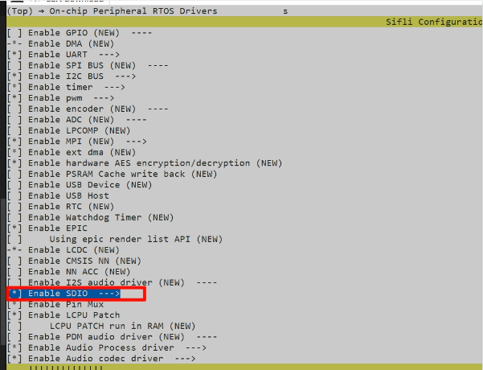
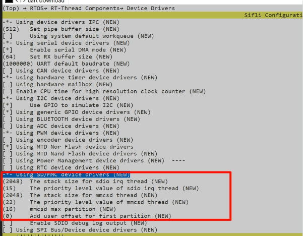
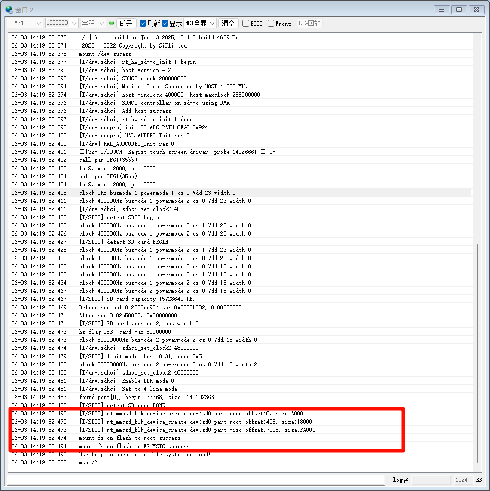
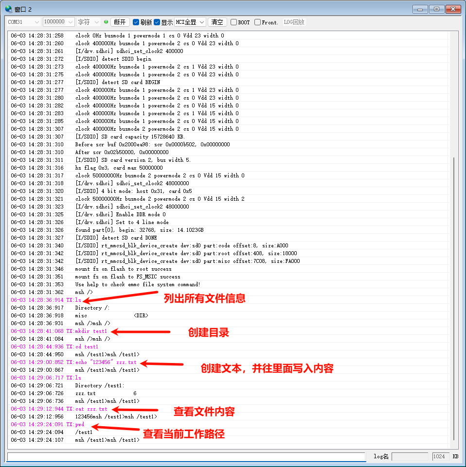
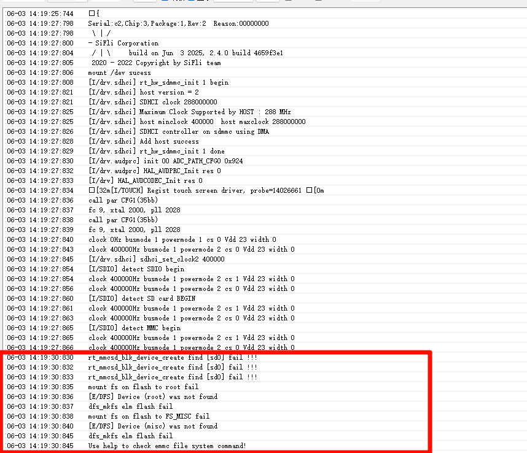

# 在TF卡上挂载文件系统
源码路径:example/rt_device/emmc
## 概述
例程展示了在TF卡上创建分区，在分区上挂载elm文件系统，可对文件系统进行一系列操作
## 支持平台
* sf32lb56-lcd_a128r12n1
* sf32lb56-lcd_n16r12n1
* sf32lb58-lcd_n16r64n4
* sf32lb58-lcd_a128r32n1_dsi

## 使用指南
    emmc应用会在板子的TF卡上创建一个分区，在分区中进行文件系统的挂载，文件系统采用FAT格式，在UART Console可以进行调用常用的文件命令。
```
df               - Disk free//查看文件系统磁盘空间的使用情况
mountfs          - Mount device to file system//将设备挂载到文件系统
mkfs             - Format disk with file system//用文件系统格式化磁盘
mkdir            - Create the DIRECTORY.//创建目录
pwd              - Print the name of the current working directory.//打印当前工作路径
cd               - Change the shell working directory.//切换目录
rm               - Remove(unlink) the FILE(s).//删除文件和目录
cat              - Concatenate FILE(s)//创建文件并写入内容
mv               - Rename SOURCE to DEST.//修改文件名
cp               - Copy SOURCE to DEST.//复制一个文件内容到内容到另一个文件
ls               - List information about the FILEs.//列出所有文件信息
```
## menuconfig配置
```
menuconfig --board=56devkit_lcd(board=后面跟着的是板子名称)
```
1、打开SDIO


2、使能和配置sd device



### 编译和烧入
按照以下步骤，可以完成编译和烧录。
```
scons --board=56_devkit_lcd -j8
build_56_board_lcd_hcpu\download.bat(uart_download.bat)//可以通过jlink和串口两种烧入方式
```

## 实验结果

1、挂载成功log（如果看到输出打印log中有图片里面框中的那些，就说明挂载成功）


2、进行创建文件的操作，首先输入ls查看文件系统中原有的文件或目录，在使用mkdir XXX进行创建，cd到创建好的目录下，进行echo命令出创建文本，并且写入内容，在使用cat命令查看创建好的文件内容，最后使用pwd命令查看一下当前的工作路径



## 未能按预期完成的结果（log）


## 失败的原因和解决方法
1、如果log中显示如下,首先，检查是否插入了TF卡，其次检查上述中的menuconfig里面的SD是否打开，可以参考上面menuconfig的操作配置一下
```
rt_mmcsd_blk_device_create find [sd0] fail !!!
```

2、如果log中显示如下，请检查TF卡是否插入
```
[E/DFS] Device (root) was not found
[E/DFS] Device (misc) was not found
```
如果未能出现预期的log，可以从以下方面进行故障排除：
* 硬件连接是否正常
* 检查USB接口是否松动
* 检查USB线是否具备数据传输功能
* TF卡是否有用
