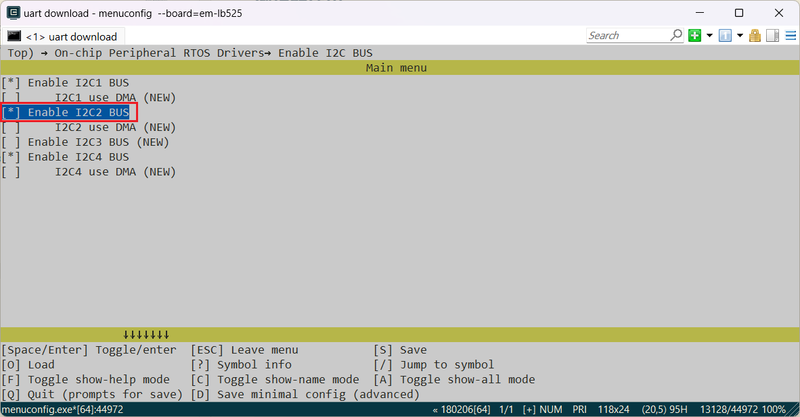
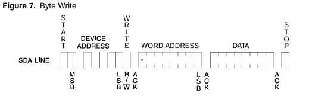
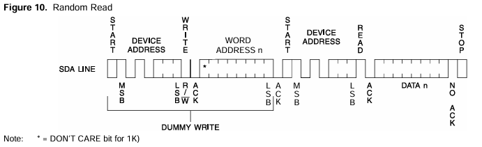
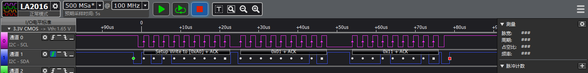
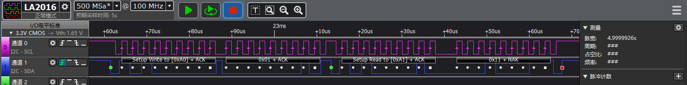

# I2C EEPROM示例
源码路径：example\rt_device\i2c\eeprom
## 支持的平台
例程可以运行在以下开发板.
* em-lb525
* em-lb587

## 概述
* 在RT-Thread操作系统下,通过对EEPROM芯片AT24CO8SC模块的读写操作，演示I2C的使用方法

## 例程的使用

### 硬件连接
AT24CO8SC的VCC,GND分别连接5v和GND供电\
AT24CO8SC的SDA,SCK分别按照下表，根据开发板型号进行连接

|开发板    |SDA管脚|SDA管脚名称|SCL管脚|SCL管脚名称|
|:---     |:---    |:---     |:---   |:---      |
|em-lb525 |3       |PA42     |5      |PA41      |
|em-lb587 |3       |PB29     |       |PB28      |

* 更详细的引脚定义请参考\
`[em-lb525]()`\
`[em-lb587]()`

* AT24C08SC


### 编译和烧录
* 此例程中用到了I2C2，在采用RT-Thread操作系统时，I2C2外设会虚拟成了一个rt_device来进行读写操作，此时需要确认工程所在路径下`rtconfig.h`文件中是否包含了下面3个宏：
```c
#define RT_USING_I2C 1
#define BSP_USING_I2C 1
#define BSP_USING_I2C2 1
```
只有包含了上面三个宏，在`rt_hw_i2c_init2`函数中才会通过`rt_i2c_bus_device_register`函数注册`"i2c2"`这个`rt_device`，后面该设备才能`rt_device_find`和`rt_device_open`成功。

如果缺失上面三个宏，就需要通过`menuconfig`如下命令进行打开
```c
menuconfig --board=em-lb525
```
如下图，选择I2C2，保存并退出menuconfig，查看`rtconfig.h`宏是否生成

#### SF525工程代码编译
切换到例程project目录，运行scons命令执行编译：

> scons --board=em-lb525 -j8

切换到例程`project/build_xx`目录，运行`uart_download.bat`，按提示选择端口即可进行下载：

> build_em-lb525_hcpu\uart_download.bat

>Uart Download

>please input the serial port num:5

#### SF587工程代码编译
切换到例程project目录，运行scons命令执行编译：

> scons --board=em-lb587 -j8

切换到例程`project/build_xx`目录，运行`download.bat`，程序通过JLink自动下载：

> build_em-lb587_hcpu\download.bat


### 例程输出结果展示:
* log输出:
```
   SFBL
   Serial:c2,Chip:4,Package:3,Rev:3  Reason:00000000
   \ | /
  - SiFli Corporation
   / | \     build on Dec  6 2024, 2.1.7 build 779fe6ee
   2020 - 2022 Copyright by SiFli team
   mount /dev sucess
   [32m][2009] I/drv.rtc: PSCLR=0x80000100 DivAI=128 DivAF=0 B=256
   [0m][32m][2036] I/drv.rtc: RTC use LXT RTC_CR=00000001
   [0m][32m][2058] I/drv.rtc: Init RTC, wake = 0
   [0m][32m][2220] I/drv.audprc: init 00 ADC_PATH_CFG0 0x606
   [0m][32m][2242] I/drv.audprc: HAL_AUDPRC_Init res 0
   [0m][32m][2264] I/drv.audcodec: HAL_AUDCODEC_Init res 0
   [0m][32m][2286] I/TOUCH: Regist touch screen driver, probe=1203b8b1 
   [0m]call par CFG1(3313)
   fc 9, xtal 2000, pll 2123
   call par CFG1(3313)
   fc 7, xtal 2000, pll 1698
   main!!
   [2448] D/eeprom_i2c: Start i2c eeprom rtt demo!
   i2c_bus:0x20007f50
   Find i2c bus device I2C2
   [2492] D/eeprom_i2c: i2c write reg:0x1,data:0x11,ret:1
   [2681] D/eeprom_i2c: i2c write reg:0x2,data:0x22,ret:1
   [2869] D/eeprom_i2c: i2c write reg:0x3,data:0x33,ret:1
   [3058] D/eeprom_i2c: i2c write reg:0x4,data:0x44,ret:1
   [3248] D/eeprom_i2c: i2c read reg:0x1,pdata:0x11,ret:1
   [3273] D/eeprom_i2c: i2c read reg:0x2,pdata:0x22,ret:1
   [3298] D/eeprom_i2c: i2c read reg:0x3,pdata:0x33,ret:1
   [3323] D/eeprom_i2c: i2c read reg:0x4,pdata:0x44,ret:1
   [3345] D/eeprom_i2c: i2c end!
   msh />
```
#### AT24C08SC芯片手册上要求的i2c读写波形
* i2c写的波形\

* i2c读的波形\

#### 逻辑分析仪抓取部分波形
* i2c写的波形

* i2c读的波形



#### I2C参数修改
* 见EEPROM_init函数内注释 
```c
unsigned char EEPROM_init(void)
{

    uint8_t slaveAddr = EEPROM_I2C_ADDRESS; // 7bit address of device
    HAL_StatusTypeDef ret;

    //1. pin mux
#ifdef SF32LB52X 
    HAL_PIN_Set(PAD_PA41, I2C2_SCL, PIN_PULLUP, 1); // i2c io select
    HAL_PIN_Set(PAD_PA42, I2C2_SDA, PIN_PULLUP, 1);
#elif defined(SF32LB58X)
    HAL_PIN_Set(PAD_PB28, I2C6_SCL, PIN_PULLUP, 1); // i2c io select
    HAL_PIN_Set(PAD_PB29, I2C6_SDA, PIN_PULLUP, 1);
#endif

    // 2. i2c init
    // find i2c2
#ifdef SF32LB52X 
    i2c_bus = rt_i2c_bus_device_find("i2c2");
#elif defined(SF32LB58X)
    i2c_bus = rt_i2c_bus_device_find("i2c6");
#endif

    rt_kprintf("i2c_bus:0x%x\n", i2c_bus);
    if (i2c_bus)
    {
        #ifdef SF32LB52X 
        rt_kprintf("Find i2c bus device I2C2\n");
        #elif defined(SF32LB58X)
        rt_kprintf("Find i2c bus device I2C6\n");
        #endif
        // open rt_device i2c2
        rt_device_open((rt_device_t)i2c_bus, RT_DEVICE_FLAG_RDWR);
        //rt_i2c_open(i2c_bus, RT_DEVICE_FLAG_RDWR);
        struct rt_i2c_configuration configuration =
        {
            .mode = 0,
            .addr = 0,
            .timeout = 500, //Waiting for timeout period (ms)
            .max_hz = 400000, //I2C rate (hz)
        };
        // config I2C parameter
        rt_i2c_configure(i2c_bus, &configuration);
    }
    else
    {
        #ifdef SF32LB52X 
        LOG_E("Can not found i2c bus I2C2, init fail\n");
        #elif defined(SF32LB58X)
        LOG_E("Can not found i2c bus I2C6, init fail\n");
        #endif
        return -1;
    }
    return 0;
}
```
* 在打开rt_device设备时，如果采用rt_i2c_open函数，功能上没有发现问题，但是`list_device`时`i2c2`不会显示open状态,
```c
rt_i2c_open(i2c_bus, RT_DEVICE_FLAG_RDWR);
```
```c
    msh />
 TX:list_device
    list_device
    device           type         ref count
    -------- -------------------- ----------
    audcodec Sound Device         0       
    audprc   Sound Device         0       
    rtc      RTC                  0       
    pwm3     Miscellaneous Device 0       
    touch    Graphic Device       0       
    lcdlight Character Device     0       
    lcd      Graphic Device       0       
    i2c4     I2C Bus              0       
    i2c2     I2C Bus              0       
    i2c1     I2C Bus              0       
    lptim1   Timer Device         0       
    btim1    Timer Device         0       
    uart1    Character Device     2       
    pin      Miscellaneous Device 0       
    msh />
```
采用`rt_device_open`时
```c
rt_device_open((rt_device_t)i2c_bus, RT_DEVICE_FLAG_RDWR);
```
```c
    msh />
 TX:list_device
    list_device
    device           type         ref count
    -------- -------------------- ----------
    audcodec Sound Device         0       
    audprc   Sound Device         0       
    rtc      RTC                  0       
    pwm3     Miscellaneous Device 0       
    touch    Graphic Device       0       
    lcdlight Character Device     0       
    lcd      Graphic Device       0       
    i2c4     I2C Bus              0       
    i2c2     I2C Bus              1       
    i2c1     I2C Bus              0       
    lptim1   Timer Device         0       
    btim1    Timer Device         0       
    uart1    Character Device     2       
    pin      Miscellaneous Device 0  
```
* 这里只是演示了I2C的一种用法，在I2C外设要求的波形跟示例不一致时，可以参考rt_i2c_transfer函数的用法。

**注意**: 
1. 除SF32LB55x芯片外，所有PA口都支持HCPU I2C的SDA、SCL功能，所有PB口都支持LCPU I2C的SDA、SCL功能
2. HCPU的PA口不能配置为LCPU的I2C实例使用，LCPU的PB口也不能配置为HCPU的I2C使用，
比如I2C5是LCPU的I2C实例，他的SCL和SDA管脚不能映射到PA口
3. HAL_PIN_Set 最后一个参数为hcpu/lcpu选择, 1:选择hcpu,0:选择lcpu 
## 异常诊断
* I2C无波形输出
1. `pin status 39`命令查看对应PA39，PA40的IO状态FUNC对不对，VAL电平应该是1
```
    msh />
 TX:pin status 39
    pin status 39
    [32m][215653658] I/TEST.GPIO: PIN 39, FUNC=4, VAL=1, DIG_IO_PU, GPIO_MODE_INPUT, irqhdr=/, arg=/
    [0m]
    msh />
    msh />
 TX:pin status 40
    pin status 40
    [32m][215753678] I/TEST.GPIO: PIN 40, FUNC=4, VAL=1, DIG_IO_PU, GPIO_MODE_INPUT, irqhdr=/, arg=/
    [0m]
    msh />
    msh />
```
2. 'list_device'命令查看'i2c2'设备是不是存在并且打开了
3. 检查IO配置和连接是否正确
* 连写失败，I2C波形正常，无应答信号
1. AT24C08SC写输入时需要至多5ms Write Cycle Time等待数据烧录 
```c
void EEPROM_test(void)
{
    unsigned char i = 0;

    for ( i = 0; i < 4; i++)
    {
        EEPROM_write_data(TEST_ADDR[i], TEST_DATA[i]);
        delayms(5); //5ms delay for AT240C8SC write time cycle
    }

    for ( i = 0; i < 4; i++)
    {
        EEPROM_read_data(TEST_ADDR[i], &RECEIVED);
    }
}
```
## 参考文档
* [AT24C08SC](./assets/at24c02sc.pdf)
## 更新记录
|版本 |日期   |发布说明 |
|:---|:---|:---|
|0.0.1 |10/2024 |初始版本 |
| | | |
