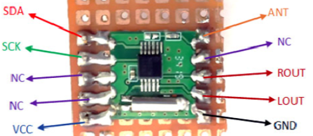
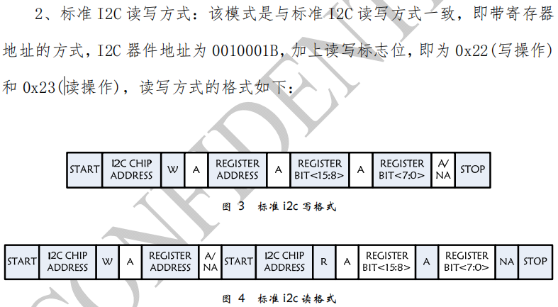
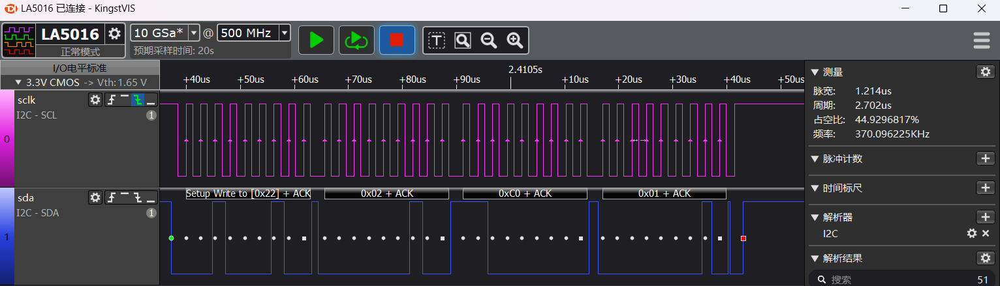
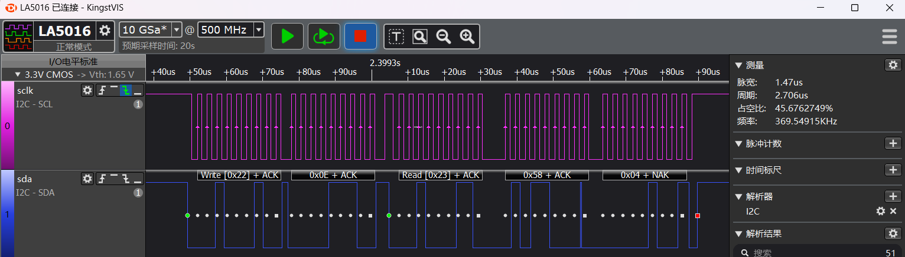

# I2C FM示例
源码路径：example\rt_device\i2c\fm
## 支持的平台
例程可以运行在以下开发板.
* em-lb520

## 概述
* 在RT-Thread操作系统下通过对RDA5802E FM模块的操作，演示I2C的使用方法

## 例程的使用
### 编译和烧录
* 此例程中用到了I2C2，在采用RT-Thread操作系统时，I2C2外设会虚拟成了一个rt_device来进行读写操作，此时需要确认工程所在路径下`rtconfig.h`文件中是否包含了下面3个宏：
```c
#define RT_USING_I2C 1
#define BSP_USING_I2C 1
#define BSP_USING_I2C2 1
```
只有包含了上面三个宏，在`rt_hw_i2c_init2`函数中才会通过`rt_i2c_bus_device_register`函数注册`"i2c2"`这个`rt_device`，后面该设备才能`rt_device_find`和`rt_device_open`成功。

如果缺失上面三个宏，就需要通过`menuconfig`如下命令进行打开
```c
menuconfig --board=em-lb525
```
如下图，选择I2C2，保存并退出menuconfig，查看`rtconfig.h`宏是否生成

* 切换到例程project目录，运行scons命令执行编译：
```c
> scons --board=em-lb525 -j8
```
* 切换到例程`project/build_xx`目录，运行`uart_download.bat`，按提示选择端口即可进行下载：
```
> build_em-lb525_hcpu\uart_download.bat

     Uart Download

please input the serial port num:5
```
### 硬件连接
PA39连接到RDA5802E FM模块的SDA脚\
PA40连接到RDA5802E FM模块的SCLK脚\
RDA5802E FM模块的VCC,GND分别连接3v3和GND供电\
ANT连接一条50cm的线当作天线


#### 例程输出结果展示:
* log输出:
```
    SFBL
    Serial:c2,Chip:4,Package:3,Rev:3  Reason:00000080
     \ | /
    - SiFli Corporation
     / | \     build on Oct 15 2024, 2.2.0 build 00000000
     2020 - 2022 Copyright by SiFli team
    mount /dev sucess
    [32m][1978] I/drv.rtc: PSCLR=0x80000100 DivAI=128 DivAF=0 B=256
    [0m][32m][2006] I/drv.rtc: RTC use LXT RTC_CR=00000001
    [0m][32m][2027] I/drv.rtc: Init RTC, wake = 0
    [0m][32m][2188] I/drv.audprc: init 00 ADC_PATH_CFG0 0x606
    [0m][32m][2211] I/drv.audprc: HAL_AUDPRC_Init res 0
    [0m][32m][2232] I/drv.audcodec: HAL_AUDCODEC_Init res 0
    [0m][32m][2254] I/TOUCH: Regist touch screen driver, probe=1203a549 
    [0m]call par CFG1(35bb)
    fc 9, xtal 2000, pll 2051
    call par CFG1(35bb)
    fc 9, xtal 2000, pll 2051
    main!!
    [2415] D/fm_i2c: Start i2c demo!
    i2c_bus:0x20007d1c
    Find i2c bus device I2C2
    [2454] D/fm_i2c: i2c write reg:0x2,data:0x0,ret:2
    [4115] D/fm_i2c: i2c read reg:0xe,pdata:0x5804,ret:2
    [4463] D/fm_i2c: fm chipid:0x5804
    [4481] D/fm_i2c: i2c write reg:0x2,data:0xc001,ret:2
    [24124] D/fm_i2c: i2c write reg:0x2,data:0xc001,ret:2
    [24148] D/fm_i2c: i2c write reg:0x3,data:0x0,ret:2
    [24172] D/fm_i2c: i2c write reg:0x4,data:0x400,ret:2
    [24197] D/fm_i2c: i2c write reg:0x5,data:0x86ef,ret:2
    [25856] D/fm_i2c: i2c write reg:0x3,data:0x1150,ret:2
    [27515] D/fm_i2c: i2c write reg:0x3,data:0x1210,ret:2
    [29175] D/fm_i2c: i2c read reg:0xb,pdata:0x4780,ret:2
    [29197] D/fm_i2c: fm 94.2Mhz is 1
    [29210] D/fm_i2c: i2c end!
```
* rda5807规格书上要求的i2c读写波形

* 例程中i2c写的波形

* 例程中i2c读的波形

#### I2C参数修改
* 见RDAFM_init函数内注释
```c
#define RDA_I2C_ADDRESS         0x11  /* read 0x22, write 0x23*/

unsigned char RDAFM_init(void)
{

    uint8_t slaveAddr = RDA_I2C_ADDRESS; /* 7bit address of device*/
    HAL_StatusTypeDef ret;

    //----------------------------------------------
    //1. pin mux
    HAL_PIN_Set(PAD_PA40, I2C2_SCL, PIN_PULLUP, 1); /* i2c2 io select */
    HAL_PIN_Set(PAD_PA39, I2C2_SDA, PIN_PULLUP, 1);

    //----------------------------------------------
    // 2. i2c init
    
    /* find i2c2 */
     i2c_bus = rt_i2c_bus_device_find("i2c2");
     rt_kprintf("i2c_bus:0x%x\n",i2c_bus);
     if (i2c_bus)
     {
         rt_kprintf("Find i2c bus device I2C2\n");
        /* open rt_device i2c2 */
        rt_device_open((rt_device_t)i2c_bus, RT_DEVICE_FLAG_RDWR); 
        //rt_i2c_open(i2c_bus, RT_DEVICE_FLAG_RDWR); 
        struct rt_i2c_configuration configuration =
         {
         .mode = 0,
         .addr = 0,
         .timeout = 500, //Waiting for timeout period (ms)
         .max_hz = 400000, //I2C rate (hz)
         };
        /* config I2C parameter */
         rt_i2c_configure(i2c_bus, &configuration);
     }
     else
     {
         LOG_E("Can not found i2c bus I2C2, init fail\n");
         return -1;
     }
     return 0;

}
```
* 在打开rt_device设备时，如果采用rt_i2c_open函数，功能上没有发现问题，但是`list_device`时`i2c2`不会显示open状态,
```c
rt_i2c_open(i2c_bus, RT_DEVICE_FLAG_RDWR);
```
```c
    msh />
 TX:list_device
    list_device
    device           type         ref count
    -------- -------------------- ----------
    audcodec Sound Device         0       
    audprc   Sound Device         0       
    rtc      RTC                  0       
    pwm3     Miscellaneous Device 0       
    touch    Graphic Device       0       
    lcdlight Character Device     0       
    lcd      Graphic Device       0       
    i2c4     I2C Bus              0       
    i2c2     I2C Bus              0       
    i2c1     I2C Bus              0       
    lptim1   Timer Device         0       
    btim1    Timer Device         0       
    uart1    Character Device     2       
    pin      Miscellaneous Device 0       
    msh />
```
采用`rt_device_open`时
```c
rt_device_open((rt_device_t)i2c_bus, RT_DEVICE_FLAG_RDWR);
```
```c
    msh />
 TX:list_device
    list_device
    device           type         ref count
    -------- -------------------- ----------
    audcodec Sound Device         0       
    audprc   Sound Device         0       
    rtc      RTC                  0       
    pwm3     Miscellaneous Device 0       
    touch    Graphic Device       0       
    lcdlight Character Device     0       
    lcd      Graphic Device       0       
    i2c4     I2C Bus              0       
    i2c2     I2C Bus              1       
    i2c1     I2C Bus              0       
    lptim1   Timer Device         0       
    btim1    Timer Device         0       
    uart1    Character Device     2       
    pin      Miscellaneous Device 0  
```
* 这里只是演示了I2C的一种用法，在I2C外设要求的波形跟示例不一致时，可以参考rt_i2c_transfer函数的用法。

**注意**: 
1. 除SF32LB55x芯片外，所有PA口都支持HCPU I2C的SDA、SCL功能，所有PB口都支持LCPU I2C的SDA、SCL功能
2. HCPU的PA口不能配置为LCPU的I2C实例使用，LCPU的PB口也不能配置为HCPU的I2C使用，
比如I2C5是LCPU的I2C实例，他的SCL和SDA管脚不能映射到PA口
3. HAL_PIN_Set 最后一个参数为hcpu/lcpu选择, 1:选择hcpu,0:选择lcpu 
## 异常诊断
* I2C无波形输出
1. `pin status 39`命令查看对应PA39，PA40的IO状态FUNC对不对，VAL电平应该是1
```
    msh />
 TX:pin status 39
    pin status 39
    [32m][215653658] I/TEST.GPIO: PIN 39, FUNC=4, VAL=1, DIG_IO_PU, GPIO_MODE_INPUT, irqhdr=/, arg=/
    [0m]
    msh />
    msh />
 TX:pin status 40
    pin status 40
    [32m][215753678] I/TEST.GPIO: PIN 40, FUNC=4, VAL=1, DIG_IO_PU, GPIO_MODE_INPUT, irqhdr=/, arg=/
    [0m]
    msh />
    msh />
```
1. 'list_device'命令查看'i2c2'设备是不是存在并且打开了
2. 检查IO配置和连接是否正确
* I2C波形正常，但FM无ACK信号
1. 检查I2C的器件地址和寄存器地址是否跟FM设备要求相符
2. 波形和地址跟FM设备完全相符的情况下,需要检查FM设备的供电和I2C硬件连接是否正确
* I2C都有ACK信号，FM工作不正常
1. 查看数据格式是否跟FM数据手册上一致，当发现发送的数据本身为0xc0，0x01,波形却是0x01，0xc0，如下代码，进行大小端交换：
```c
uint16_t swap_u16(uint16_t input) /* 对数据的高字节和低自己进行交换 */
{
    return (uint16_t)(((input << 8) & 0xff00) | ((input >> 8) & 0xff));
}
void RDAFM_write_data(uint8_t addr, uint16_t data)
{
    HAL_StatusTypeDef ret;
    uint16_t reg_data = swap_u16(data); /* 对数据的高字节和低自己进行交换 */
    /* RDA_I2C_ADDRESS：为I2C设备高7bit地址，addr：为寄存器地址，8：是寄存器长度为8bit（2个byte改成16）。&reg_data：为往寄存器写的值，2：为写的byte长度 */
    ret = rt_i2c_mem_write(i2c_bus, RDA_I2C_ADDRESS, addr, 8, &reg_data, 2);  
    LOG_D("i2c write reg:0x%x,data:0x%x,ret:%d\n",addr,data, ret);
}
```
## 参考文档
* RDA5807N系列编程指南V3_7CH.pdf
* RDA5807_drv_V5.0.rar

## 更新记录
|版本 |日期   |发布说明 |
|:---|:---|:---|
|0.0.1 |10/2024 |初始版本 |
| | | |
