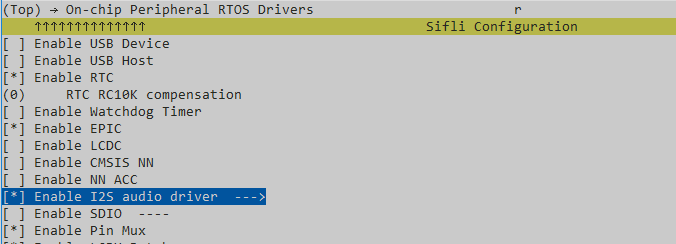
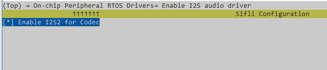
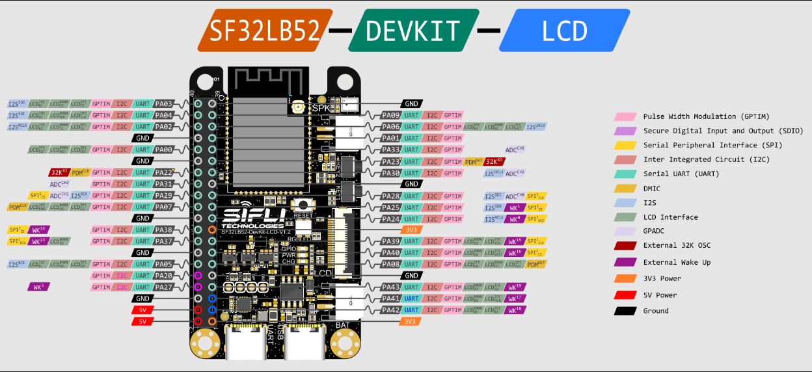
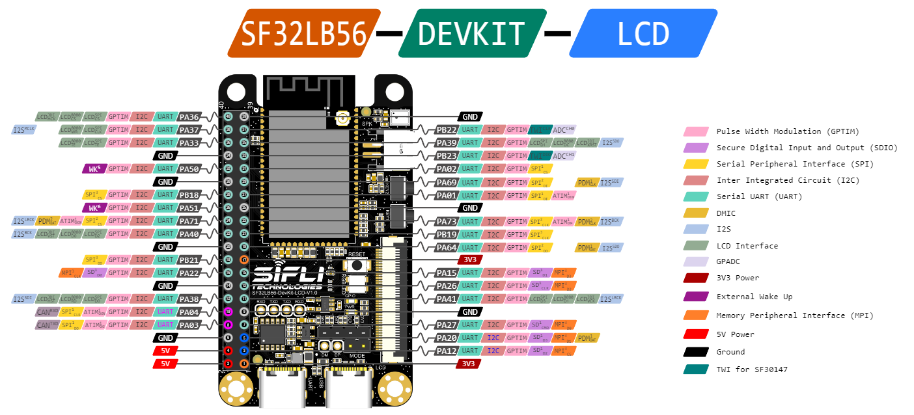

# I2S示例

源码路径：example/rt_device/i2s

## 支持的平台
<!-- 支持哪些板子和芯片平台 -->
+ eh-lb525
+ sf32lb52-lcd_n16r8

## 概述
<!-- 例程简介 -->
本例程中，使用两块开发板演示I2S发送和接受（一块开发板A做tx,一块开发板B做rx），包含：
+ 开发板A：
    - mic录音。
    - 通过i2s发送给开发板B。
+ 开发板A：
    - 通过i2s接受开发板A的数据。
    - speaker播放。

## 例程的使用
<!-- 说明如何使用例程，比如连接哪些硬件管脚观察波形，编译和烧写可以引用相关文档。
对于rt_device的例程，还需要把本例程用到的配置开关列出来，比如PWM例程用到了PWM1，需要在onchip菜单里使能PWM1 -->

### 硬件需求
运行该例程前，需要准备：
+ 两块本例程支持的开发板（[支持的平台](quick_start)）。
+ 喇叭。
+ 两根数据线（分别用作两块板子的程序烧录）。

### menuconfig配置

1. 使能I2S


    ```{tip}
    如果芯片支持多个I2S，需按实际使用情况配置。
    ```
2. 使能AUDIO CODEC 和 AUDIO PROC：


3. 例程用到了FINSH功能，需要使能`RT_USING_FINSH`。  

```{tip}
配置2、3在本例程中用于辅助功能展示，非I2S必要配置。
```  

### 硬件连接\PIN CONFIG

以`SF32LB52_DevKit-LCD`为例，本例程中使用`PA02 ~ PA06`做I2S 引脚，管脚配置如下：
```c
    /* PIN CONFIG */
#ifdef BSP_ENABLE_I2S_CODEC
#ifdef SOC_SF32LB52X
    HAL_PIN_Set(PAD_PA06, I2S1_LRCK, PIN_NOPULL, 1);
    HAL_PIN_Set(PAD_PA05, I2S1_BCK, PIN_NOPULL, 1);
    HAL_PIN_Set(PAD_PA04, I2S1_SDI, PIN_PULLDOWN, 1);
    HAL_PIN_Set(PAD_PA03, I2S1_SDO, PIN_NOPULL, 1);
    HAL_PIN_Set(PAD_PA02, I2S1_MCLK, PIN_NOPULL, 1);
#endif
#endif
```

如需使用其他型号开发板，需要更改pinmux配置，这里以56x 为例：
```c
#ifdef SOC_SF32LB56X
    HAL_PIN_Set(PAD_PA71, I2S1_LRCK, PIN_NOPULL, 1);
    HAL_PIN_Set(PAD_PA40, I2S1_BCK, PIN_NOPULL, 1);
    HAL_PIN_Set(PAD_PA38, I2S1_SDI, PIN_PULLDOWN, 1);
    HAL_PIN_Set(PAD_PA39, I2S1_SDO, PIN_NOPULL, 1);
    HAL_PIN_Set(PAD_PA37, I2S1_MCLK, PIN_NOPULL, 1);
#endif
```

接线：
开发板A | -- | 开发板B
--|--|--
I2S1_LRCK|--|I2S1_LRCK
I2S1_BCK|--|I2S1_BCK
I2S1_SDI|--|I2S1_SDO
I2S1_SDO|--|I2S1_SDI
I2S1_MCLK|--|I2S1_MCLK

不确定管脚定位的可以参考下图：
SF32LB52x_DevKit_40p图片：

SF32LB56x_DevKit_40p图片：

```{warning}
`SF32LB52_DevKit-LCD`上：  
+ `PA02 ~ PA06`当有配置LCD时会被使用，需要注意冲突（需关闭LCD：`BSP_USING_LCD = n BSP_USING_LCDC = n`）。  

其他版型，需要参考规格书选择管脚。
```

### 编译和烧录
切换到例程project目录，运行scons命令执行编译：
```shell
> scons --board=eh-lb525 -j32
```
切换到例程`project/build_xx`目录，运行`uart_download.bat`，按提示选择端口即可进行下载：
```shell
$ ./uart_download.bat

     Uart Download

please input the serial port num:5（板子A端口号）
```
再烧一次板子B
$ ./uart_download.bat

     Uart Download

please input the serial port num:6（板子B端口号）

关于编译、下载的详细步骤，请参考[快速上手](quick_start)的相关介绍。

## 例程的预期结果
<!-- 说明例程运行结果，比如哪几个灯会亮，会打印哪些log，以便用户判断例程是否正常运行，运行结果可以结合代码分步骤说明 -->
本例程中通过FINSH命令来操作：
用途 | 命令 | 示例 |备注
|---|--|--|--|
录音|audprc rx [channels:1/2] [采样率] [采样位数]|`audprc rx 1 16000 16` |录音存放到ram buffer（录音满1M后自动停止录音）
I2S发送|i2s tx [tx channels:1/2] [tx采样率] [tx采样位数]|`i2s tx 1 16000 16`|将录音保存的ram buffer中的数据通过i2s发送。`例程中默认配置为master模式。`配置方法可见`i2s_config_tx`。
I2S接收|i2s rx [rx channels:1/2] [rx采样率] [rx采样位数]|`i2s rx 1 16000 16`|接收的数据保存到ram buffer（接受满1M后停止接收）。`例程中默认配置为slave模式。`配置方法可见`i2s_config_rx`。
播放录音|audprc tx [channels:1/2] [采样率] [采样位数]|`audprc tx 1 16000 16`| 播放数据来ram buffer

操作如下：
1. 开发板A，录制一段音频。
    ```c
    01-03 00:50:30:962 TX:audprc rx 1 16000 16
    01-03 00:50:30:987    [EX_I2S]Start recording.
    01-03 00:50:30:991    [EX_I2S]audprc_rx_entry
    01-03 00:50:30:995    [EX_I2S]codec input parameter:sub_type=4 channels 1, rate 16000, bits 16
    01-03 00:50:31:000    [EX_I2S]mic input:rx channel 0, channels 1, rate 16000, bitwidth 16
    01-03 00:50:31:002    get_mic_volume = 0db

    01-03 00:50:31:005    get_mic_volume = 0db

    01-03 00:50:31:009    [EX_I2S]start_rx
    01-03 00:50:31:011    [I/drv.audcodec] pll config state:1, samplerate:0 
    01-03 00:50:31:013    
    01-03 00:50:31:225    [EX_I2S]recording. size:6400
    01-03 00:50:31:440    [EX_I2S]recording. size:12800
    01-03 00:50:31:633    [EX_I2S]recording. size:19200
    01-03 00:50:31:826    [EX_I2S]recording. size:25600
    01-03 00:50:32:040    [EX_I2S]recording. size:32000
    01-03 00:50:32:232    [EX_I2S]recording. size:38400

    // 录音完成
    01-03 00:51:03:629    [EX_I2S]recording. size:1043200
    01-03 00:51:03:804    [EX_I2S]recording finished. size:1048320
    01-03 00:51:03:808    [EX_I2S]Recording finished.
    01-03 00:51:03:815    [EX_I2S]stop_rx
    01-03 00:51:03:822    [I/drv.audcodec] bf0_audio_stop 0x401
    01-03 00:51:03:828    
    01-03 00:51:03:834    [I/drv.audcodec] audcodec close adc
    01-03 00:51:03:840    [I/drv.audcodec] bf0_audio_stop 0x401 done
    01-03 00:51:03:850    
    01-03 00:51:03:854    [I/drv.audprc] bf0_audio_stop 0x1001
    ```

2. I2S发送和接收  

    开发板A开启I2S发送
    ```c
    01-03 00:51:44:552 TX:i2s tx 1 16000 16
    01-03 00:51:44:577    [EX_I2S]I2S TX:
    01-03 00:51:44:582    [EX_I2S]i2s_tx_entry
    // 发送完成（录制的数据发送完成）
    01-03 00:52:00:382    [EX_I2S]I2S TX. size:1011200
    01-03 00:52:00:474    [EX_I2S]I2S TX. size:1017600
    01-03 00:52:00:569    [EX_I2S]I2S TX. size:1024000
    01-03 00:52:00:680    [EX_I2S]I2S TX. size:1030400
    01-03 00:52:00:772    [EX_I2S]I2S TX. size:1036800
    01-03 00:52:00:865    [EX_I2S]I2S TX. size:1043200
    01-03 00:52:00:957    [EX_I2S]I2S TX finished.
    01-03 00:52:00:962    [EX_I2S]i2s_stop_tx
    ```
    `同时`，开发板B开启I2S接收
    ```c
    01-03 00:51:43:833 TX:i2s rx 1 16000 16
    01-03 00:51:43:865    [EX_I2S]I2S RX.
    01-03 00:51:43:873    [EX_I2S]i2s_rx_entry[I/drv.i2s_audio] Configure audio chn 2, samplerate 16000, bitwidth 16
    // 接收完成（满1M）
    01-03 00:51:59:786    [EX_I2S]I2S RX. size:1017600
    01-03 00:51:59:878    [EX_I2S]I2S RX. size:1024000
    01-03 00:51:59:991    [EX_I2S]I2S RX. size:1030400
    01-03 00:52:00:083    [EX_I2S]I2S RX. size:1036800
    01-03 00:52:00:177    [EX_I2S]I2S RX. size:1043200
    01-03 00:52:00:270    [EX_I2S]I2S RX finished.
    01-03 00:52:00:274    [EX_I2S]i2s_stop_rx
    ```
    ```{tip}
    is tx开启后就会有空数据，开发板A开启i2s tx 和开发板B开启i2s
     rx不完全同步，此处未处理空数据，所以，开发板B接收的1M数据前后可能存在空数据。
    ```

3. 开发板B播放接收的数据

```
    01-03 00:52:13:543 TX:audprc tx 1 16000 16
    01-03 00:52:13:591    [EX_I2S]audprc_tx_entry
    01-03 00:52:13:600    [EX_I2S]prc_codec : sub_type=1 channel 1, samplerate 16000, bits 16
    01-03 00:52:13:604    [EX_I2S]speaker OUTPUTSRC channel=1 in_rate=16000 out_rate=16000
    01-03 00:52:13:611    [EX_I2S]speaker select=0x5050 mixer=0x5150
    01-03 00:52:13:618    [EX_I2S]tx[0]: sub_type 0, ch 1, samrate 16000, bits 16
    01-03 00:52:13:622    [EX_I2S]init volume=-18
    01-03 00:52:13:627    [I/drv.audcodec] dac set volume: prc=0 codec=-18
    01-03 00:52:13:631    
    01-03 00:52:13:634    [EX_I2S]start_tx
    01-03 00:52:13:639    [I/drv.audcodec] codec dac mute set:1
    01-03 00:52:13:646    
    01-03 00:52:13:651    [I/drv.audcodec] pll config state:1, samplerate:0 
    01-03 00:52:13:658    
    01-03 00:52:13:662    [I/drv.audprc] samplerate = 16000, select voice eq
    01-03 00:52:13:667    
    01-03 00:52:13:671    [I/drv.audprc] -----tx dma size = 320
    01-03 00:52:13:675    sifli_aw8155 to do power handle 
    01-03 00:52:13:679    sifli_aw8155_start,mode:1 10
    01-03 00:52:13:685    [I/drv.audcodec] codec dac mute set:0
    01-03 00:52:13:690    
    01-03 00:52:46:330    [EX_I2S]Play finished.
    01-03 00:52:46:336    [EX_I2S]Play finished.
    01-03 00:52:46:343    [EX_I2S]stop_tx
    01-03 00:52:46:350    [I/drv.audcodec] bf0_audio_stop 0x100
    01-03 00:52:46:354    
    01-03 00:52:46:358    [I/drv.audcodec] audcodec close dac
    01-03 00:52:46:363    [I/drv.audcodec] bf0_audio_stop 0x100 done
    01-03 00:52:46:368    
    01-03 00:52:46:372    [I/drv.audprc] bf0_audio_stop 0x100
    01-03 00:52:46:377    
    01-03 00:52:46:381    [I/drv.audprc] audprc close adc/dac
    01-03 00:52:46:385    [I/drv.audprc] bf0_audio_stop 0x100 done
    01-03 00:52:46:392    
    01-03 00:52:46:398    sifli_aw8155_stop 
    ```

## 异常诊断


## 参考文档
<!-- 对于rt_device的示例，rt-thread官网文档提供的较详细说明，可以在这里添加网页链接，例如，参考RT-Thread的[RTC文档](https://www.rt-thread.org/document/site/#/rt-thread-version/rt-thread-standard/programming-manual/device/rtc/rtc) -->

## 更新记录
|版本 |日期   |发布说明 |
|:---|:---|:---|
|0.0.1 |12/2024 |初始版本 |
| | | |
| | | |
