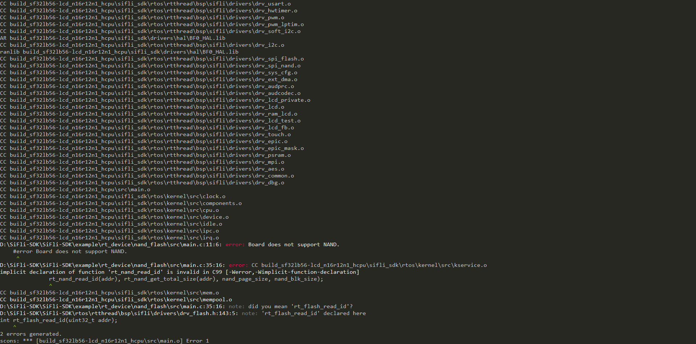
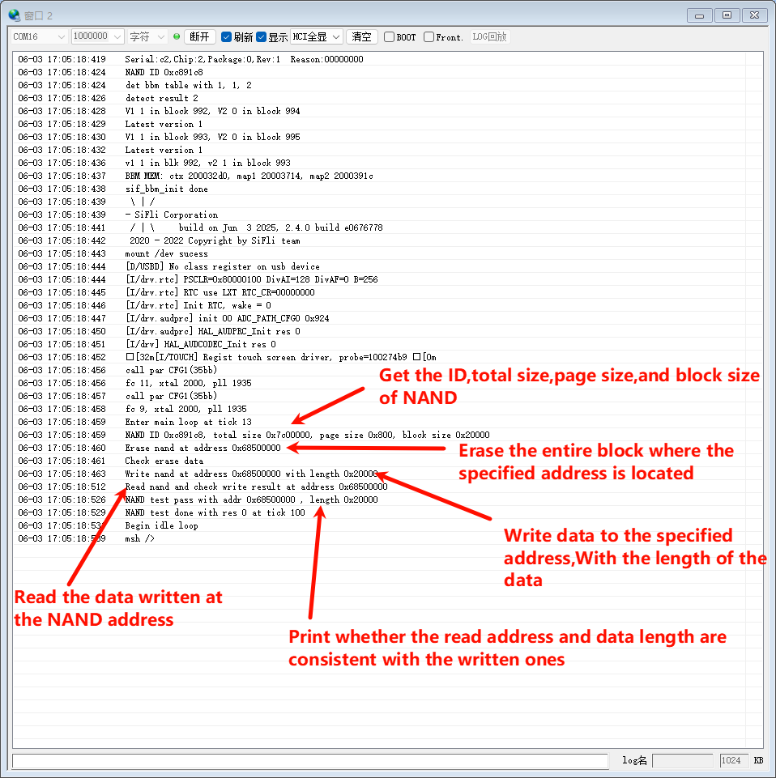

# nand_flash
源码路径：SiFli-SDK\example\rt_device\nand_flash
## 支持平台
* sf32lb56-lcd_a128r12n1
* sf32lb58-lcd_a128r32n1

## 概述
nand_flash例程用来展示rt-thread层的对NAND读、写、擦除功能接口。

在编译前需要把对用的控制器配置成NAND接口，系统启动时会初始化NAND并进行坏块管理信息的初始化，（这部分应用可以不用关注）。

NAND的擦除操作必须要按照块对齐操作（包括地址和长度），块的大小可以通过接口获取。

NAND写操作必须按照页对齐操作（包括地址和长度），页的大小可以通过接口获取。读操作建议按照页对齐操作。
     
## 例程的使用
以 sf32lb56-lcd_a128r12n1为例
### 编译和烧写
* 编译方法：切换到工程例程project目录下运行scons命令进行代码编译：
```
scons --board=板子名称 -j8
例如：scons --board=sf32lb56-lcd_a128r12n1 -j8
```
如果编译出现如下错误，说明参与编译的板子并不是nand falsh类型的板子。

* 下载方法： 进入project目录执行build命令将编译好的程序进行烧入
```
build_<board_name>_hcpu\download.bat(uart_download.bat)
<board_name>：板子名称
download.bat：jlink烧入使用
uart_download.bat：使用串口使用
例如：build_sf32lb56-lcd_a128r12n1_hcpu\download.bat
```
### 例程输出展示
首先根据地址获取NAND设备句柄，确认地址是否有效
若无效log中会打印：```Address 0x%x is not for NAND FLASH```

然后获取NAND的ID、总容量(total size)、页大小(page size)、块大小(block size)

在进行擦除处理
如果擦除失败log中会打印：```Erase fail at address 0x%x, res %d ```

检查是否擦除成功
如果是检查并非全为1，则log中会打印：```"Data not 0xffffffff after erase at pos 0x%x ```

然后进行生成随机数写入整个块中的所有页中
如果失败log会打印：```write page fail at pos 0x%x ```

最后在进行读取并检验
如果读取与写入的不一致,log中会打印：```"Read page fail at pos 0x ``` ```Read data not same to source at pos 0x ```

### 故障排查
如果log未能出现预期的log和现象，可以从已下几个方面进行故障排查：
* 硬件连接是否正常
* 检查USB线是否具备数据传输功能
* 根据上述log中的信息来排查
