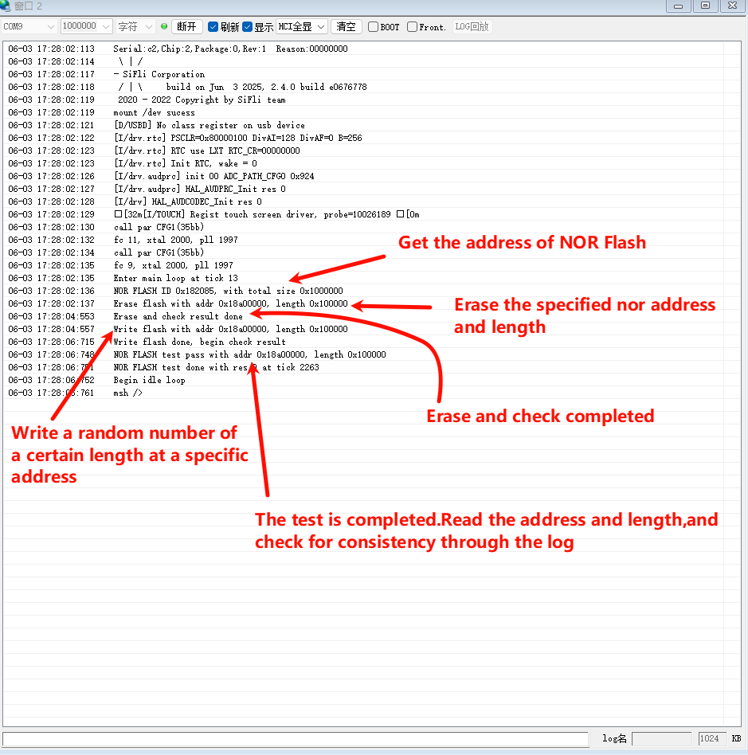

# nor_flash
## 概述
nor_flash 用来展示rt-thread 层的NOR FLASH读、写、擦功能接口。

在编译前需要把对用的控制器配置成Nor接口，系统启动时会初始化Nor并进行坏块管理信息的初始化，这部分应用可以不用关注。

NOR FLASH的擦操作需要以4KB对齐（包括地址和长度），读写没有要求。

## 支持平台
* sf32lb52-lcd_n16r8
* sf32lb56-lcd_n16r12n1
* sf32lb58-lcd_n16r64n4

## 例程的使用
以 sf32lb56-lcd_n16r12n1为例
### 编译和烧写
* 编译方法：切换到工程例程project目录下运行scons命令进行代码编译：
```
scons --board=板子名称 -j8
例如：scons --board=sf32lb56-lcd_n16r12n1 -j8
```

* 下载方法： 进入project目录执行build命令将编译好的程序进行烧入
```
build_<board_name>_hcpu\download.bat(uart_download.bat)
<board_name>：板子名称
download.bat：jlink烧入使用
uart_download.bat：使用串口使用
例如：build_sf32lb56-lcd_n16r12n1_hcpu\download.bat
```
### 例程输出展示
首先根据地址获取NOR设备句柄，确认地址是否有效
若无效log中会打印：```Address 0x%x not NOR FLASH```

然后获取NOR的ID、总容量(length)
在进行擦除处理
如果擦除失败log中会打印：```FLASH ERASE fail %d ```

检查是否擦除成功
如果是检查并非全为1，则log中会打印：```"Data not 0xffffffff but 0x%08x after erase at pos 0x%x ```

然后进行生成随机数写入整个块中的所有页中
如果失败log会打印：```Write flash fail ```

最后在进行读取并检验
如果读取与写入的不一致,log中会打印：```compare flash fail ```

### 故障排查
如果log未能出现预期的log和现象，可以从已下几个方面进行故障排查：
* 硬件连接是否正常
* 检查USB线是否具备数据传输功能
* 根据上述log中的信息来排查