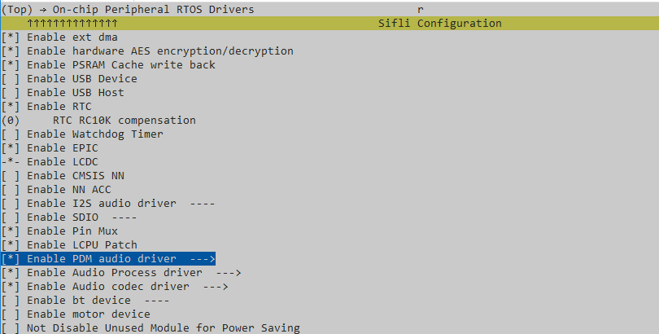
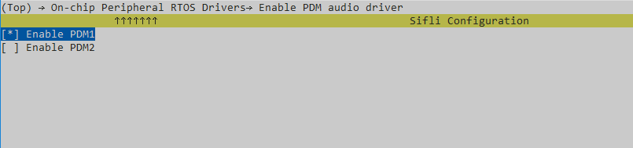
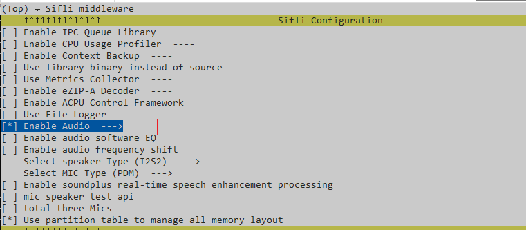
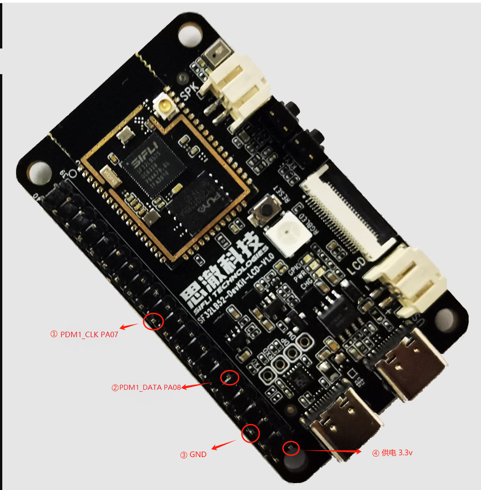

# PDM示例

源码路径：example/rt_device/pdm

## 支持的平台
<!-- 支持哪些板子和芯片平台 -->
+ sf32lb52-lcd_n16r8
+ eh-lb525

## 概述
<!-- 例程简介 -->
本例程演示PDM录音，包含：
+ 通过PDM录音，pcm数据保存到Flash(裸写)。
+ 读取录音数据并播放。


## 例程的使用
<!-- 说明如何使用例程，比如连接哪些硬件管脚观察波形，编译和烧写可以引用相关文档。
对于rt_device的例程，还需要把本例程用到的配置开关列出来，比如PWM例程用到了PWM1，需要在onchip菜单里使能PWM1 -->

### 硬件需求
运行该例程前，需要准备：
+ 一块本例程支持的开发板（[支持的平台](quick_start)）。
+ PDM
+ 喇叭。

### menuconfig配置

1. 使能PDM（这里使用PDM1）


2. 使能AUDIO CODEC 和 AUDIO PROC：

3. 使能AUDIO(`AUDIO`)：

4. 使能AUDIO MANAGER.(`AUDIO_USING_MANAGER`)


```{tip}
配置3、4是为了播放录音文件，本例程中，录音播放使用Audio manager接口。
```  

### 硬件连接\PIN CONFIG
|开发板  | PDM       | PDM1_CLK    | PDM1_DATA   |   供电 |  GND | SEL(左右声道选择) |
|--------|------------|---------------|-------------------|---|---|---|
|SF32LB52_DevKit-LCD    | PDM1     | PAD_PA22/PAD_PA07    | PAD_PA23/PAD_PA08 |   3.3V | GND | GND/3.3V |

```{tip}
+ 有两路pdm时，SEL用于区分左右声道。
+ 一路pdm时，SEL可以悬空。
```

以`SF32LB52_DevKit-LCD`为例，使用`PA07/PA08`做`PDM1_CLK/PDM1_DATA`，管脚配置如下：
```C
    /* PIN CONFIG */
#ifdef SOC_SF32LB52X
#if !defined(BSP_USING_LCD) && defined(BSP_USING_PDM1)
    HAL_PIN_Set(PAD_PA07, PDM1_CLK, PIN_NOPULL, 1);
    HAL_PIN_Set(PAD_PA08, PDM1_DATA, PIN_PULLDOWN, 1);
#endif
#endif
````


```{warning}
`SF32LB52_DevKit-LCD`上：  
+ `PA07/PA08`当有配置LCD时会被使用，需要注意冲突（需关闭LCD：`BSP_USING_LCD = n BSP_USING_LCDC = n`）。
+ `PA22/PA23`当有配置32k时会被使用，需要注意冲突（需关闭32k：`LXT_DISALBE = y`）。  

其他版型，需要参考规格书选择管脚。
```


### 编译和烧录
切换到例程project目录，运行scons命令执行编译：
```c
> scons --board=sf32lb52-lcd_n16r8 -j32
```
切换到例程`project/build_xx`目录，运行`uart_download.bat`，按提示选择端口即可进行下载：
```c
$ ./uart_download.bat

     Uart Download

please input the serial port num:5
```
关于编译、下载的详细步骤，请参考[快速上手](quick_start)的相关介绍。

## 例程的预期结果
<!-- 说明例程运行结果，比如哪几个灯会亮，会打印哪些log，以便用户判断例程是否正常运行，运行结果可以结合代码分步骤说明 -->
本例程中通过FINSH命令来操作录音和播放：
1. 开始录音命令：`pdm open [声道选择] [depth] [采样率]`  
例如：
+ `pdm open 1 16 16000`  
表示，配置为左声道、16位、16k采样率进行录音。
+ `pdm open 2 16 16000`  
表示，配置为双声道（立体声）、16位、16k采样率进行录音。

2. 结束录音命令：`pdm stop`
+ `pdm stop`  
表示，结束录音。

3. 播放录音命令：`pdm play [声道数] [depth] [采样率]`  
例如：
+ `pdm play 1 16 16000`  
表示，播放单声道、16k采样率、16位的录音数据。
+ `pdm play 2 16 16000`  
表示，播放双声道、16k采样率、16位的录音数据。

执行录音后，执行播放，可以正常录音、播放。  

串口log输出参考：
```c
// 开始pdm录音 （擦flash会有些耗时）
12-29 11:55:48:261 TX:pdm open 2 16 16000
12-29 11:55:48:287    example_pdm_record_start
12-29 11:55:48:293    [I/drv.pdm_audio] PDM audio init
12-29 11:55:48:301    PDM opened
12-29 11:55:48:308    pdm_record_init
12-29 11:55:48:315    erasing flash.
12-29 11:55:58:295    erase finished.
12-29 11:55:58:301    CONFIG ch 2 samplefmt 16 samplerate 16000
12-29 11:55:58:312    [I/drv.pdm_audio] Config PDM channel 2, depth 16, samplerate 16000
12-29 11:55:58:320    
12-29 11:55:58:328    [I/drv.pdm_audio] bf0_audio_init len=1280, hdmarx=20038598
// 停止录音
12-29 11:56:51:055 TX:pdm stop
12-29 11:56:51:072    example_pdm_record_stop
12-29 11:56:51:077    [I/drv.pdm_audio] PDM audio stop
12-29 11:56:51:086    [I/drv.pdm_audio] PDM audio stop
12-29 11:56:51:095    pdm_record_deinit
12-29 11:56:51:104    g_wr_cache_offset 101120 g_saved_size 3276800 align_size 100352
12-29 11:56:51:288    FINSH. Total size : 0x338800
// 播放
12-29 11:57:06:101 TX:pdm play 2 16 16000
12-29 11:57:06:117    pdm_record_play
12-29 11:57:06:122    [I/drv.audprc] set g_eq_enable=1
12-29 11:57:06:128    [I/drv.audcodec] dac set volume: prc=0 codec=-28
12-29 11:57:06:139    
12-29 11:57:06:146    [I/drv.audcodec] codec dac mute set:1
12-29 11:57:06:154    
12-29 11:57:06:161    [I/drv.audprc] samplerate = 16000, select voice eq
12-29 11:57:06:169    
12-29 11:57:06:176    [I/drv.audprc] -----tx dma size = 1600
12-29 11:57:06:182    [I/drv.audcodec] pll config state:1, samplerate:0 
12-29 11:57:06:190    
12-29 11:57:06:200    sifli_aw8155 to do power handle 
12-29 11:57:06:207    sifli_aw8155_start,mode:1 10
12-29 11:57:06:243    [I/drv.audcodec] codec dac mute set:0
12-29 11:57:06:253    
12-29 11:57:06:259    audio_callback_play cmd= 0
12-29 11:57:06:267    PDM start play. g_play_client 537065664 samplefmt 16 samplerate 16000
12-29 11:57:06:273    audio_callback_play cmd= 4
12-29 11:57:06:280    g_saved_size 3377152 POS 0
12-29 11:57:06:290    [I/drv.audcodec] dac set volume: prc=0 codec=-8
12-29 11:57:06:296    
12-29 11:57:06:304    audio_callback_play cmd= 4
12-29 11:57:06:312    g_saved_size 3377152 POS 2048
12-29 11:57:06:319    audio_callback_play cmd= 4
12-29 11:57:06:325    g_saved_size 3377152 POS 4096
12-29 11:57:06:332    audio_callback_play cmd= 4
12-29 11:57:06:338    g_saved_size 3377152 POS 6144
12-29 11:57:06:347    audio_callback_play cmd= 3
... ...
// 播放完成
12-29 11:57:59:013    PDM play end.
12-29 11:57:59:014    audio_callback_play cmd= 1
12-29 11:57:59:014    sifli_aw8155_stop 
12-29 11:57:59:015    [I/drv.audcodec] codec dac mute set:1
12-29 11:57:59:016    
12-29 11:57:59:016    [I/drv.audcodec] bf0_audio_stop 0x100
12-29 11:57:59:017    
12-29 11:57:59:018    [I/drv.audcodec] audcodec close dac
12-29 11:57:59:019    [I/drv.audcodec] bf0_audio_stop 0x100 done
12-29 11:57:59:019    
12-29 11:57:59:020    [I/drv.audprc] bf0_audio_stop 0x100
12-29 11:57:59:021    
12-29 11:57:59:021    [I/drv.audprc] audprc close adc/dac
12-29 11:57:59:023    [I/drv.audprc] bf0_audio_stop 0x100 done
12-29 11:57:59:024    
12-29 11:57:59:025    PLL disable
```

## 异常诊断


## 参考文档
<!-- 对于rt_device的示例，rt-thread官网文档提供的较详细说明，可以在这里添加网页链接，例如，参考RT-Thread的[RTC文档](https://www.rt-thread.org/document/site/#/rt-thread-version/rt-thread-standard/programming-manual/device/rtc/rtc) -->

## 更新记录
|版本 |日期   |发布说明 |
|:---|:---|:---|
|0.0.1 |12/2024 |初始版本 |
| | | |
| | | |
