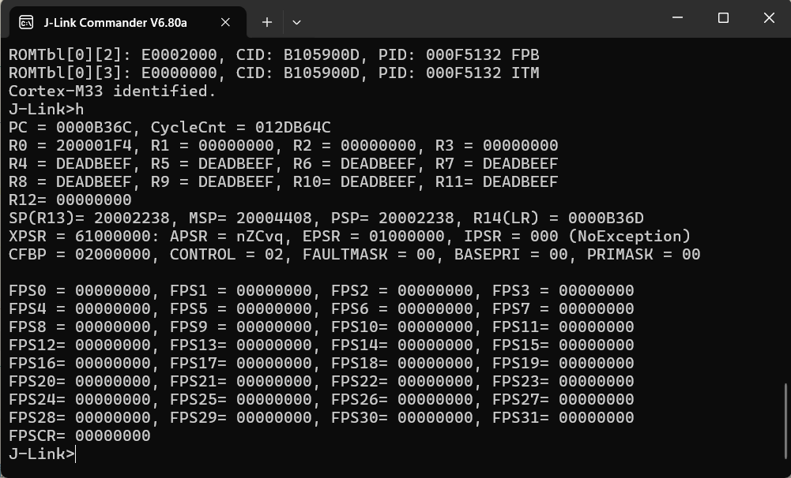
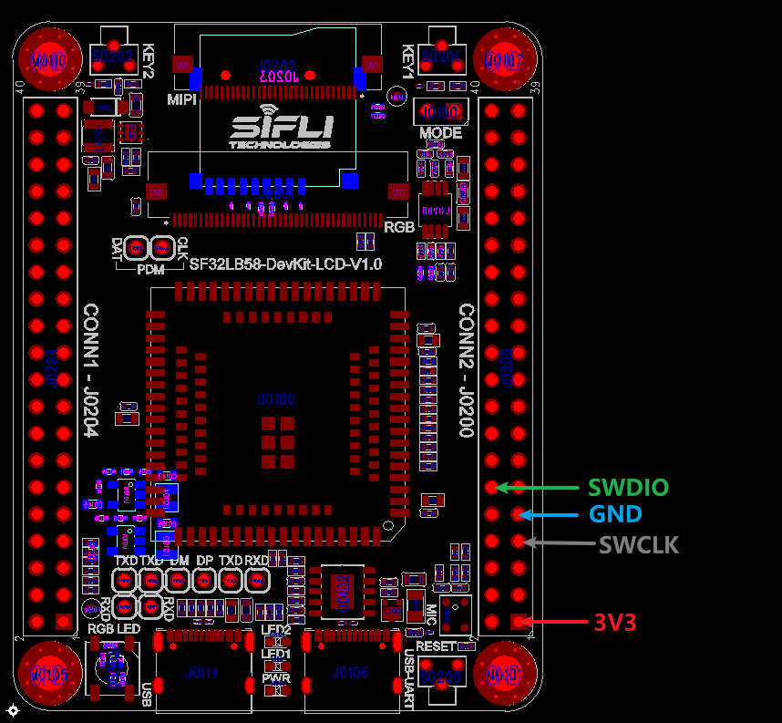
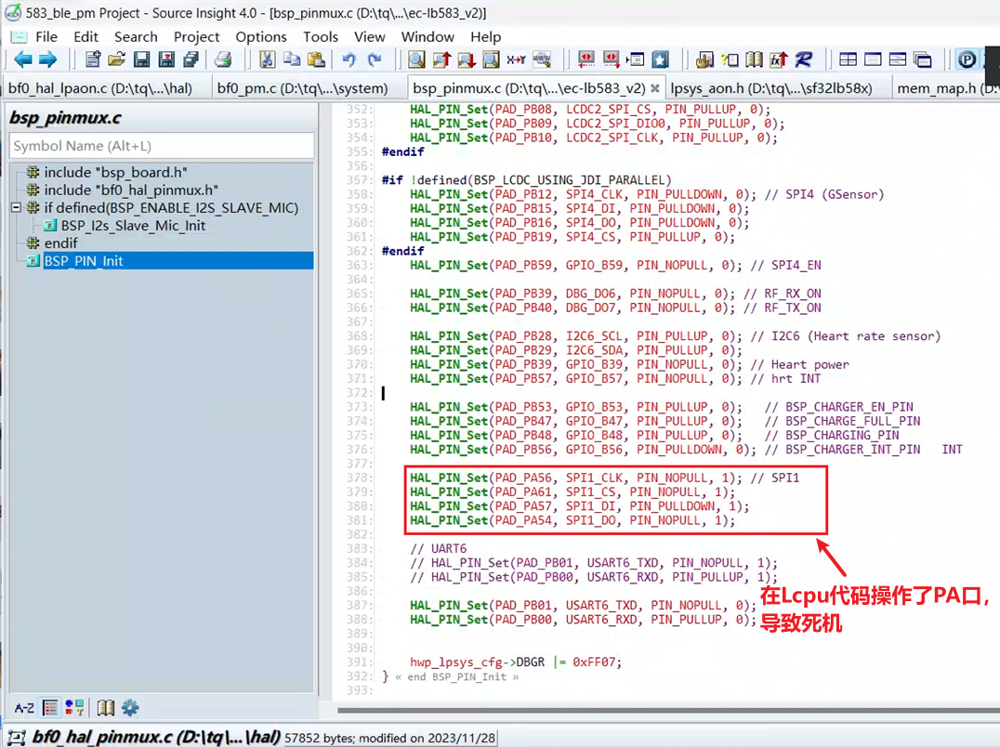
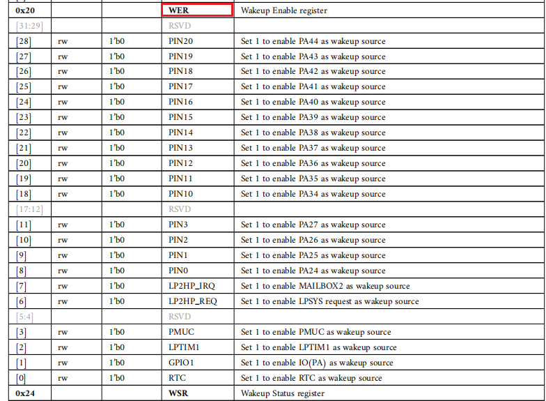
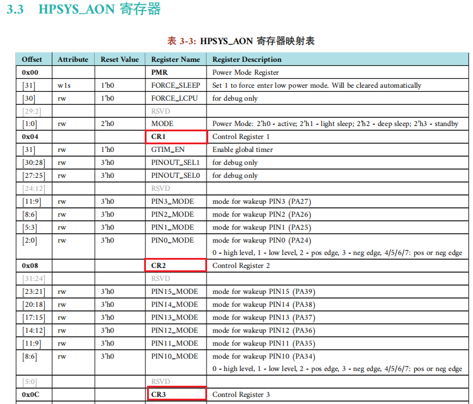
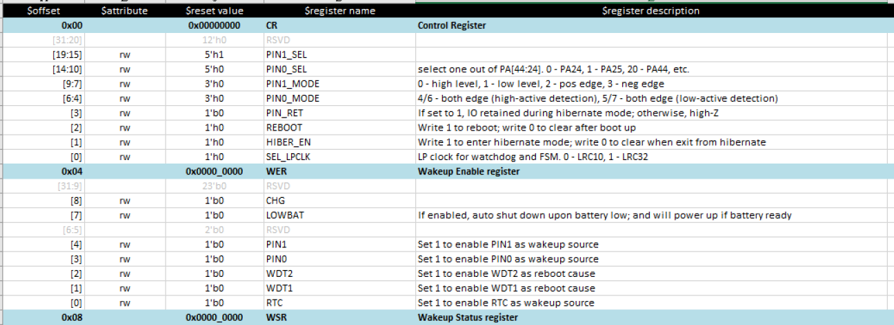

# PM示例
源码路径：example\rt_device\pm
## 支持的平台
例程可以运行在以下开发板.
* em-lb566
* eh-lb551
* em-lb525
* em-lb587
## 概述
* 在RT-Thread操作系统下，进入低功耗和唤醒PM工程演示

## 例程的使用
### 编译和烧录
#### em-lb566编译方法
56平台默认已配置为Standby Sleep模式休眠<br>
编译命令<br>
```c
> scons --board=em-lb566 -j8
```
* 切换到例程`project/build_xx`目录，运行`uart_download.bat`，按提示选择端口（boot脚拉高后有打印的串口）即可进行下载：
```c
> build_em-lb566_hcpu\uart_download.bat

     Uart Download

please input the serial port num:5
```
#### eh-lb551编译方法
56平台默认已配置为Standby Sleep模式休眠<br>
编译命令<br>
```c
> scons --board=eh-lb551 -j8
```
确认Jlink正确连接，并且可以成功通讯，如下<br>

* 切换到例程`project/build_xx`目录，该551例程目前只支持Jlink下载，运行`download.bat`进行下载
```c
> build_eh-lb551_hcpu\download.bat
```
#### em-lb525编译方法
menuconfig配置为Deep Sleep模式休眠<br>
```c
menuconfig
```

52平台推荐采用Deep Sleep模式，这里修改为Enable Deep Mode，保存退出<br>
```
 → RTOS → RT-Thread Components → Device Drivers → Using Power Management device driverselect PM Mode
```
编译命令<br>
```c
> scons --board=em-lb525 -j8
```
* 切换到例程`project/build_xx`目录，运行`uart_download.bat`，按提示选择端口即可进行下载：
```c
> build_em-lb525_hcpu\uart_download.bat

     Uart Download

please input the serial port num:5
```
#### em-lb587编译方法
56平台默认已配置为Standby Sleep模式休眠<br>
编译命令<br>
```c
> scons --board=em-lb587 -j8
```
* 切换到例程`project/build_em-lb587_hcpu`目录，运行`download.bat`，此处演示用Jlink进行下载：<br>
```c
> build_em-lb587_hcpu\download.bat

```
* em-lb587板子Jlink连接方法如下图：<br>
<br>
### 硬件连接
#### em-lb566
采用板子上按键PB32为唤醒PIN0`#WKUP_PIN0`，按下按键电平变高唤醒Hcpu
#### eh-lb551
板子上按键KEY1`PB48`作为Lcpu的唤醒PIN5`#WKUP_PIN5`，按下按键电平变低进行Lcpu唤醒<br>
#### em-lb525
采用板子上按键PA34为唤醒PIN10`#WKUP_PIN10`，按下按键电平变高唤醒Hcpu
#### em-lb587
采用板子上按键PB54为唤醒PIN0`#WKUP_PIN0`，按下按键电平变高唤醒Hcpu
### 例程输出结果
#### em-lb566
* 566 hcpu log，进入standyby待机
```
    Serial:c2,Chip:3,Package:1,Rev:2  Reason:00000000
    Serial PowerOnMOde:0 rtc_record:00000000
     \ | /
    - SiFli Corporation
     / | \     build on Apr 14 2025, 2.3.5 build aea79fd6
     2020 - 2022 Copyright by SiFli team
    [I/FAL] Flash Abstraction Layer (V0.5.99) initialize success.
    [I/FAL] The FAL MTD NOR device (dfu) created successfully
    [I/FAL] The FAL MTD NOR device (ble) created successfully
    [1701] I/drv.audprc main: init 00 ADC_PATH_CFG0 0x924
    [1723] I/drv.audprc main: HAL_AUDPRC_Init res 0
    [1744] I/drv.audcodec main: HAL_AUDCODEC_Init res 0
    [1765] I/TOUCH main: Regist touch screen driver, probe=1401f50d 
    call par CFG1(35bb)
    fc 9, xtal 2000, pll 2064
    call par CFG1(35bb)
    fc 7, xtal 2000, pll 1656
    mbox_stack:20007df0,1024
    proc_stack:200081f0,4096
    [1954] I/mw.sys ds_proc: turn on lcpu
    [139193] I/mw.sys ds_proc: rf ful ver:1.1.9_2841,calen:0xff
    hcpu main!!!
    msh >
    app_wakeup!
    SF32LB56X WER:0x1c4,WSR:0x0,CR1:0x80000002
    [pm]S:4,237566
    [pm]W:401728
    [pm]WSR:0x4
    hcpu timer wakeup!!!
    [pm]S:4,401761
    [pm]W:447328
    [pm]WSR:0x100
    hcpu timer wakeup!!!
```
* 566 lcpu log(Lcpu工程路径为../lcpu)
```
     \ | /
    - SiFli Corporation
     / | \     build on Jun 27 2022, 1.8.0 build cc1e38
     2020 - 2022 Copyright by SiFli team
    proc_stack:20403638,2048
    lcpu main!!!
    msh >
    [pm]S:4,237763
    [pm]W:401547
    [pm]WSR:0x60
    [pm]S:4,401801
    [pm]W:447147
    [pm]WSR:0x60
```
#### eh-lb551
* 551 hcpu进入standby待机的log
```
    Serial:c2,Chip:1,Package:0,Rev:80  Reason:00000000
    Serial PowerOnMOde:0 rtc_record:00000000
     \ | /
    - SiFli Corporation
     / | \     build on Apr 15 2025, 2.3.5 build aea79fd6
     2020 - 2022 Copyright by SiFli team
    [I/FAL] Flash Abstraction Layer (V0.5.99) initialize success.
    [I/FAL] The FAL MTD NOR device (dfu) created successfully
    [I/FAL] The FAL MTD NOR device (ble) created successfully
    [299] I/drv.rtc main: PSCLR=0x80000100 DivAI=128 DivAF=0 B=256
    [306] I/drv.rtc main: RC10K Freq=9kHz, cycle=985648, rtc ppm=0
    [314] I/drv.rtc main: DIVA=38, DIVA_FRA=754, DIVB=256
    [320] I/drv.rtc main: Init RTC, wake = 0
    [371] I/TOUCH main: Regist touch screen driver, probe=1003ef3d 
    mbox_stack:20000000,1024
    proc_stack:20000400,4096
    [389] I/mw.sys ds_proc: turn on lcpu
    [535] I/mw.sys ds_proc: rf ful ver:null,calen:0xff
    hcpu main!!!
    msh >
    [pm]S:4,29758
    [pm]W:78662
    [pm]WSR:0x2
    hcpu timer wakeup!!!
    [pm]S:4,78672
```
* 551 开机后在Hcpu还没休眠的情况下串口命令`sleep down`进入hibernate和按键唤醒的log
由于eh-lb551板,默认没有贴32768晶体，开了宏`LXT_DISABLE`，因而进入Hibernate后按键唤醒后无PM_HIBERNATE_BOOT标志位
```
   Serial:c2,Chip:1,Package:0,Rev:80  Reason:00000000
   Serial PowerOnMOde:0 rtc_record:00000000
    \ | /
   - SiFli Corporation
    / | \     build on Apr 15 2025, 2.3.5 build aea79fd6
    2020 - 2022 Copyright by SiFli team
   [I/FAL] Flash Abstraction Layer (V0.5.99) initialize success.
   [I/FAL] The FAL MTD NOR device (dfu) created successfully
   [I/FAL] The FAL MTD NOR device (ble) created successfully
   [299] I/drv.rtc main: PSCLR=0x80000100 DivAI=128 DivAF=0 B=256
   [306] I/drv.rtc main: RC10K Freq=9kHz, cycle=985621, rtc ppm=0
   [314] I/drv.rtc main: DIVA=38, DIVA_FRA=771, DIVB=256
   [320] I/drv.rtc main: Init RTC, wake = 0
   [371] I/TOUCH main: Regist touch screen driver, probe=1003ef3d 
   mbox_stack:20000000,1024
   proc_stack:20000400,4096
   [389] I/mw.sys ds_proc: turn on lcpu
   [534] I/mw.sys ds_proc: rf ful ver:null,calen:0xff
   hcpu main!!!
   msh >
TX:sleep down
   sleep down
   SF32LB55X entry_hibernate
   SF32LB55X CR:0x180000,WER:0x200
   Serial:c2,Chip:1,Package:0,Rev:80  Reason:00000000
   Serial PowerOnMOde:3 rtc_record:00000000
   [I/FAL] Flash Abstraction Layer (V0.5.99) initialize success.
   [I/FAL] The FAL MTD NOR device (dfu) created successfully
   [I/FAL] The FAL MTD NOR device (ble) created successfully
   [285] I/drv.rtc main: PSCLR=0x260c0d00 DivAI=38 DivAF=771 B=256
   [293] I/drv.rtc main: RC10K Freq=9kHz, cycle=985733, rtc ppm=0
   [300] I/drv.rtc main: DIVA=38, DIVA_FRA=701, DIVB=256
   [306] I/drv.rtc main: Init RTC, wake = 1
   [313] I/TOUCH main: Regist touch screen driver, probe=1003ef3d 
   mbox_stack:20000000,1024
   proc_stack:20000400,4096
   [332] I/mw.sys ds_proc: turn on lcpu
   [477] I/mw.sys ds_proc: rf ful ver:null,calen:0xff
   hcpu main!!!
   msh >
```
* 551 lcpu log 包含进入standby待机，进入hibernate和按键唤醒的log(Lcpu工程路径为../lcpu)
```
    \ | /
   - SiFli Corporation
    / | \     build Jul 21 2021, 0.9.5.6
    2020 - 2021 Copyright by SiFli team
   proc_stack:20105ba4,2048
   lcpu main!!!
   msh >
   [pm]S:4,29794
   [pm]W:78613
   [pm]WSR:0x810
   [pm]S:4,78693
   [pm]W:89639
   [pm]WSR:0x410
   Lcpu wake_key_handle!!!
   [pm]S:4,89655
   [pm]W:90930
   [pm]WSR:0x410
   Lcpu wake_key_handle!!!
   [pm]S:4,90946
```
#### em-lb525
* em-lb525运行的log输出
```
   SFBL
   Serial:c2,Chip:4,Package:3,Rev:3  Reason:00000000
   Serial PowerOnMOde:0 rtc_record:00000000
    \ | /
   - SiFli Corporation
    / | \     build on Jan  8 2025, 2.2.4 build 00000000
    2020 - 2022 Copyright by SiFli team
   [I/FAL] Flash Abstraction Layer (V0.5.99) initialize success.
   [I/FAL] The FAL MTD NOR device (dfu) created successfully
   [I/FAL] The FAL MTD NOR device (ble) created successfully
   [573] I/drv.rtc main: PSCLR=0x80000100 DivAI=128 DivAF=0 B=256
   [599] I/drv.rtc main: RTC use LXT RTC_CR=00000001
   [619] I/drv.rtc main: Init RTC, wake = 1
   [645] I/drv.audprc main: init 00 ADC_PATH_CFG0 0x606
   [665] I/drv.audprc main: HAL_AUDPRC_Init res 0
   [686] I/drv.audcodec main: HAL_AUDCODEC_Init res 0
   [706] I/TOUCH main: Regist touch screen driver, probe=1203e225 
   call par CFG1(35bb)
   fc 9, xtal 2000, pll 2054
   call par CFG1(35bb)
   fc 9, xtal 2000, pll 2053
   mbox_stack:200067f8,1024
   proc_stack:20006bf8,4096
   [937] I/mw.sys ds_proc: turn on lcpu
   [36981] I/mw.sys ds_proc: rf ful ver:1.1.13_2859,calen:0xf
   hcpu main!!!
   msh >
   [pm]S:3,135137
   [pm]W:298069
   [pm]WSR:0x40002
   gpio_wakeup_handler!
   hcpu timer wakeup!!!
   [pm]S:3,298998
   [pm]W:462858
   [pm]WSR:0x4
   hcpu timer wakeup!!!
   [pm]S:3,462881
```
* em-lb525进入hibernate和按键唤醒的log
```
    SFBL
    Serial:c2,Chip:4,Package:3,Rev:3  Reason:00000000
    Serial PowerOnMOde:0 rtc_record:00000000
     \ | /
    - SiFli Corporation
     / | \     build on Jan  8 2025, 2.2.4 build 00000000
     2020 - 2022 Copyright by SiFli team
    [I/FAL] Flash Abstraction Layer (V0.5.99) initialize success.
    [I/FAL] The FAL MTD NOR device (dfu) created successfully
    [I/FAL] The FAL MTD NOR device (ble) created successfully
    [585] I/drv.rtc main: PSCLR=0x80000100 DivAI=128 DivAF=0 B=256
    [611] I/drv.rtc main: RTC use LXT RTC_CR=00000001
    [631] I/drv.rtc main: Init RTC, wake = 1
    [658] I/drv.audprc main: init 00 ADC_PATH_CFG0 0x606
    [678] I/drv.audprc main: HAL_AUDPRC_Init res 0
    [699] I/drv.audcodec main: HAL_AUDCODEC_Init res 0
    [719] I/TOUCH main: Regist touch screen driver, probe=1203e245 
    call par CFG1(35bb)
    fc 9, xtal 2000, pll 2056
    call par CFG1(35bb)
    fc 7, xtal 2000, pll 1646
    mbox_stack:200067f8,1024
    proc_stack:20006bf8,4096
    [950] I/mw.sys ds_proc: turn on lcpu
    [36961] I/mw.sys ds_proc: rf ful ver:1.1.13_2859,calen:0xf
    hcpu main!!!
    msh >
 TX:sleep down
    sleep down
    SF32LB52X entry_hibernate
    SF32LB52X CR:0xa801,WER:0x8c
    SFBL
    Serial:c2,Chip:4,Package:3,Rev:3  Reason:00000000
    Serial PowerOnMOde:2 rtc_record:00000000
    [I/FAL] Flash Abstraction Layer (V0.5.99) initialize success.
    [I/FAL] The FAL MTD NOR device (dfu) created successfully
    [I/FAL] The FAL MTD NOR device (ble) created successfully
    [505] I/drv.rtc main: PSCLR=0x80000100 DivAI=128 DivAF=0 B=256
    [530] I/drv.rtc main: RTC use LXT RTC_CR=00000001
    [550] I/drv.rtc main: Init RTC, wake = 1
    [576] I/drv.audprc main: init 00 ADC_PATH_CFG0 0x606
    [597] I/drv.audprc main: HAL_AUDPRC_Init res 0
    [617] I/drv.audcodec main: HAL_AUDCODEC_Init res 0
    [638] I/TOUCH main: Regist touch screen driver, probe=1203e245 
    call par CFG1(35bb)
    fc 9, xtal 2000, pll 2058
    call par CFG1(35bb)
    fc 7, xtal 2000, pll 1645
    mbox_stack:200067f8,1024
    proc_stack:20006bf8,4096
    [869] I/mw.sys ds_proc: turn on lcpu
    [36944] I/mw.sys ds_proc: rf ful ver:1.1.13_2859,calen:0xf
    hcpu main!!!
    msh >
    boot from hibernate!!!
    [pm]S:3,135216
```
#### em-lb587
* em-lb587 hcpu运行的log输出，包含进入standby待机，PB54按键唤醒的log
```
 Serial:c2,Chip:2,Package:0,Rev:1  Reason:00000000
 Serial PowerOnMOde:0 rtc_record:00000000
  \ | /
 - SiFli Corporation
  / | \     build on Jan 24 2025, 2.3.0 build 00000000
  2020 - 2022 Copyright by SiFli team
 [I/FAL] Flash Abstraction Layer (V0.5.99) initialize success.
 [E/FAL] (fal_mtd_nor_device_create:496) Error: the flash device name (flash3) is not found.
 [E/FAL] (fal_mtd_nor_device_create:496) Error: the flash device name (flash3) is not found.
 [D/USBD] No class register on usb device
 [1191] I/drv.rtc main: PSCLR=0x80000100 DivAI=128 DivAF=0 B=256
 [1215] I/drv.rtc main: RTC use LXT RTC_CR=00000000
 [1235] I/drv.rtc main: Init RTC, wake = 0
 [1397] I/drv.audprc main: init 00 ADC_PATH_CFG0 0x924
 [1418] I/drv.audprc main: HAL_AUDPRC_Init res 0
 [1437] I/drv.audcodec main: HAL_AUDCODEC_Init res 0
 [1458] I/TOUCH main: Regist touch screen driver, probe=10023e9d 
 call par CFG1(35bb)
 fc 11, xtal 2000, pll 1985
 call par CFG1(35bb)
 fc 9, xtal 2000, pll 1984
 mbox_stack:20000000,1024
 proc_stack:20000400,4096
 [1639] I/mw.sys ds_proc: turn on lcpu
 [47036] I/mw.sys ds_proc: rf ful ver:1.0.0.1,calen:0xff
 hcpu main!!!
 msh >
 SF32LB58X AON CR1:0x80000000,CR2:0x0,WER:0x1c4
 [pm]S:4,145384
 [pm]W:198520
 [pm]WSR:0x100
 gpio_wakeup_handler!
 [pm]S:4,205008
 [pm]W:309478
 [pm]WSR:0x4
 hcpu timer wakeup!!!
 [pm]S:4,309501
```
* em-lb587 lcpu运行的log输出，包含进入standby待机，PB54按键唤醒的log
```
 \ | /
- SiFli Corporation
 / | \     build on Mar 20 2022, 1.2.0 build dbebac
 2020 - 2022 Copyright by SiFli team
proc_stack:2040759c,2048
lcpu main!!!
msh >
[pm]S:4,145530
[pm]W:177325
[pm]WSR:0x60
[pm]S:4,185126
[pm]W:309339
[pm]WSR:0x60
[pm]S:4,309537
```
* em-lb587 hcpu在串口接收到命令sleep down进入hibernate后，并且在PB54按键唤醒开机的log
```
    Serial:c2,Chip:2,Package:0,Rev:1  Reason:00000000
    Serial PowerOnMOde:0 rtc_record:00000000
     \ | /
    - SiFli Corporation
     / | \     build on Jan 24 2025, 2.3.0 build 00000000
     2020 - 2022 Copyright by SiFli team
    [I/FAL] Flash Abstraction Layer (V0.5.99) initialize success.
    [E/FAL] (fal_mtd_nor_device_create:496) Error: the flash device name (flash3) is not found.
    [E/FAL] (fal_mtd_nor_device_create:496) Error: the flash device name (flash3) is not found.
    [D/USBD] No class register on usb device
    [1192] I/drv.rtc main: PSCLR=0x80000100 DivAI=128 DivAF=0 B=256
    [1216] I/drv.rtc main: RTC use LXT RTC_CR=00000000
    [1235] I/drv.rtc main: Init RTC, wake = 0
    [1397] I/drv.audprc main: init 00 ADC_PATH_CFG0 0x924
    [1418] I/drv.audprc main: HAL_AUDPRC_Init res 0
    [1437] I/drv.audcodec main: HAL_AUDCODEC_Init res 0
    [1458] I/TOUCH main: Regist touch screen driver, probe=10023e9d 
    call par CFG1(35bb)
    fc 11, xtal 2000, pll 1986
    call par CFG1(35bb)
    fc 9, xtal 2000, pll 1986
    mbox_stack:20000000,1024
    proc_stack:20000400,4096
    [1639] I/mw.sys ds_proc: turn on lcpu
    [47034] I/mw.sys ds_proc: rf ful ver:1.0.0.1,calen:0xff
    hcpu main!!!
    msh >
 TX:sleep down
    sleep down
    SF32LB58X entry_hibernate
    SF32LB5XX CR:0x4001,WER:0x8,WKUP_CNT:0x10001,PBR0R:0x800002a7
    Serial:c2,Chip:2,Package:0,Rev:1  Reason:00000000
    Serial PowerOnMOde:2 rtc_record:00000000
    [I/FAL] Flash Abstraction Layer (V0.5.99) initialize success.
    [E/FAL] (fal_mtd_nor_device_create:496) Error: the flash device name (flash3) is not found.
    [E/FAL] (fal_mtd_nor_device_create:496) Error: the flash device name (flash3) is not found.
    [D/USBD] No class register on usb device
    [286] I/drv.rtc main: PSCLR=0x80000100 DivAI=128 DivAF=0 B=256
    [310] I/drv.rtc main: RTC use LXT RTC_CR=00000000
    [329] I/drv.rtc main: Init RTC, wake = 1
    [357] I/drv.audprc main: init 00 ADC_PATH_CFG0 0x924
    [377] I/drv.audprc main: HAL_AUDPRC_Init res 0
    [396] I/drv.audcodec main: HAL_AUDCODEC_Init res 0
    [416] I/TOUCH main: Regist touch screen driver, probe=10023e9d 
    call par CFG1(35bb)
    fc 11, xtal 2000, pll 1984
    call par CFG1(35bb)
    fc 9, xtal 2000, pll 1985
    mbox_stack:20000000,1024
    proc_stack:20000400,4096
    [598] I/mw.sys ds_proc: turn on lcpu
    [46091] I/mw.sys ds_proc: rf ful ver:1.0.0.1,calen:0xff
    hcpu main!!!
    msh >
    SF32LB58X AON CR1:0x80000000,CR2:0x0,WER:0x1c4
    boot from hibernate!!!
    [pm]S:4,144433
    [pm]W:308543
    [pm]WSR:0x4
    hcpu timer wakeup!!!
    [pm]S:4,308566
```
### 休眠流程
#### em-lb566
* hcpu休眠唤醒<br>
在 hcpu 进入 idle 线程，并判断是否符合休眠条件，会按下面流程进行休眠和唤醒<br>
rt_thread_idle_entry->rt_system_power_manager->_pm_enter_sleep->'pm->ops->sleep(pm, mode);->sifli_sleep -> log 打印[pm]S:4,11620140 -> RT_DEVICE_CTRL_SUSPEND 设备挂起 -> 
sifli_standby_handler ->BSP_IO_Power_Down-> 汇编 WFI 进入 standby-> 定时器或者IO唤醒 -> 函数
SystemInitFromStandby -> HAL_Init -> BSP_IO_Init-> restore_context-> PC 指针设置到 sifli_standby_handler 函数 WFI 后指令继续运行 -> BSP_Power_Up-> 执行 RTT 设备 RT_DEVICE_CTRL_RESUME 设备恢复函数 -> log 打印[pm]W:11620520 -> log 打印[pm]WSR:0x80<br>
* LCPU休眠唤醒<br>
Lcpu休眠唤醒流程跟 hcpu 待机流程基本一样，差异点：sifli_standby_handler-> sifli_standby_handler_core->休眠时IO配置函数BSP_IO_Power_Down->内存休眠函数soc_power_down-> 汇编 WFI 进入 standby->定时器或者IO唤醒 -> 函数 SystemPowerOnModeInit ->SystemPowerOnInitLCPU-> HAL_Init-> BSP_IO_Init-> restore_context-> 设置到 WFI 指令后继续执行  -> 内存退出休眠函数soc_power_up-> IO休眠后配置函数BSP_Power_Up-> 执行 RTT 设备 RT_DEVICE_CTRL_RESUME 设备恢复函数 -> log 打印[pm]W:11620520 -> log 打印[pm]WSR:0x80<br>
#### eh-lb551
* hcpu休眠唤醒<br>
55系列跟56系列待机流程一样，差异点在唤醒的函数不一样<br>
定时器或者IO唤醒 -> 函数
SystemPowerOnModeInit -> HAL_Init -> BSP_IO_Init->restore_context-> PC 指针设置到 sifli_standby_handler 函数 WFI 后指令继续运行 -> BSP_Power_Up-> 执行 RTT 设备 RT_DEVICE_CTRL_RESUME 设备恢复函数 -> log 打印[pm]W:11620520 -> log 打印[pm]WSR:0x80<br>
* LCPU休眠唤醒<br>
Lcpu唤醒流程56系列一样
#### em-lb525
* hcpu休眠唤醒<br>
52系列跟56系列的待机流程差异的点在进的是`sifli_deep_handler();`待机函数,并且少了外设的SUSPEND/RESUME和恢复现场过程，睡眠唤醒更快<br>
sifli_sleep -> log 打印[pm]S:3,11620140 -> sifli_deep_handler ->BSP_IO_Power_Down-> 汇编 WFI 进入 deep-> 定时器或者IO唤醒 ->  WFI 后指令继续运行 -> BSP_Power_Up->  log 打印
[pm]W:11620520 -> log 打印[pm]WSR:0x80<br>
* LCPU休眠唤醒<br>
52系列的Lcpu不开放代码修改，这块不用考虑<br>
#### em-lb587
* hcpu休眠唤醒<br>
58系列跟56系列待机流程一样，<br>
* LCPU休眠唤醒<br>
Lcpu唤醒流程56系列一样<br>
### Hibernate流程
* 进入Hibernate<br>
进入Hibernate流程相对简单，都是调用函数`HAL_PMU_EnterHibernate();`，芯片在休眠前，都需要配置好Hibernate后PMU的唤醒PIN和唤醒电平，55系列MCU在hibernate下唤醒PIN都为浮空输入态，
需要外部电路给定上下拉状态，不需要再做其他处理，
58，56，52系列MCU，由于唤醒PIN多了一套在Hibernate下生效的PMU上下拉系统，避免漏电，可以用函数`HAL_PIN_Set`配置好唤醒PIN的上下拉，
52系列MCU由于内置了3个LDO，需要查看你的硬件连接，来考虑是否通过函数`HAL_PMU_ConfigPeriLdo`配置关闭<br>
`hwp_pmuc->WKUP_CNT`寄存器可以配置，在hibernate下，外部信号需要持续多长时间可以唤醒（只限58，56，52系列MCU）；<br>
**注意：**<br>
55系列MCU，由于每个唤醒pin都可以单独使能，配置Hibernate唤醒源只需要调用函数`HAL_PMU_EnablePinWakeup`使能对应的唤醒pin就可以了;<br>
58，56，52系列MCU只允许同时存在2个唤醒源`pin0`,`pin1`,这里就需要多一个步骤，调用函数`HAL_PMU_SelectWakeupPin`配置对应的pin0，pin1对应哪一个具体唤醒pin，对应寄存器配置参考`hwp_pmuc->CR`；<br>
* Hibernate唤醒<br>
按下唤醒PIN从Hibernate唤醒后，可以判断`(PM_HIBERNATE_BOOT == SystemPowerOnModeGet())`是否为`hibernate boot`和按键的时间长短来判断是否需要开机<br>
Log中打印的`boot from hibernate!!!`可以指示从hibernate开机<br>
## 异常诊断
### 唤醒Log解读<br>
   [pm]S:3,298998<br>
    S表示已进入休眠，3表示休眠为PM_SLEEP_MODE_DEEP模式，4代表PM_SLEEP_MODE_STANDBY，298998为Gtimer时间戳<br>
   [pm]W:462858 <br>
   W表示已唤醒，462858为Gtimer时间戳<br>
   [pm]WSR:0x4 <br>
   WSR为唤醒寄存器，0x04为WSR寄存器值，需要对照规格书查看具体来自哪个唤醒源<br>
### 没PM[S]打印<br>
原因1：<br>
确认下面宏已经打开<br>
```
#define RT_USING_PM 1
#define PM_STANDBY_ENABLE 1 //#define PM_DEEP_ENABLE 1 //525为Deep
#define BSP_USING_PM 1
#define BSP_PM_DEBUG 1
```
原因2：<br>
软件没有跑进`sifli_sleep`函数<br>
在 hcpu 不忙的情况下会进入 idle 线程，并且符合休眠条件时，会按下面流程进入休眠`sifli_sleep`函数<br>
rt_thread_idle_entry->rt_system_power_manager->_pm_enter_sleep->'pm->ops->sleep(pm, mode);->sifli_sleep -> log 打印[pm]S:4,11620140 <br>
在_pm_enter_sleep函数内，会判断睡眠条件是否满足，满足后才会进入到休眠，每个休眠条件如何判断，可以参考FAQ文档低功耗部分和低功耗开发指南<br>
### 没有[pm]W打印
原因1：<br>
如果已经有了PM[S]打印，而且有定时器唤醒的情况下，无[pm]W打印，通常是在休眠过程中或者唤醒过程中出现了死机，常见原因有`BSP_IO_Power_Down`，`BSP_PIN_Init`函数或者外设`RT_DEVICE_CTRL_SUSPEND`消息下面添加了打印（此时串口已经挂起不可用）或者操作了对方核的GPIO寄存器导致（Hcpu待机时，Lcpu已经允许休眠，而且Lcpu不能操作PA口）；<br>
如下图，最常见的一个死机，在Hcpu，Lcpu共用的函数`BSP_PIN_Init`中的宏`#ifdef SOC_BF0_HCPU`之外地方操作了PA口，由于Lcpu中不可以操作PA口，导致standby唤醒后死机<br>

此时出现的死机调试比较棘手，Jlink，串口可能都已经不通了，通常的方法是采取在确认MCU在Jlink或者串口还是正常运行的地方，用指令`__asm("B .")`让CPU停下来，可能还需要关掉中断（如果不关，操作系统在跑，会切到其他线程继续跑），
如果怀疑进入休眠过程中出现死机，可以在`[pm]S:3,298998`打印后停下来，如果怀疑休眠起来后死机，hcpu可以在`startup_bf0_hcpu.S`,Lcpu可以在`startup_bf0_lcpu.S`的复位最开始运行的地方`Reset_Handler`后打开`B .`停住MCU,再通过Jlink单步运行来死机的问题点；<br>
### Standby后按键无法唤醒
原因1：<br>
Hcpu可以对照此时的HPSYS_AON的WER,CR寄存器值，Lcpu可以对照此时的LPSYS_AON的WER,CR寄存器值，查看对应的唤醒PIN和唤醒模式是否配置正确，下图以52的规格书为例<br>


**注意：**
如何读取此时的寄存器值的方法，有很多种，包括打印寄存器值，Jlink，串口读写多种方式，这里不再重复，参考FAQ开发工具部分<br>
### 55系列MCU Lcpu无log打印
55系列MCU，为了解决Lcpu RAM不够用的情况，量产芯片从A0升级到A3版本，A3版本芯片更多代码处于ROM内，从而给腾出更多可用RAM空间，在SDK代码中，需要注意配置要跟芯片对应，如下rtconfig.h中定位标志位A3版本<br>
```c
#define BSP_LB55X_CHIP_ID 3
```
芯片版本查看，可以查芯片下面丝印，比如:TFA2XXXXX代表A2版本芯片(用默认配置Lcpu会出现死机，没有log输出)，默认例程是在TFA3XXXXX(A3)版本芯片进行验证的;<br>
如果要改成A2版本配置,Hcpu,Lcpu的rtconfig.h都需要修改`#define BSP_LB55X_CHIP_ID 2`
### Hibernate后按键无法唤醒
原因1：<br> 
例程中添加了进入hibernate的finsh命令，Hcpu的串口输入`sleep down`就能进入hibernate关机状态<br>
Hibernate关机后，不同于Standby唤醒能恢复到原有程序继续跑，从Hibernate唤醒后等同于冷启动（但有PM_HIBERNATE_BOOT标志位），唤醒PIN和电平模式由PMU寄存器来控制<br> 
相关配置是否生效，可以打印对应PMU的`WER, CR`寄存器值对照查看,下图以52的规格书为例<br>
```c
rt_kprintf("SF32LB52X CR:0x%x,WER:0x%x\n",hwp_pmuc->CR,hwp_pmuc->WER);
```

原因2：<br> 
配置了错误的唤醒PIN或者唤醒电平,比如55系列MCU，Hibernate下，只有Lcpu的唤醒PIN0-5才具体唤醒功能，具体查看55系列用户手册`PMUC WER`寄存器配置<br> 
58，56，52系列MCU，只允许同时存在两个唤醒源PIN0和PIN1，每一个唤醒源可以指定到任意Hcpu/Lcpu的唤醒PIN，具体配置查看用户手册`PMUC CR`寄存器配置<br>
**注意：**<br> 
55系列MCU，系统处于冬眠模式（Hibernate）时，PA77-80不能 用于开机唤醒。<br>
55系列MCU，系统处于冬眠模式（Hibernate）时，PB43-48可以 用于开机唤醒。<br>
### Hibernate后马上自动重启
原因1：<br> 
唤醒PIN的电平配置错误，一进入Hibernate后，外部电平条件满足，马上又唤醒了<br> 
原因2：<br> 
进入Hibernate后没有关中断添加`while(1);`等待，由于进入Hibernate需要时间，不关中断和死循环，代码会继续跑

### Hibernate后按键唤醒后无PM_HIBERNATE_BOOT标志位
hibernate模式和powerdown模式的差异,就是hibernate模式下rtc 32768时钟还在运行,
但一些客户为了低成本考量,不贴32768晶体,需要打开宏`LXT_DISABLE`,打开后32768时钟将不会运行
```c
#define LXT_DISABLE 1
```
这种情况下,进入hibernate模式下,就算贴了32768晶体,实际是没有RTC时钟在跑,进入Hibernate后按键唤醒后,将会无`PM_HIBERNATE_BOOT`标志位,唤醒开机是在此例程中,会看不到log:`boot from hibernate!!!`

## 参考文档
* EH-SF32LB52X_Pin_config_V1.3.0_20231110.xlsx
* DS0052-SF32LB52x-芯片技术规格书 V0p3.pdf
* UM0052-SF32LB52x-用户手册 V0p5.pdf
* UM0055-SF32LB55x-用户手册 V0p1.pdf
* UM0056-SF32LB56x-用户手册 V0p7.pdf
* AN0003-SF32LB55x-低功耗开发指南 V0p5.pdf
* SF32LB5XX-FAQ-V0.04.pdf
* [RT-Thread官网](https://www.rt-thread.org/document/site/#/rt-thread-version/rt-thread-standard/programming-manual/pm/pm?id=pm-%e7%bb%84%e4%bb%b6%e4%bb%8b%e7%bb%8d)<br>
https://www.rt-thread.org/document/site/#/rt-thread-version/rt-thread-standard/programming-manual/pm/pm
## 更新记录
|版本 |日期   |发布说明 |
|:---|:---|:---|
|0.0.2 |01/2025 |初始版本 |
| | | |
