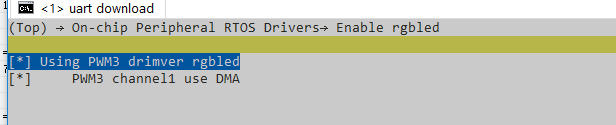

# RGBLED示例

源码路径：[example/rt_device/rgbled/](#)

## 支持的平台
<!-- 支持哪些板子和芯片平台 -->
+ em-lb525

## 概述
<!-- 例程简介 -->
本例程演示基于rt-device（使用rt-thread）的rgbled驱动，包含：
+ rgb_循环展示RGB灯光；

```{tip}
本例程基于HCPU，使用到PWM的DMA驱动。
```

## 例程的使用
<!-- 说明如何使用例程，比如连接哪些硬件管脚观察波形，编译和烧写可以引用相关文档。
对于rt_device的例程，还需要把本例程用到的配置开关列出来，比如PWM例程用到了PWM1，需要在onchip菜单里使能PWM1 -->

### 硬件需求
运行该例程前，需要准备一块本例程支持的开发板（[支持的平台](#支持的平台)）。

### menuconfig配置

运行如下命令
```c
menuconfig --board=em-lb525
```
BSP使能RGBLED   



### 编译和烧录
切换到例程project目录，运行scons命令执行编译：
```
scons -j8 --board=em-lb525 
```
运行`build_em-lb525_hcpu\uart_download.bat`，按提示选择端口即可进行下载：
```
$ ./uart_download.bat

     Uart Download

please input the serial port num:5
```
关于编译、下载的详细步骤，请参考[](/quickstart/get-started.md)的相关介绍。

## 例程的预期结果
<!-- 说明例程运行结果，比如哪几个灯会亮，会打印哪些log，以便用户判断例程是否正常运行，运行结果可以结合代码分步骤说明 -->
例程启动后，串口输出如下：
```
12-25 11:51:46:770    start display color!
12-25 11:51:47:266    -> black
12-25 11:51:49:261    -> blue
12-25 11:51:50:257    -> green
12-25 11:51:51:264    -> cyan
12-25 11:51:51:283    -> red
12-25 11:51:52:262    -> purple
12-25 11:51:54:278    -> yellow
12-25 11:51:55:275    -> white

```


## 异常诊断

1. 通过PWM/DMA寄存器确认PWM/DMA配置状态：


## 参考文档
<!-- 对于rt_device的示例，rt-thread官网文档提供的较详细说明，可以在这里添加网页链接，例如，参考RT-Thread的[RTC文档](https://www.rt-thread.org/document/site/#/rt-thread-version/rt-thread-standard/programming-manual/device/rtc/rtc) -->

## 更新记录
|版本 |日期   |发布说明 |
|:---|:---|:---|
|0.0.1 |12/2024 |初始版本 |
| | | |
| | | |
