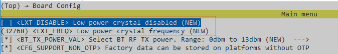
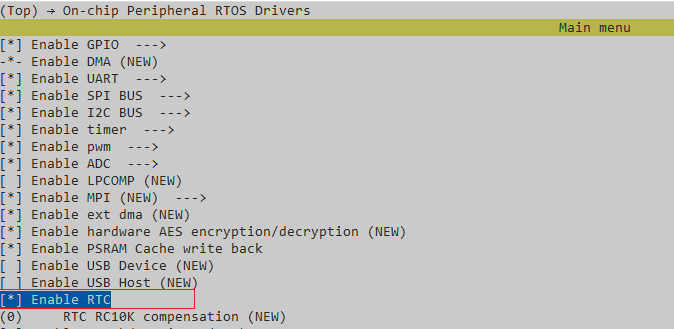
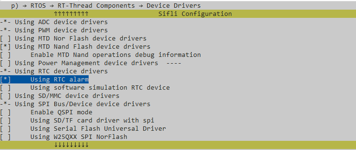

# RTC示例
源码路径:example/rt_device/rtc
## 支持的平台
<!-- 支持哪些板子和芯片平台 -->
+ sf32lb52-lcd_n16r8
+ sf32lb58-lcd_n16r64n4

## 概述
<!-- 例程简介 -->
例程演示基于RT device框架的系统时间设置、系统时间读取以及闹钟使用：
+ 设置日期时间、读取日期时间。
+ 设置Alarm。

## 例程的使用
<!-- 说明如何使用例程，比如连接哪些硬件管脚观察波形，编译和烧写可以引用相关文档。
对于rt_device的例程，还需要把本例程用到的配置开关列出来，比如PWM例程用到了PWM1，需要在onchip菜单里使能PWM1 -->

### 硬件需求
运行该例程前，需要准备一块本例程支持的开发板

### menuconfig配置
如下配置，本例程已配置OK。
1. 该例程基于外挂32k晶体，需要配置LXT使能（LXT_DISABLE不勾选）：

2. 使能RTC（`BSP_USING_ONCHIP_RTC`配置后自动配置`RT_USING_RTC`）:

3. 使能RTC Alarm：


### 编译和烧录
切换到例程project目录，运行scons命令执行编译：
```
scons --board=sf32lb52-lcd_n16r8 -j32
```
运行`build_sf32lb52-lcd_n16r8_hcpu\uart_download.bat`，按提示选择端口即可进行下载：
```
$ ./uart_download.bat

     Uart Download

please input the serial port num:5
```
关于编译、下载的详细步骤，请参考[](/quickstart/get-started.md)的相关介绍。

## 例程的预期结果
<!-- 说明例程运行结果，比如哪几个灯会亮，会打印哪些log，以便用户判断例程是否正常运行，运行结果可以结合代码分步骤说明 -->
例程启动后，串口输出如下：
1. 设置系统时间为2024/01/01 08:30:00
```c
10-09 11:01:46:350    set system time (by RT DEVICE):  2024 01 01 08:30:00
10-09 11:01:46:352    current system time:  2024 01 01 08:30:00
```
2. 设置系统时间为2024/02/01 08:30:00
```c
10-09 11:01:46:354    set system time (by RTT API):  2024 02 01 08:30:00
10-09 11:01:46:356    current system time:  2024 02 01 08:30:00
```
3. 设置单次闹钟，闹钟达到时间为08:32:00
```c
10-09 11:01:46:358    SET ONESHOT ALARM : [08:32:00] 
```
4. 闹钟到达
```c
10-09 11:03:46:301    Alarm triggered at  2024 02 01 08:32:00
```
5. 周期获取系统时间（每秒）
```c
10-09 11:03:56:885    current system time:  2024 02 01 08:32:11
10-09 11:03:57:852    current system time:  2024 02 01 08:32:12
10-09 11:03:58:880    current system time:  2024 02 01 08:32:13
10-09 11:03:59:847    current system time:  2024 02 01 08:32:14
10-09 11:04:00:861    current system time:  2024 02 01 08:32:15
```

## 异常诊断


## 参考文档
<!-- 对于rt_device的示例，rt-thread官网文档提供的较详细说明，可以在这里添加网页链接，例如，参考RT-Thread的[RTC文档](https://www.rt-thread.org/document/site/#/rt-thread-version/rt-thread-standard/programming-manual/device/rtc/rtc) -->
[RTC 设备](https://www.rt-thread.org/document/site/#/rt-thread-version/rt-thread-standard/programming-manual/device/rtc/rtc)

## 更新记录
|版本 |日期   |发布说明 |
|:---|:---|:---|
|0.0.1 |10/2024 |初始版本 |
| | | |
| | | |
