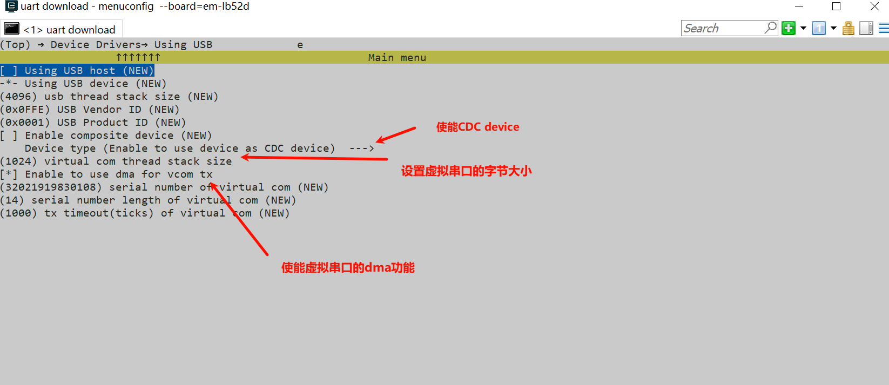
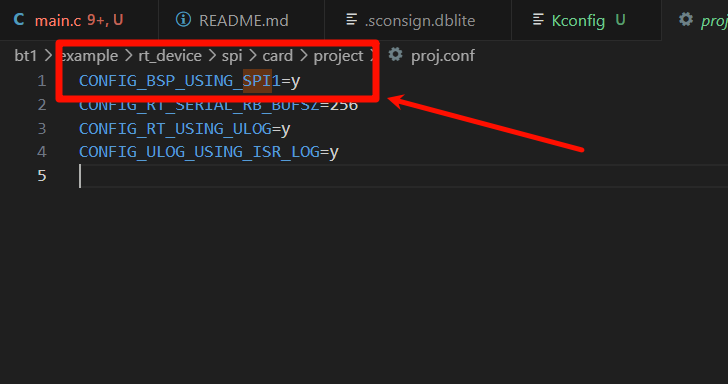
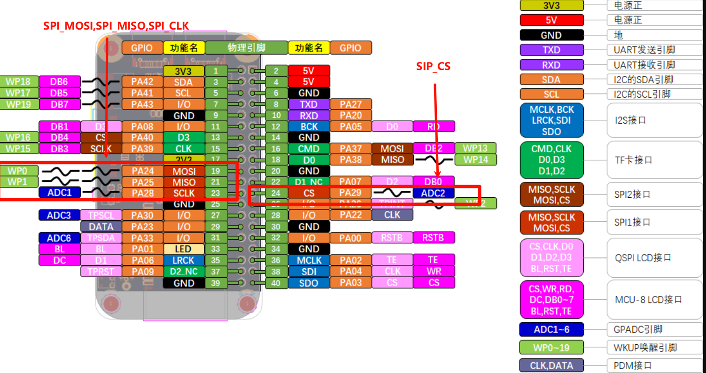
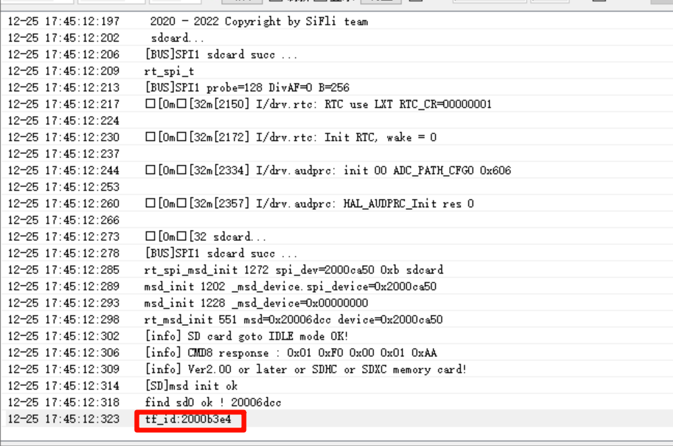
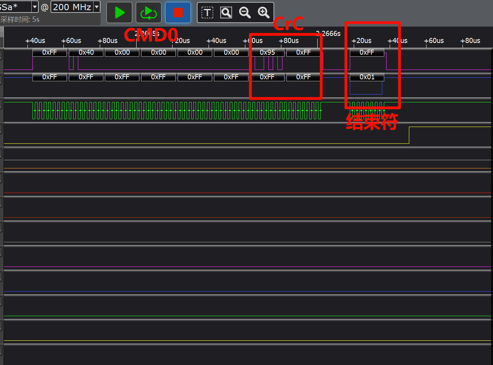
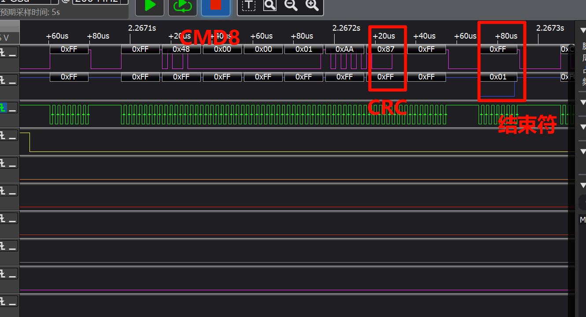
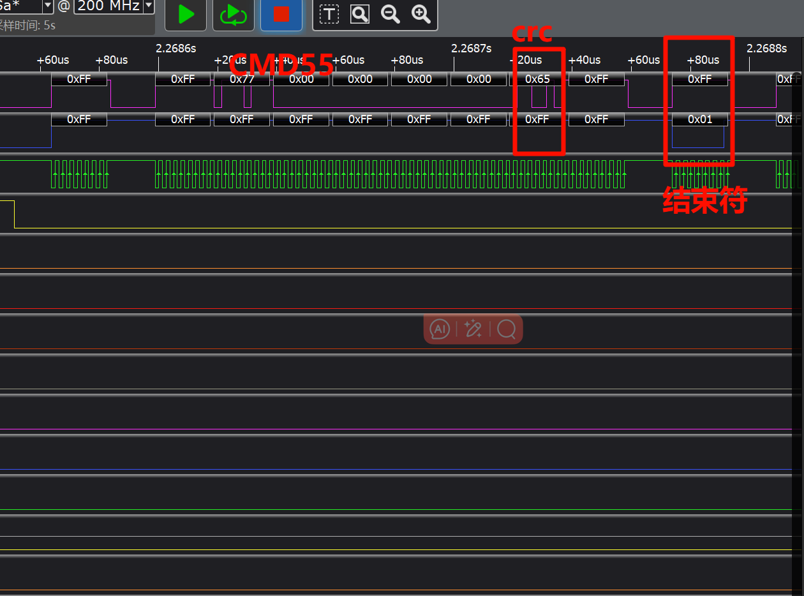
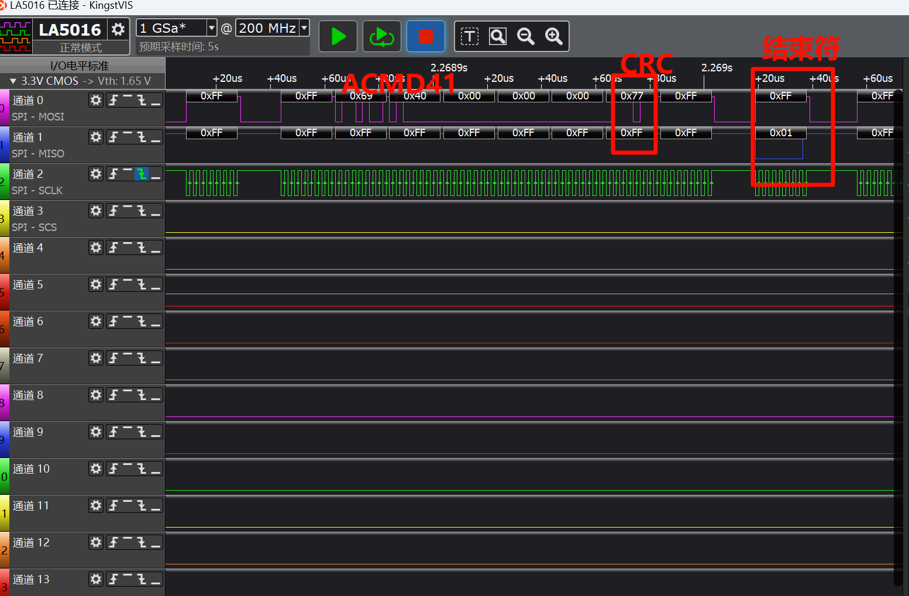
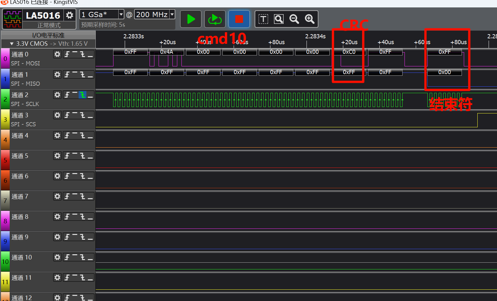
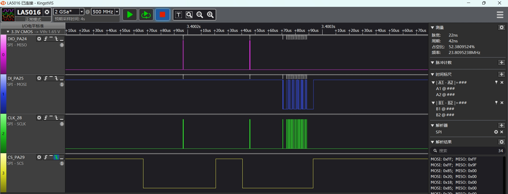

# 使用SPI通过CMD指令读取TF卡ID
源码路径：example\rt_device\spi
## 支持平台
* sf32lb52-lcd_n16r8
* sf32lb58-lcd_n16r64n4

## 概述
* 在RT-Thread操作系统下，通过SPI接口发送CMD指令，读取TF卡id演示

## 例程的使用
### 编译和烧写
#### 以sf32lb52-lcd_52d为例
* 此例程中用到了spi1，在采用RT-Thread操作系统时，spi1外设会虚拟成了一个rt_device来进行读写操作，此时需要确认所在路径下`rtconfig.h`文件中是否包含了下面2个宏：
```c
#define BSP_USING_SPI 1
#define BSP_USING_SPI1 1
```
只有包含了上面两个宏，在`rt_spi_msd_init`函数中才会通过`rt_hw_spi_device_attach`创建`spi1`这个rt_device，只有创建好设备，后面才能通`rt_device_find`和`rt_device_open`成功

如果发现上面的宏缺失或者未打开，可通过菜单`menuconfig` 中打开，具体操作如下
```
menuconfig --board=sf32lb52-lcd_52d
```
如下图操作,选择SPI1使能（需要用到DMA，选择对应的DMA选项），保存并退出menuconfig，查看`rtconfig.h`宏是否生成



* 切换到工程历程project目录运行scons命令进行代码编译：
```
scons --board=sf32lb52-lcd_52d -j8
```
* 切换到例程`project/build_xx`目录，运行`uart_download.bat`，按提示选择端口即可进行下载：

>`build_sf32lb52-lcd_52d_hcpu\uart_download.bat`//下载代码

>`Uart Download`

>`please input the serial port num:5`

关于编译、下载的详细步骤，请参考[](/quickstart/get-started.md)的相关介绍。

### 硬件连接
```{eval-rst}
+---------+--------+------------+------------+-----------------+
|开发板   |功能引脚|本端设备引脚|对端设备引脚|物理引脚（CONN2）|   
+=========+========+============+============+=================+ 
|sf32lb52-lcd |PA_24   |dio         |SPI_MOSI    |19               |
|         +--------+------------+------------+-----------------+     
|         |PA_25   |di          |SPI_MISO    |21               |     
|         +--------+------------+------------+-----------------+
|         |PA_28   |clk         |SPI_CLK     |23               |   
|         +--------+------------+------------+-----------------+  
|         |PA_29   |cs          |SPI_CS      |24               |
+---------+--------+------------+------------+-----------------+
|sf32lb58-lcd |PA_21   |do          |SPI_MOSI    |8                |    
|         +--------+------------+------------+-----------------+ 
|         |PA_20   |di          |SPI_MISO    |10               |     
|         +--------+------------+------------+-----------------+
|         |PA_28   |clk         |SPI_CLK     |5                |   
|         +--------+------------+------------+-----------------+  
|         |PA_29   |cs          |SPI_CS      |3                |   
+---------+--------+------------+------------+-----------------+
```
* 注意功能引引脚跟设备引脚并不是一一对应的关系，设备引脚请参考原理图

### 例程输出结果展示

是否读取ID成功log打印结果如下
* 如果没有插tf卡或者读取失败则Log打印为
```c
[err]SD card goto IDLE mode timeout
[SD]msd init failed,spi_dev=xxxxxxxx 
```
* 读取ID成功则Log打印为
```
 [SD] msd init ok
 find sd0 ok!
 tf_id:2000b3e4(后四位为TF卡ID，以16)
 ``` 

下图为其中抓取发送CMD指令的波形
CMD0的波形（发送CMD0将设备设置为SPI模式）

CMD8的波形(校验卡的协议是否是SD2.0)

CMND55的波形（特殊指令前命令，发送ACMD类指令前 ，需要发送此指令）

ACMD41的波形（获取SD电压值，作为测试当前SD卡的支持协议，所需的电压值是否正常）

CMD10的波形（读取CID信息）

**注意** 
1. 如果使用TX DMA，则需要打开`#define BSP_SPI1_TX_USING_DMA 1`；
2. 在SPI的数据量不多的情况下，采用DMA会增加代码开销，反而实时性会更低；

* 以sf32lb52-lcd_52d开发版为例，配置对应的spi1对应的IO口
```c
    /* 1, pinmux set to spi1 mode */
    HAL_PIN_Set(PAD_PA24, SPI1_DIO, PIN_PULLDOWN, 1);       // SPI1 (Nor flash)
    HAL_PIN_Set(PAD_PA25, SPI1_DI,  PIN_PULLUP, 1);
    HAL_PIN_Set(PAD_PA28, SPI1_CLK, PIN_NOPULL, 1);
    HAL_PIN_Set(PAD_PA29, SPI1_CS,  PIN_NOPULL, 1);
```
**注意**
1. CLK，CS为输出口，不需要配置为上下拉状态
2. DIO，DI口为输入口，需要配置上下拉，如果外设没有特别需要，采用此默认值
3. HAL_PIN_Set 最后一个参数为hcpu/lcpu选择, 1：选择hcpu，0：选择lcpu 
4. Hcpu的PA口不能配置为Lcpu的spi外设，比如spi3，spi4输出
* 先后`rt_device_find`,`rt_device_control`,`rt_device_open`分别查找、配置和打开`spi`设备
1. rt-thread为了适配不同设备采用同一个spi总线，多定义一个设备，需要通过rt_hw_spi_device_attach把`spi1`设备附到该设备，此处为`tfcord`

## 工作流程
1. 使用rt_spi_msd_init()函数进行SPI设备注册
2. 在通过msd_init()函数进行设备的初始化，并将tfcord设备挂在在sd设备上
3. 通过rt_msd_init()函数进行设备的转换和spi参数的额配置，并且发送一系列的CMD指令初始化TF卡和读取其cid寄存器中的数据，即可得到其id了

## 异常诊断
* spi1无波形输出
1. `pin status 24/25/28/29`命令查看对应PA24，PA25，PA28，PA29的IO状态FUNC对不对，PA29作为CS脚应该为高电平，对应VAL=1
```
    msh />
 TX:pin status 24
    pin status 24
    [109951461] I/TEST.GPIO: PIN 24, FUNC=2, VAL=0, DIG_IO_PD, GPIO_MODE_INPUT, irqhdr=/, arg=/
    msh />
    msh />
 TX:pin status 25
    pin status 25
    [110036013] I/TEST.GPIO: PIN 25, FUNC=2, VAL=1, DIG_IO_PU, GPIO_MODE_INPUT, irqhdr=/, arg=/
    msh />
    msh />
 TX:pin status 28
    pin status 28
    [110115999] I/TEST.GPIO: PIN 28, FUNC=2, VAL=0, DIG_IO, GPIO_MODE_INPUT, irqhdr=/, arg=/
    msh />
    msh />
 TX:pin status 29
    pin status 29
    [110195531] I/TEST.GPIO: PIN 29, FUNC=2, VAL=1, DIG_IO, GPIO_MODE_INPUT, irqhdr=/, arg=/
    msh />
    msh />

```
2. `list_device`命令查看`spi1`，`nor_flash`设备是不是存在并且打开了
3. 检查spi1初始化和配置流程是否都已生效
* spi1波形正常，spi1的DI接收不到数据
1. 先示波器查看波形电平是否正常
2. 逻辑分析仪抓取时序，跟外设的规格书对比，看波形要求是否一致
3. 检测spi1输出和外设是否连接正常
4. 检测外设的供电是否正常
* spi波形时效性不够
1. 如下图cs信号到clk实际数据，中间延时过大，这是因为rt-thread封装后导致的延迟，如果对时效性要求高的，可以参考直接操作hal的示例


