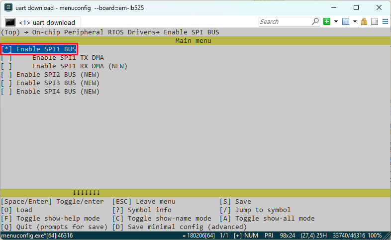
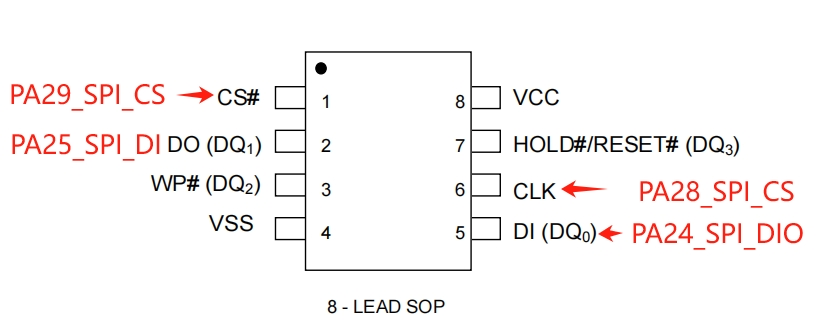
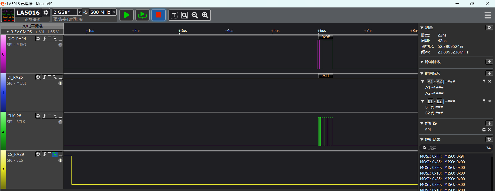
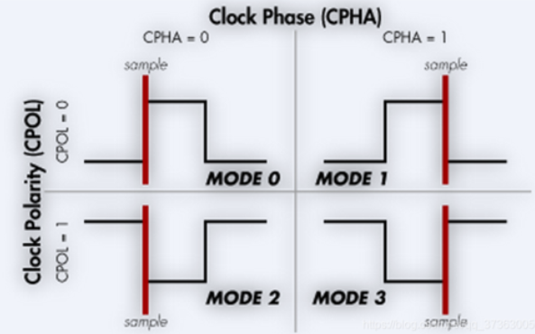

# SPI示例
源码路径：example\rt_device\spi
## 支持的平台
例程可以运行在以下开发板.
* sf32lb52-lcd_n16r8
* sf32lb58-lcd_n16r64n4

## 概述
* 在RT-Thread操作系统下，通过spi接口进行读写nor flash演示

## 例程的使用
### 编译和烧录
#### 以sf32lb52-lcd_n16r8为例
* 此例程中用到了spi1，在采用RT-Thread操作系统时，spi1外设会虚拟成了一个rt_device来进行读写操作，此时需要确认所在路径下`rtconfig.h`文件中是否包含了下面2个宏：
```c
#define BSP_USING_SPI 1
#define BSP_USING_SPI1 1
```
只有包含了上面两个宏，在`rt_hw_spi_bus_init`函数中才会通过`rt_spi_bus_register`函数注册`"spi1"这个`rt_device`，后面该设备才能`rt_device_find`和`rt_device_open`成功。

如果缺失上面三个宏，就需要通过`menuconfig`如下命令进行打开
```c
menuconfig --board=sf32lb52-lcd_n16r8
```
如下图，选择spi1(需要用到DMA，选择对应DMA选项)，保存并退出menuconfig，查看`rtconfig.h`宏是否生成

* 切换到例程project目录，运行scons命令执行编译：
```c
> scons --board=sf32lb52-lcd_n16r8 -j8
```
* 切换到例程`project/build_xx`目录，运行`uart_download.bat`，按提示选择端口即可进行下载：

>`build_sf32lb52-lcd_n16r8_hcpu\uart_download.bat`

>`Uart Download`

>`please input the serial port num:5`

关于编译、下载的详细步骤，请参考[快速上手](quick_start)的相关介绍。

### 硬件连接

```{eval-rst}
+---------+--------+------------+------------+-----------------+
|开发板   |功能引脚|本端设备引脚|对端设备引脚|物理引脚（CONN2）|   
+=========+========+============+============+=================+ 
|sf32lb52-lcd |PA_24   |dio         |SPI_MOSI    |19               |
|         +--------+------------+------------+-----------------+     
|         |PA_25   |di          |SPI_MISO    |21               |     
|         +--------+------------+------------+-----------------+
|         |PA_28   |clk         |SPI_CLK     |23               |   
|         +--------+------------+------------+-----------------+  
|         |PA_29   |cs          |SPI_CS      |24               |
+---------+--------+------------+------------+-----------------+
|sf32lb58-lcd |PA_21   |do          |SPI_MOSI    |8                |    
|         +--------+------------+------------+-----------------+ 
|         |PA_20   |di          |SPI_MISO    |10               |     
|         +--------+------------+------------+-----------------+
|         |PA_28   |clk         |SPI_CLK     |5                |   
|         +--------+------------+------------+-----------------+  
|         |PA_29   |cs          |SPI_CS      |3                |   
+---------+--------+------------+------------+-----------------+
```

      
sf32lb52-lcd_n16r8硬件原理图参考如下图：


#### 例程输出结果展示:
* log输出:
```
  SFBL
  Serial:c2,Chip:4,Package:3,Rev:3  Reason:00000080
   \ | /
  - SiFli Corporation
   / | \     build on Oct 24 2024, 2.2.0 build 00000000
   2020 - 2022 Copyright by SiFli team
  mount /dev sucess
  [32m][1920] I/drv.rtc: PSCLR=0x80000100 DivAI=128 DivAF=0 B=256
  [0m][32m][1947] I/drv.rtc: RTC use LXT RTC_CR=00000001
  [0m][32m][1968] I/drv.rtc: Init RTC, wake = 0
  [0m][32m][2129] I/drv.audprc: init 00 ADC_PATH_CFG0 0x606
  [0m][32m][2152] I/drv.audprc: HAL_AUDPRC_Init res 0
  [0m][32m][2173] I/drv.audcodec: HAL_AUDCODEC_Init res 0
  [0m][32m][2195] I/TOUCH: Regist touch screen driver, probe=1203bcad 
  [0mcall par CFG1](35bb)
  fc 9, xtal 2000, pll 2052
  call par CFG1(35bb)
  fc 9, xtal 2000, pll 2052
  Start spi demo!
  msh />
  [35017] D/spi1: Find spi bus spi1:20008184
  [35036] D/spi1: rt_spi_configure result:0
  [38320] D/spi1: rt_spi_transfer recv reg:9f value:85
  spi read:0x85,0x20,0x18,0x85,0x20,0x18,0x85,0x20,0x18,0x85,0x20,0x18,0x85,0x20,0x18,0x85,
  [38375] D/spi1: spidev_register_write addr:0x2 value:0x33
  spi demo end!
```
下图为其中抓取的`spidev_register_read(reg,1,read_data, 16);`前半部分波形：

```
```
#### spi1配置流程
* 确保`rtconfig.h`文件中是否包含了下面2个宏：
```c
#define BSP_USING_SPI 1
#define BSP_USING_SPI1 1
```
**注意** 
1. 如果使用TX DMA，则需要打开`#define BSP_SPI1_TX_USING_DMA 1`；
2. 在SPI的数据量不多的情况下，采用DMA会增加代码开销，反而实时性会更低；

* 以sf32lb52-lcd开发版为例，配置对应的spi1对应的IO口
```c
    /* 1, pinmux set to spi1 mode */
    HAL_PIN_Set(PAD_PA24, SPI1_DIO, PIN_PULLDOWN, 1);       // SPI1 (Nor flash)
    HAL_PIN_Set(PAD_PA25, SPI1_DI,  PIN_PULLUP, 1);
    HAL_PIN_Set(PAD_PA28, SPI1_CLK, PIN_NOPULL, 1);
    HAL_PIN_Set(PAD_PA29, SPI1_CS,  PIN_NOPULL, 1);
```
**注意**
1. CLK，CS为输出口，不需要配置为上下拉状态
2. DIO，DI口为输入口，需要配置上下拉，如果外设没有特别需要，采用此默认值
3. HAL_PIN_Set 最后一个参数为hcpu/lcpu选择, 1：选择hcpu，0：选择lcpu 
4. Hcpu的PA口不能配置为Lcpu的spi外设，比如spi3，spi4输出
* 先后`rt_device_find`,`rt_device_control`,`rt_device_open`分别查找、配置和打开`spi`设备
1. rt-thread为了适配不同设备采用同一个spi总线，多定义一个设备，需要通过rt_hw_spi_device_attach把`spi1`设备附到该设备，此处为`nor_flash`
```c
#define NOR_FLASH_DEVICE_NAME     "nor_flash"

#define SPI_BUS_NAME "spi1"

static struct rt_spi_device *spi_dev_handle = {0};/* 定义spi设备的操作句柄 */

static struct rt_spi_configuration spi_dev_cfg = {0}; /* 配置spi的结构体 */

rt_err_t spi_dev_init(void) 
{
    rt_err_t rst = RT_EOK;
    /* 1, pinmux set to spi1 mode */
#ifdef  SF32LB52X
    HAL_PIN_Set(PAD_PA24, SPI1_DIO, PIN_PULLDOWN, 1);       // SPI1 (Nor flash)
    HAL_PIN_Set(PAD_PA25, SPI1_DI,  PIN_PULLUP, 1);
    HAL_PIN_Set(PAD_PA28, SPI1_CLK, PIN_NOPULL, 1);
    HAL_PIN_Set(PAD_PA29, SPI1_CS,  PIN_NOPULL, 1);

#elif defined(SF32LB58X)
    HAL_PIN_Set(PAD_PA21, SPI1_DO, PIN_PULLDOWN, 1);       // SPI1 (Nor flash)
    HAL_PIN_Set(PAD_PA20, SPI1_DI,  PIN_PULLUP, 1);
    HAL_PIN_Set(PAD_PA28, SPI1_CLK, PIN_NOPULL, 1);
    HAL_PIN_Set(PAD_PA29, SPI1_CS,  PIN_NOPULL, 1);
#endif
    /* 2, find/open/config spi1 device  */
    rt_device_t spi_bus = rt_device_find(SPI_BUS_NAME);

    if (spi_bus)
    {
		rt_device_open(spi_bus, RT_DEVICE_FLAG_RDWR);
		LOG_D("Find spi bus %s:%x\n", SPI_BUS_NAME, spi_bus);
        spi_dev_handle = (struct rt_spi_device *)rt_device_find(NOR_FLASH_DEVICE_NAME);
        if (spi_dev_handle == NULL)
        {
            rst = rt_hw_spi_device_attach(SPI_BUS_NAME, NOR_FLASH_DEVICE_NAME);
            spi_dev_handle = (struct rt_spi_device *)rt_device_find(NOR_FLASH_DEVICE_NAME);
            if (spi_dev_handle == NULL)
            {
                LOG_E("Register spi_dev spi device fail\n");
                return -RT_ERROR;
            }
        }
        /* 需要使用中断或者DMA，或上对应的参数 */
        rst = rt_device_open((rt_device_t)(spi_dev_handle), RT_DEVICE_FLAG_RDWR);//|RT_DEVICE_FLAG_DMA_TX);

        spi_dev_cfg.data_width = 8; //bit
        spi_dev_cfg.max_hz = 20 * 1000 * 1000; // hz
        spi_dev_cfg.mode = RT_SPI_MODE_0 | RT_SPI_MSB | RT_SPI_MASTER;
        spi_dev_cfg.frameMode = RT_SPI_MOTO; //RT_SPI_TI;
        rst = rt_spi_configure(spi_dev_handle, &spi_dev_cfg);
        LOG_D("rt_spi_configure result:%d", rst);
    }

    /* rt_pin_mode(spi_dev_CS_PIN, PIN_MODE_OUTPUT); */
    /* rt_pin_write(spi_dev_CS_PIN, PIN_HIGH); */

    return rst;
}
```
* spi参数配置
```c
/* 数据宽度，参数为8，16 对应8bit，16bit */
    spi_dev_cfg.data_width = 8; //bit
/* spi的clk频率，单位为hz */
    spi_dev_cfg.max_hz = 20 * 1000 * 1000; // hz
/**
RT_SPI_MODE_0：选择mode 0-3；
RT_SPI_MSB：为一个byte中bit7先发送，bit0最后发送；
RT_SPI_MASTER：spi主模式（slave模式此处没有演示）
*/
    spi_dev_cfg.mode = RT_SPI_MODE_0 | RT_SPI_MSB | RT_SPI_MASTER;
```
1. RT_SPI_MODE_0（0-3）对应下图4种spi模式，4种模式的区别在于clk空闲时候的电平状态、第一个还是第二个clk进行采样
2. MODE0，MODE1在clk空闲时为低电平，MODE1和MODE3为CS拉低后第二个clk上升沿采样DIO或者DI数据

3. 示例中采用的nor flash规格书上，标注MODE0和MODE3都支持

* spi收发数据
```c
    uint8_t reg_data[] = {0x02,0x11,0x22,0x33,0x44,0x55,0x66,0x77,0x88,0x99,0xaa,0xbb,0xcc,0xdd,0xee,0xff};
    uint8_t reg[2] = {0x9f,0xff};
    uint8_t read_data[16] = {0};
    /* 单独发送一个字节0xFF */
    spidev_write(&reg[1],1);
    /* 发送一个字节0x9f命令后，读取16个字节数据 */
    spidev_register_read(reg,1,read_data, 16);
    /* 打印出来读出来的数据 */
    rt_kprintf("spi read:");
    for(uint8_t i = 0; i < 16; i++)
    {
        rt_kprintf("0x%x,",read_data[i]);
    }
    rt_kprintf("\n");
     /* 先发送3个字节后，再发送13个字节 */   
    spidev_register_write(reg_data,3,&reg_data[3],13);
```
* 打开`finsh`功能后，可以log串口终端输入`list_device`可以查看`spi1`和`nor_flash`是否open状态，0表示设备已经注册，1，2表示设备open的次数

```c
    msh />
 TX:list_device
    list_device
    device           type         ref count
    -------- -------------------- ----------
    nor_flas SPI Device           1       
    audcodec Sound Device         0       
    audprc   Sound Device         0       
    rtc      RTC                  0       
    pwm3     Miscellaneous Device 0       
    touch    Graphic Device       0       
    lcdlight Character Device     0       
    lcd      Graphic Device       0       
    i2c4     I2C Bus              0       
    i2c1     I2C Bus              0       
    spi1     SPI Bus              1       
    lptim1   Timer Device         0       
    btim1    Timer Device         0       
    uart2    Character Device     0       
    uart1    Character Device     2       
    pin      Miscellaneous Device 0       
    msh />
```
* 这里只是演示了spi作为master的一种推荐用法，其他操作方式，在rt-thread操作系统下，可以参考rt-thread官网使用手册


## 异常诊断
* spi1无波形输出
1. `pin status 24/25/28/29`命令查看对应PA24，PA25，PA28，PA29的IO状态FUNC对不对，PA29作为CS脚应该为高电平，对应VAL=1
```
    msh />
 TX:pin status 24
    pin status 24
    [109951461] I/TEST.GPIO: PIN 24, FUNC=2, VAL=0, DIG_IO_PD, GPIO_MODE_INPUT, irqhdr=/, arg=/
    msh />
    msh />
 TX:pin status 25
    pin status 25
    [110036013] I/TEST.GPIO: PIN 25, FUNC=2, VAL=1, DIG_IO_PU, GPIO_MODE_INPUT, irqhdr=/, arg=/
    msh />
    msh />
 TX:pin status 28
    pin status 28
    [110115999] I/TEST.GPIO: PIN 28, FUNC=2, VAL=0, DIG_IO, GPIO_MODE_INPUT, irqhdr=/, arg=/
    msh />
    msh />
 TX:pin status 29
    pin status 29
    [110195531] I/TEST.GPIO: PIN 29, FUNC=2, VAL=1, DIG_IO, GPIO_MODE_INPUT, irqhdr=/, arg=/
    msh />
    msh />

```
2. `list_device`命令查看`spi1`，`nor_flash`设备是不是存在并且打开了
3. 检查spi1初始化和配置流程是否都已生效
* spi1波形正常，spi1的DI接收不到数据
1. 先示波器查看波形电平是否正常
2. 逻辑分析仪抓取时序，跟外设的规格书对比，看波形要求是否一致
3. 检测spi1输出和外设是否连接正常
4. 检测外设的供电是否正常
* spi波形时效性不够
1. 如下图cs信号到clk实际数据，中间延时过大，这是因为rt-thread封装后导致的延迟，如果对时效性要求高的，可以参考直接操作hal的示例

## 参考文档
* EH-SF32LB52X_Pin_config_V1.3.0_20231110.xlsx
* DS0052-SF32LB52x-芯片技术规格书 V0p3.pdf
* PY25Q128HA_datasheet_V1.1.pdf
* RT-Thread官网 https://www.rt-thread.org/document/site/#/rt-thread-version/rt-thread-standard/programming-manual/device/spi/spi

## 更新记录
|版本 |日期   |发布说明 |
|:---|:---|:---|
|0.0.1 |10/2024 |初始版本 |
| | | |
