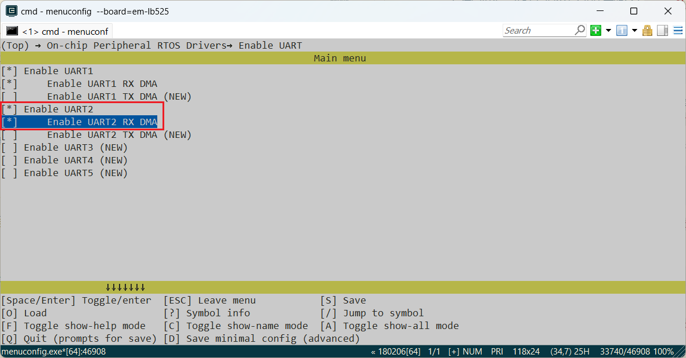
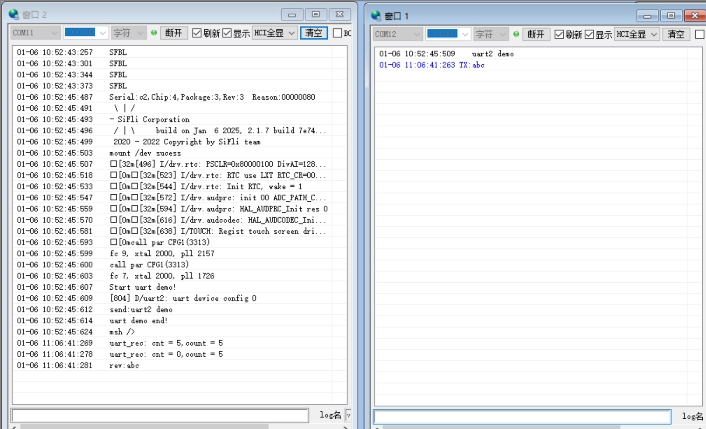

# UART示例
源码路径：example\rt_device\uart
## 支持的平台
例程可以运行在以下开发板.
* em-lb525
* em-lb587
## 概述
* 在RT-Thread操作系统下采用RX DMA方式，操作UART跟电脑串口之间进行通讯演示

## 例程的使用
### 编译和烧录

关于编译、下载的详细步骤，请参考[快速上手](quick_start)的相关介绍。
* 此例程中用到了uart2，在采用RT-Thread操作系统时，uart2外设会虚拟成了一个rt_device来进行读写操作，此时需要确认工程编译所在路径下`rtconfig.h`文件中是否包含了下面3个宏：
```c
#define BSP_USING_UART 1
#define BSP_USING_UART2 1
#define BSP_UART2_RX_USING_DMA 1
```
只有包含了上面三个宏，在`rt_hw_usart_init`函数中才会通过`rt_hw_serial_register`函数注册`"uart2`这个`rt_device`，后面该设备才能`rt_device_find`和`rt_device_open`成功。

如果缺失上面三个宏，就需要通过`menuconfig`如下命令进行打开(注意：缺失可能并不会报出错误，若配置串口没有信息打印请及时查看是否打开)
```c
menuconfig --board=em-lb525
```
如下图，选择uart2和rx dma，保存并退出menuconfig，查看`rtconfig.h`宏是否生成

* 切换到例程project目录，运行scons命令执行编译：
```c
> scons --board=em-lb525 -j8
```
* 切换到例程`project/build_xx`目录，运行`uart_download.bat`，按提示选择端口即可进行下载：

> `build_em-lb525_hcpu\uart_download.bat`

> `Uart Download`

> `please input the serial port num:5`

### 硬件连接

|版型名称  | UART       | TX(物理位置)     | RX(物理位置)   |    
|--------|------------|---------------|-------------------|
|525    | UART2     | PAD_PA27（8）    | PAD_PA20（10）    |   
|587  | UART2     | PAD_PA28 (CONN2 5)  |PAD_PA29 (CONN2 3)  |

* PA27软件配置为UART2的TX，连接到电脑usb转串口的RX
* PA20软件配置为UART2的RX，连接到电脑usb转串口的TX
* GND连接到usb转串口的GND，如下图：


#### 例程输出结果展示:
* log输出:左边为机器log，右边为电脑串口端接收和发送数据：

log结尾收到的`rev: `为接收到的电脑串口TX发来的字符
```
    SFBL
    Serial:c2,Chip:4,Package:3,Rev:3  Reason:00000080
     \ | /
    - SiFli Corporation
     / | \     build on Oct 23 2024, 2.2.0 build 00000000
     2020 - 2022 Copyright by SiFli team
    mount /dev sucess
    [32m][490] I/drv.rtc: PSCLR=0x80000100 DivAI=128 DivAF=0 B=256
    [0m][32m][517] I/drv.rtc: RTC use LXT RTC_CR=00000001
    [0m][32m][538] I/drv.rtc: Init RTC, wake = 1
    [0m][32m][565] I/drv.audprc: init 00 ADC_PATH_CFG0 0x606
    [0m][32m][587] I/drv.audprc: HAL_AUDPRC_Init res 0
    [0m][32m][609] I/drv.audcodec: HAL_AUDCODEC_Init res 0
    [0m][32m][630] I/TOUCH: Regist touch screen driver, probe=1203a299 
    [0mcall par CFG1](35bb)
    fc 9, xtal 2000, pll 2050
    call par CFG1(35bb)
    fc 9, xtal 2000, pll 2051
    Start uart demo!
    [796] D/uart2: uart device config 0
    send:uart2 demo
    uart demo end!
    msh />
    uart_rec: cnt = 83,count = 83
    uart_rec: cnt = 0,count = 83
    rev:abcdefghijklmnopqrstuvwxyz0abcdefghijklmnopqrstuvwxyz1abcdefghijklmnopqrstuvwxyz2
    uart_rec: cnt = 5,count = 5
    uart_rec: cnt = 0,count = 5
    rev:abc
```
下面为电脑串口端接收到从uart2接收到的`uart2 demo`字符和发送的数据
```c    
   uart2 demo
TX:abcdefghijklmnopqrstuvwxyz0abcdefghijklmnopqrstuvwxyz1abcdefghijklmnopqrstuvwxyz2
TX:abc
```
#### uart2配置流程
* 确保`rtconfig.h`文件中是否包含了下面3个宏：
编译窗口输入命令查看board=（版型）
```c
#define BSP_USING_UART 1
#define BSP_USING_UART2 1
#define BSP_UART2_RX_USING_DMA 1

menuconfig --board=em-lb525
```


* 设置对应的Uart2对应的IO口
```c
   #if defined(BSP_USING_BOARD_EM_LB525XXX)
    HAL_PIN_Set(PAD_PA20, USART2_RXD, PIN_PULLUP, 1);
    HAL_PIN_Set(PAD_PA27, USART2_TXD, PIN_PULLUP, 1);
    #elif defined (BSP_USING_BOARD_EM_LB587XXX)
    HAL_PIN_Set(PAD_PA29, USART2_RXD, PIN_PULLUP, 1);
    HAL_PIN_Set(PAD_PA28, USART2_TXD, PIN_PULLUP, 1);
    #endif
```
**注意**: 
1. 除55x芯片外,可以配置到任意带有PA*_I2C_UART功能的IO输出UART2波形（想查询引脚复用表可在项目路径下文件中查找如：bf0_pin_const.c）
2.  HAL_PIN_Set 最后一个参数为hcpu/lcpu选择, 1:选择hcpu,0:选择lcpu 
3.  Hcpu的PA口不能配置为Lcpu的uart外设，比如uart5,uart6输出
* 先后`rt_device_find`,`rt_device_control`,`rt_device_open`分别查找、配置和打开`uart2`设备
```c
#define UART_DEMO_NAME "uart2"

    /* 2, find  and config uart2 device */
    g_uart_device = rt_device_find(UART_DEMO_NAME);
    if (!g_uart_device)
    {
        LOG_E("find %s failed!\n", UART_DEMO_NAME);
        return RT_ERROR;
    }

    /* config uart2 baud_rate */
    {
        rt_err_t err;
        struct serial_configure config = RT_SERIAL_CONFIG_DEFAULT;
        config.baud_rate = 1000000; /* 配置uart2波特率为1000000 */
        err = rt_device_control(g_uart_device, RT_DEVICE_CTRL_CONFIG, &config);
        LOG_D("uart device config %d", err);
    }

    /* 初始化rx_sem信号量，在uart_rx_ind函数内释放，在serial_rx_thread_entry线程内使用 */
    rt_sem_init(&rx_sem, "rx_sem", 0, RT_IPC_FLAG_FIFO);

	/* 配置uart2 采用rx dma方式接收 */
	rt_err_t open_result = rt_device_open(g_uart_device, RT_DEVICE_OFLAG_RDWR | RT_DEVICE_FLAG_DMA_RX);
	//using interring mode when DMA mode not supported
	if (open_result == -RT_EIO)
	{
	    rt_device_open(g_uart_device, RT_DEVICE_OFLAG_RDWR | RT_DEVICE_FLAG_INT_RX);/* 配置uart2中断 */
    }
    /* set the callback function of recieving */
```
* 配置uart2的中断回调函数`uart_rx_ind`，并创建启动线程`serial_rx_thread_entry`来接收处理RX DMA收到的数据
```c
    /* 设置uart_rx_ind为uart2 中断回调函数 */
    rt_device_set_rx_indicate(g_uart_device, uart_rx_ind);
    
    /* creat the thread of g_uart_device */
    rt_thread_t thread = rt_thread_create("g_uart_device", serial_rx_thread_entry, RT_NULL,  3 * 1024, 12, 10);

    /* start the thread of g_uart_device */
    if (thread != RT_NULL)
    {
        rt_thread_startup(thread);
    }
    else
    {
        ret = RT_ERROR;
    }
```
* uart2通过uart_send_data函数发送数据
```c
    uint8_t tx_data[ONE_DATA_MAXLEN] = {'u','a','r','t','2',' ','d','e','m','o','\n'};
    uart_send_data(tx_data,12);
```
* 打开`finsh`功能后，可以log串口终端输入`list_device`可以查看`uart2`是否open状态，0表示设备已经注册，1，2表示设备open的次数

```c
 TX:list_device
   list_device
   device           type         ref count
   -------- -------------------- ----------
   audcodec Sound Device         0       
   audprc   Sound Device         0       
   rtc      RTC                  0       
   pwm3     Miscellaneous Device 0       
   touch    Graphic Device       0       
   lcdlight Character Device     0       
   lcd      Graphic Device       0       
   i2c4     I2C Bus              0       
   i2c1     I2C Bus              0       
   lptim1   Timer Device         0       
   btim1    Timer Device         0       
   uart2    Character Device     1       
   uart1    Character Device     2       
   pin      Miscellaneous Device 0       
   msh />
```
* 这里只是演示了uart的一种推荐用法，其他操作，在rt-thread操作系统下，可以参考rt-thread官网使用手册


## 异常诊断
* uart2无波形输出
1. `pin status 20/27`命令查看对应PA20，PA27的IO状态FUNC对不对，VAL电平应该是1
```c
    msh />
 TX:pin status 20
    pin status 20
    [I/TEST.GPIO] PIN 20, FUNC=4, VAL=1, DIG_IO_PU, GPIO_MODE_INPUT, irqhdr=/, arg=/
    msh />
    msh />
 TX:pin status 27
    pin status 27
    [I/TEST.GPIO] PIN 27, FUNC=4, VAL=1, DIG_IO_PU, GPIO_MODE_INPUT, irqhdr=/, arg=/
    msh />
    msh />
```
2. `list_device`命令查看`uart2`设备是不是存在并且打开了
3. 检查uart2配置流程是否都已生效
* uart2波形正常，电脑串口接收不到数据
1. 检测uart2输出和电脑串口连接是否正常，需要TX接RX,RX连接TX，波特率是否一致,以及引脚对应的TX,RX是否正确
2. 检测硬件连接，包括uart2输出电平跟电脑uart电平是否一致
* 电脑串口发出数据，uart2出现数据接收丢失现象
1. 确认串口DMA的buffer长度是否足够 `#define RT_SERIAL_RB_BUFSZ 256`
```c
/* 
&data[count]：为接收到数据的内存地址；
ONE_DATA_MAXLEN：准备接收的长度，可以大于DMA的buffer长度；
返回值为：实际接收到的长度，0为已经接收完毕；
*/
rt_device_read(g_uart_device, -1, &data[count], ONE_DATA_MAXLEN);
```   
## 参考文档
* EH-SF32LB52X_Pin_config_V1.3.0_20231110.xlsx
* DS0052-SF32LB52x-芯片技术规格书 V0p3.pdf
* DS0058-SF32LB58x-芯片技术规格书 V1p8.pdf
* RT-Thread官网 https://www.rt-thread.org/document/site/#/rt-thread-version/rt-thread-standard/README

## 更新记录
|版本 |日期   |发布说明 |
|:---|:---|:---|
|0.0.1 |10/2024 |初始版本 |
| 0.0.2| 12/2024|2.0 |
