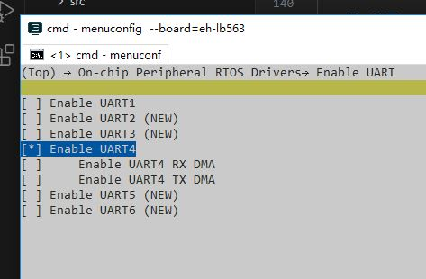
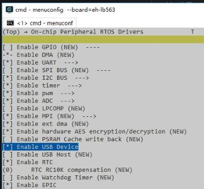
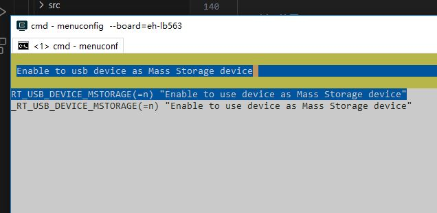
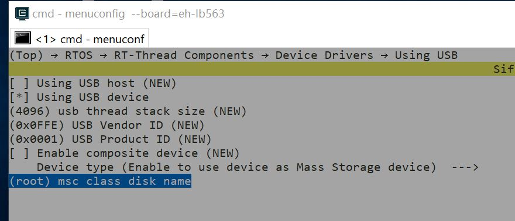
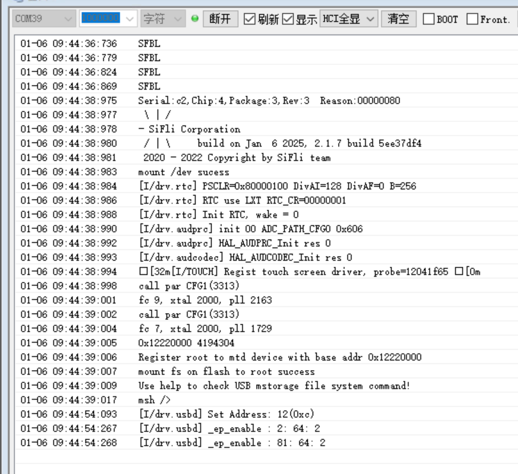
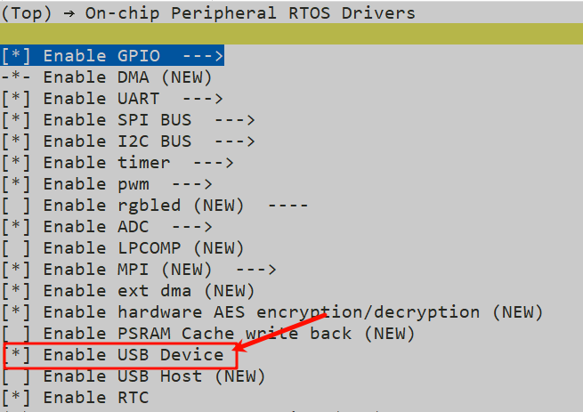
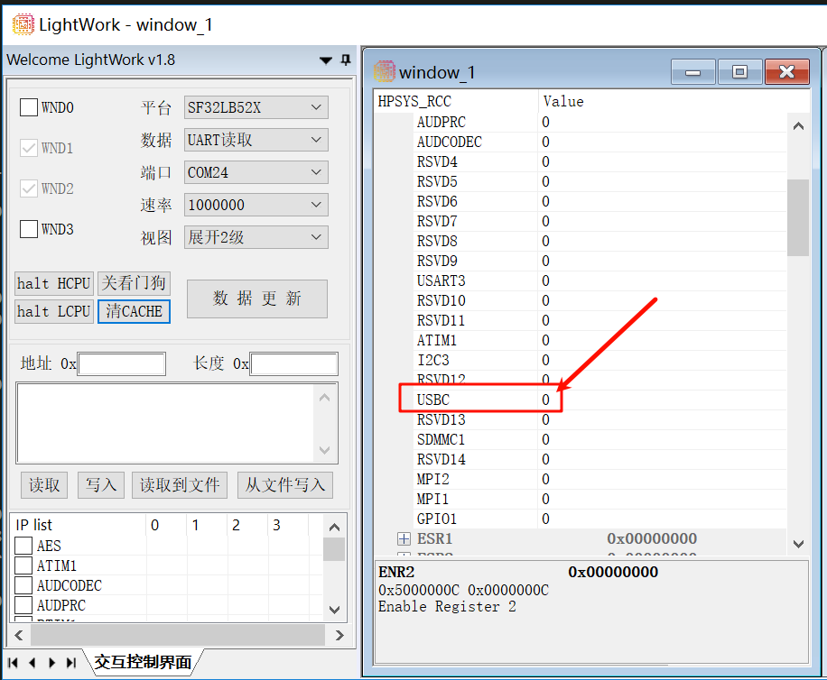
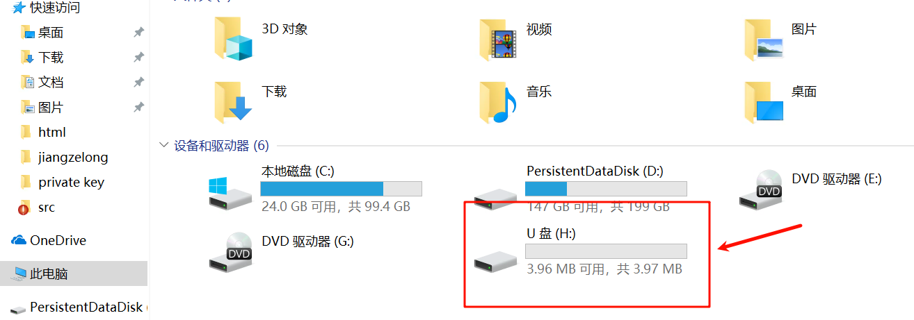

# USB_MSTORAGE示例
## 概述
例程展示了USB作为device设备的U盘功能，可以在pc上挂载本地的文件系统。

## 支持的开发板
例程可以运行在以下开发板.
* sf32lb52-lcd_n16r8


**注意：** 一般而言，例程都是运行芯片的HCPU，"eh-lb563_v2" 等效于"eh-lb563_v2_hcpu"，如果想在LCPU运行例程，可以使用"eh-lb563_v2_lcpu"。目前USB功能暂时只支持在HCPU上运行。

## 例程目录结构
USB_MSTORAGE工程包含了1个.c文件(main.c),下面的树状结构展示 了工程目录下的其他文件.
```
|--Readme.md
|--src
|    |--main.c
|    |--Sconscript
|--project  
        |--Kconfig
        |--Kconfig.proj
        |--proj.conf
        |--rtconfig.py
        |--SConscript
        |--SConstruct
```
## 例程的使用
### 硬件需求
1、运行例程的前提，需要拥有一块支持该例程的开发板。
2、一根具备数据传输能力的USB数据线。
3、HDK52X的V1.2版本硬件需要做如下更改；
| R0105 | R0710 | R0706 |
|-------|-------|-------|
|   NF  |   NF  |   NF  |

4、HDK56X的V1.1版本硬件需要做如下更改；
| R0210 | R0211 | R0202 | R0204 | R0634 | R0633 | R0132 | R0107 | R0103 | R0106 |
|-------|-------|-------|-------|-------|-------|-------|-------|-------|-------|
|   NF  |   NF  |   NF  |   NF  |   NF  |   NF  |   NF  |   NF  | 220K  | 390K  |
### 管脚配置
**注意:** 下面表格展示了各开发板用于VBUS控制的管脚配置。
1、HDK52X的V1.2版本中USB的插拔引脚使用NTC功能引脚复用。
2、HDK56X的V1.1版本中USB的DP与DM引脚与UART1复用了，所以需要将LOG打印的uart1修改为uart4，并关闭uart1。
|               |   vbus pin  |  DP  |  DM  |
|---------------|-------------|------|------|
|eh-lb523    |    PA32     | PA35 | PA36 |
|eh-lb520    |    PA32     | PA35 | PA36 |
|eh-lb525    |    PA32     | PA35 | PA36 |
|eh-lb561    |    PA51     | PA17 | PA18 |
|eh-lb563    |    PAXX     | PA17 | PA18 |

### menuconfig配置
```
//指令执行
menuconfig --board=sf32lb52-lcd_n16r8
```
**注意：** HDK52X中的USB引脚没有与UART复用因此可跳过1、2步骤。

1、配置log打印串口号 "the device name for console"

2、使能log打印打印串口uart4，关闭uart1；"Enable UART4"


3、使能USB的device功能；"Enable USB Device"


4、配置USB的插拔检测引脚；"usb Insertion detetion PIN",将其配置为对应的引脚号

5、使能USB的storage功能;"Enable to usb device as Mass Storage device"


6、配置USB挂载文件系统分区；
如果没有DHARA功能（用于NAND的管理与优化）如HDK523、HDK561则只需要修改“msc class disk name”为需要加载到USB识别的文件系统分区名。


如果有DHARA功能(如525、563使用外部NAND flash芯片等系列)，因存在DHARA映射存在，“msc class disk name” 为DHARA映射后的dhara名：例如目前563HDK上只有一个分区的DHARA名为dhara0。


### 编译和烧录
按照以下步骤，可以完成编译和烧录。

```
scons --board=sf32lb52-lcd_n16r8

.\build_sf32lb52-lcd_n16r8_hcpu\uart_download.bat
```

## 例程输出结果展示
下面结果展示了例程在开发板运行起来后的log。如果看不到这些log，就说明例程没能按预期运行成功，需要进行原因排查。
系统启动

```
mount fs on flash to root success
usb_init
Use help to check USB mstorage file system command!
msh />usb_thread_entry
```

插入USB并检测到u盘设备的log



## 故障排除
如果未能出现预期的log，可以从以下方面进行故障排除：
* 硬件连接是否正常
* 管脚配置是否正确
* 检查USB接口是否有松动
* 检查USB线是否具备数据传输功能
* 检查USB的时钟是否是60MHz的频率

## 例程扩展
 
如果想要修改VBUS的检测引脚号，可按照如下方式进行修改。
1.  修改配置menuconfig --board=eh-lb525中重新修改 将"usb Insertion detection PIN"中的参数修改为想要的检测引脚
D:\MyWork\code_sdk\siflisdk\customer\boards\ec-lb555xxx
2.  修改pinmux配置文件 **"\siflisdk\customer\boards\ec-lb对应的型号目录\bsp_pinmux.c"**，将该引脚配置为GPIO模式；
```c
HAL_PIN_Set(PAD_PA32, GPIO_A32, PIN_NOPULL, 1);//USB VBUS
```

## 例程实例 sf32lb52-lcd_52d

以下是使用sf32lb52-lcd_52d来实现u盘功能的实例步骤
### 硬件需求
* 运行例程的前提，需要拥有一块支持该例程的开发板。
* 两根具备数据传输能力的USB数据线。

将两根数据线插入52d的接口并连接至pc，若pc端出现“无法识别的USB设备”可能是以下原因：

* 未使能 Usb Deivce 
* 未将硬件设备正确连接
* USB接口有松动
* 连接的数据线有损坏，无法进行数据传输

以下是一些解决方法：
* 通过 menuconfig --board=sf32lb52-lcd_52d 命令进入menu页面，开启  Enable USB Device 后通过查看寄存器数据以达到自检效果





* 更换一根功能正常的数据线

当能够正常识别usb插入后，就可以进行文件的编写和烧录

### 编译和烧录
执行以下命令，可以完成对-emlb52d的编译和烧录。

```
scons --board=sf32lb52-lcd_52d -j8
build_sf32lb52-lcd_52d_hcpu\uart_download.bat

```

## 例程实例 -emlb587

以下是使用-emlb587来实现u盘功能的实例步骤
### 硬件需求
* 运行例程的前提，需要拥有一块支持该例程的开发板。
* 两根具备数据传输能力的USB数据线。
* 一个用于烧录的j-link

将link与开发板和pc连接后进行文件的编译和烧录

### 编译和烧录
执行以下命令，可以完成对-emlb587的编译。

```
scons --board=sf32lb58-lcd_n16r64n4 -j8 
```

编译后打开J-LINK连接工具 执行 connect 命令进行连接 若是连接不成功自检串口是否被占用或其他问题 J-LINK连接成功后进行文件的烧录

执行以下命令，可以完成对-emlb587的烧录。

```
build_sf32lb58-lcd_n16r64n4_hcpu\download.bat 
```


### 例程实现效果

可见pc设备栏出现u盘设备



