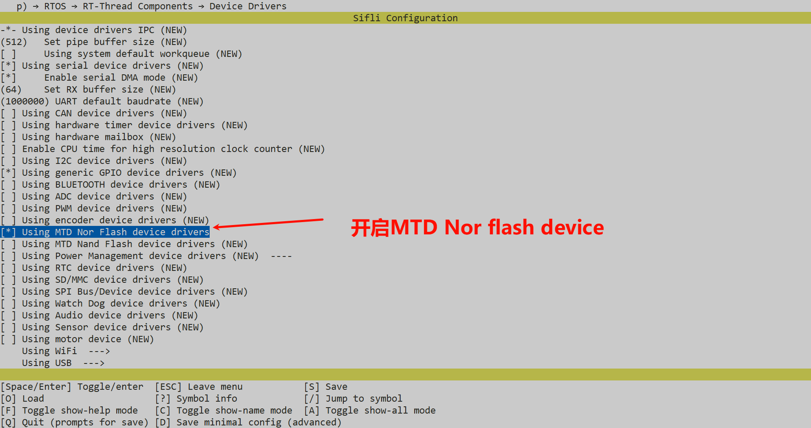
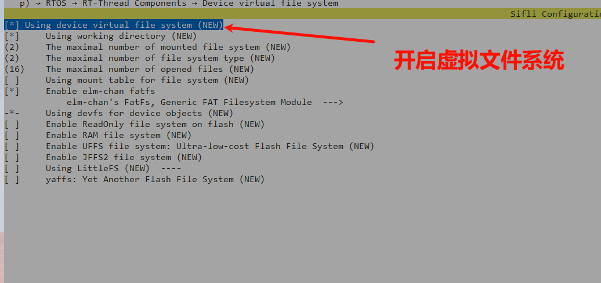
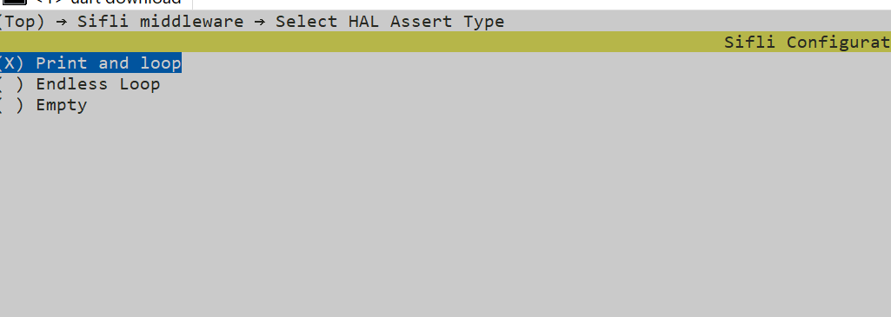
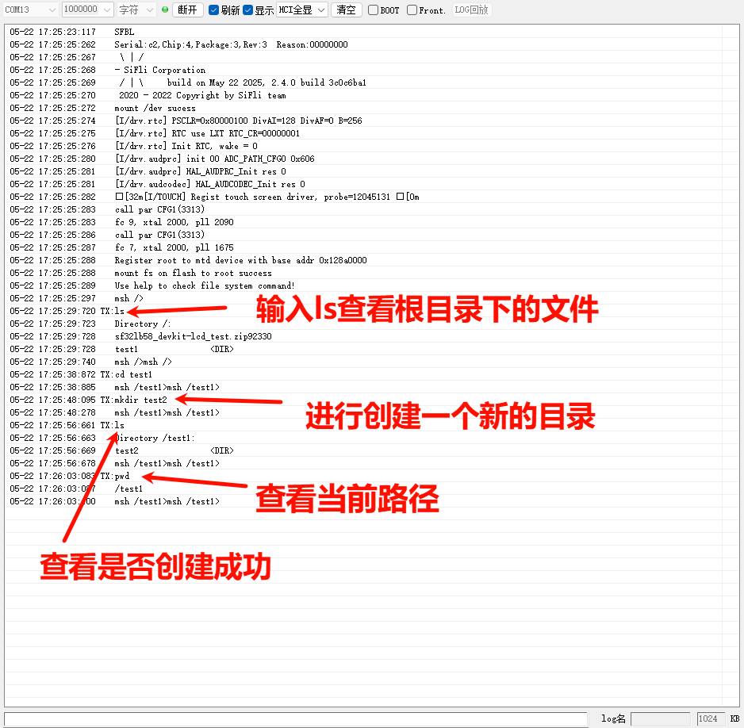

# file_system示例
## 使用指南
file_system应用会在板子flash上面验证文件系统的功能，文件系统采用FAT格式，在UART console可以调用常用的文件命令，如:

```
df               - Disk free
mountfs          - Mount device to file system
mkfs             - Format disk with file system
mkdir            - Create the DIRECTORY.
pwd              - Print the name of the current working directory.
cd               - Change the shell working directory.
rm               - Remove(unlink) the FILE(s).
cat              - Concatenate FILE(s)
mv               - Rename SOURCE to DEST.
cp               - Copy SOURCE to DEST.
ls               - List information about the FILEs.

```
  
### 文件系统打包

默认的编译脚本没有下载文件系统分区镜像文件，因此第一次运行程序如果mount失败会自动格式化分区，具体实现见`main.c`的函数`mnt_init`。SDK还提供了打包指定目录下的文件并生成文件系统镜像文件的功能，可以放开`SConstruct`里的如下代码，这段代码的作用是在编译时打包disk目录下的文件，在build目录下生成`fs_root.bin`文件，如果`ptab.json`的分区表中定义了`img`属性为`fs_root`的分区，下载脚本就会同时下载该bin文件。
      
```
# fs_bin=FileSystemBuild( "../disk", env)
# AddCustomImg("fs_root",bin=[fs_bin])
```
## 例程的使用说明
### 硬件需求
1、运行例程的前提，需要拥有一块支持该例程的开发板
2、一根具备数据传输能力的USB数据线
### menuconfig配置
```
 //执行指令
 menuconfig --board=em-lb561
```  
1、首先需要在menuconfig里面进行开启MTD Nor Flash device


2、使用设备虚拟文件系统


3、选择HAL Assert类型



## 工程说明
- 编译方法：进入project目录执行命令`scons --board=<board_name> -j8`， 其中board_name为板子名称，例如编译eh-lb561板子，完整命令为`scons --board=eh-lb561 -j8`编译生成的image文件存放在HCPU的build_<board_name>目录下，common工程的用法参考通<<用工程构建方法>>
- 下载方法： 进入project目录执行命令`build_<board_name>_hcpu\download.bat(uart_download.bat)` ,其中board_name为板子名称，后面download前面带了uart是通过串口进行程序烧入，不带是进行jlink烧入（这个得根本板子型号是否支持jlink烧入），例如编译eh-lb561板子，完整命令为`build_en-lb561_hcpu\download.bat`

## 例程输出结果展示
下面结果展示了例程在开发板运行起来后的log。如果看不到这些log，就说明例程没能按预期运行成功，需要进行原因排查。
```
mount fs on flash root success//说明文件系统挂载成功
```
1、串口发送ls查看根目录下的文件

2、在输入mkdir XXX，创建XXX文件夹（目录）

3、再次输入ls，看XXX文件夹（目录）是否创建成功

4、输入pwd查看当前工作路径

### 故障排查
如果log未能出现预期的log和现象，可以从已下几个方面进行故障排查：
* 硬件连接是否正常
* 检查USB线是否具备数据传输功能
* 上面的menuconfig是否配置对了