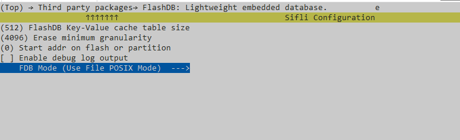

# FlashDB示例

源码路径：example/storage/flashdb

## 支持的平台
<!-- 支持哪些板子和芯片平台 -->
+ sf32lb52-lcd_n16r8
+ eh-lb523

## 概述
<!-- 例程简介 -->
本例程演示FlashDB的配置使用，包含：
+ project/nand：KVDB/TSDB在Nand flash上配置使用（`FDB_USING_FILE_MODE`）。
+ project/nor：KVDB/TSDB在Nor flash上配置使用（`FDB_USING_FAL_MODE`）。


## 例程的使用
<!-- 说明如何使用例程，比如连接哪些硬件管脚观察波形，编译和烧写可以引用相关文档。
对于rt_device的例程，还需要把本例程用到的配置开关列出来，比如PWM例程用到了PWM1，需要在onchip菜单里使能PWM1 -->

### 硬件需求
运行该例程前，需要准备：
+ 一块本例程支持的开发板（[支持的平台](quick_start)）。

### menuconfig配置

1. 使能FlashDB：
  
     ```{tip}
     + Nand 使用`FILE MODE`, 通过文件系统操作，`FDB Mode` 配置为`PKG_FDB_USING_FILE_POSIX_MODE`。
     + Nor 使用`FAL MODE`, 直接操作Flash， `FDB Mode` 配置为`PKG_FDB_USING_FAL_MODE`。
     ```
2. 配置`FAT`文件系统（使用`FILE MODE`时，`FAL MODE`无需配置文件系统）   


     ```{tip}
     mnt_init 中mount root分区。
     ```
3. FAL 分区配置（使用`FAL MODE`时，`FILE MODE`无需配置独立分区）   
+ `project/nor/ptab.json`:
     ```c
            {
                "offset": "0x00620000", 
                "max_size": "0x00004000", 
                "tags": [
                    "KVDB_TST_REGION"
                ]
            }, 
            {
                "offset": "0x00624000", 
                "max_size": "0x00004000", 
                "tags": [
                    "TSDB_TST_REGION"
                ]
            }, 
     ```  
+ `project/nor/custom_mem_map.h`
     ```c
     #define FAL_PART_TABLE \
     { \
          {FAL_PART_MAGIC_WORD,       "kvdb_tst",      NOR_FLASH2_DEV_NAME,    KVDB_TST_REGION_OFFSET,   KVDB_TST_REGION_SIZE, 0}, \
          {FAL_PART_MAGIC_WORD,       "tsdb_tst",      NOR_FLASH2_DEV_NAME,    TSDB_TST_REGION_OFFSET,   TSDB_TST_REGION_SIZE, 0}, \
          ... ...
     }
     ``` 

### 编译和烧录
切换到例程project/nand目录，运行scons命令执行编译：
```c
> scons --board=eh-lb525 -j32
```
切换到例程`project/nand/build_xx`目录，运行`uart_download.bat`，按提示选择端口即可进行下载：
```c
$ ./uart_download.bat

     Uart Download

please input the serial port num:5
```
关于编译、下载的详细步骤，请参考[快速上手](quick_start)的相关介绍。

```{tip}
project/nor 是对应nor方案，编译下载方式相同，区别是对应的board不同。
```
## 例程的预期结果
<!-- 说明例程运行结果，比如哪几个灯会亮，会打印哪些log，以便用户判断例程是否正常运行，运行结果可以结合代码分步骤说明 -->
本例程中通过FINSH命令来操作FlashDB：  
KVDB:
用途 | 命令 | 示例
|---|--|--|
设置kvdb|kvdb set [key] [数据类型:int\|str] [value]|`kvdb set "kv1" int 100` 
读取kvdb|kvdb get [key] [数据类型:int\|str]|`kvdb get "kv1" int`
删除kvdb|kvdb del [key]|`kvdb del "kv1"`

串口打印如下：  

```c
// 设置、读取整形数据
12-23 00:51:23:316 TX:kvdb set "key1" int 100
12-23 00:51:23:353    kvdb set "key1" int 100
12-23 00:51:23:465    set the key1 value to 100
12-23 00:51:23:579    msh />
12-23 00:51:30:771 TX:kvdb get "key1" int
12-23 00:51:30:827    kvdb get "key1" int
12-23 00:51:30:831    [key1] int
12-23 00:51:30:836    get the key1 value is 100 
// 设置、读取string
12-23 00:52:21:753 TX:kvdb set "key2" str "hello"
12-23 00:52:21:810    kvdb set "key2" str "hello"
12-23 00:52:22:003    set key2 value to hello
12-23 00:52:22:115    msh />
12-23 00:52:29:612 TX:kvdb get "key2" str
12-23 00:52:29:667    kvdb get "key2" str
12-23 00:52:29:672    [key2] str
12-23 00:52:29:677    get the key2 value is hello 
// 删除kvdb
12-23 00:53:16:528 TX:kvdb del "key1"
12-23 00:53:16:585    kvdb del "key1"
12-23 00:53:16:675    delete the key1 finish
12-23 00:53:16:788    msh />
12-23 00:53:20:062 TX:kvdb get "key1" int
12-23 00:53:20:116    kvdb get "key1" int
12-23 00:53:20:120    [key1] int
12-23 00:53:20:147    get the key1 failed
```  
TSDB:
用途 | 命令 | 示例
|---|--|--|
增加tsdb|tsdb append [value]|`tsdb append 1` 
全部查询tsdb|tsdb query_all|`tsdb query_all`
按时间查询tsdb|tsdb query_by_time [from timestamp] [to timestamp]|`tsdb query_by_time 0 946686530`
清除tsdb|tsdb clear|`tsdb clear`

串口打印如下：  
```c
// clear tsdb
12-23 00:55:21:376 TX:tsdb clear
12-23 00:55:21:430    tsdb clear
12-23 00:55:23:455    clear tsdb.
// 新增tsdb条目
12-23 00:55:56:845 TX:tsdb append 1
12-23 00:55:56:902    tsdb append 1
12-23 00:55:57:198    append tsdb item : value = 1
12-23 00:55:57:244    tsdb count is: 1
12-23 00:55:57:361    msh />
12-23 00:55:59:988 TX:tsdb append 2
12-23 00:56:00:045    tsdb append 2
12-23 00:56:00:134    append tsdb item : value = 2
12-23 00:56:00:162    tsdb count is: 2
12-23 00:56:00:278    msh />
12-23 00:56:01:521 TX:tsdb append 3
12-23 00:56:01:577    tsdb append 3
12-23 00:56:01:666    append tsdb item : value = 3
12-23 00:56:01:693    tsdb count is: 3
// 全部查询
12-23 00:56:39:698 TX:tsdb query_all
12-23 00:56:39:753    tsdb query_all
12-23 00:56:39:757    query all:
12-23 00:56:39:783    [query_cb] queried a TSL: value: 1 time: 946689062 Sat Jan  1 01:11:02 2000
12-23 00:56:39:788    [query_cb] queried a TSL: value: 2 time: 946689065 Sat Jan  1 01:11:05 2000
12-23 00:56:39:793    [query_cb] queried a TSL: value: 3 time: 946689067 Sat Jan  1 01:11:07 2000
// 按时间查询
12-23 00:57:04:317 TX:tsdb query_by_time 0 946689065
12-23 00:57:04:371    tsdb query_by_time 0 946689065
12-23 00:57:04:375    query by time:
12-23 00:57:04:380    from time:0 Thu Jan  1 00:00:00 1970
12-23 00:57:04:385    to time:946689065 Sat Jan  1 01:11:05 2000
12-23 00:57:04:391    [query_by_time_cb] queried a TSL: value: 1 time: 946689062 Sat Jan  1 01:11:02 2000
12-23 00:57:04:396    [query_by_time_cb] queried a TSL: value: 2 time: 946689065 Sat Jan  1 01:11:05 2000
12-23 00:57:04:402    query count is: 2
```
## 异常诊断


## 参考文档
<!-- 对于rt_device的示例，rt-thread官网文档提供的较详细说明，可以在这里添加网页链接，例如，参考RT-Thread的[RTC文档](https://www.rt-thread.org/document/site/#/rt-thread-version/rt-thread-standard/programming-manual/device/rtc/rtc) -->

+ siflisdk\external\FlashDB\README.md
+ siflisdk\external\FlashDB\README_zh.md

## 更新记录
|版本 |日期   |发布说明 |
|:---|:---|:---|
|0.0.1 |10/2024 |初始版本 |
| | | |
| | | |
