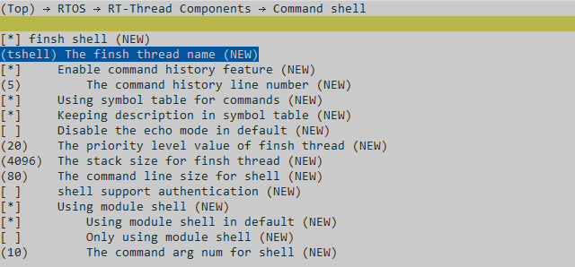

# FinSH

## 支持的平台
例程可以运行在以下开发板.
* sf32lb52-lcd_n16r8
* sf32lb58-lcd_n16r64n4

## 概述
* FinSH 是 RT-Thread 的命令行组件（shell），提供一套供用户在命令行调用的操作接口，主要用于调试或查看系统信息。除了 FinSH 自带的命令，FinSH 还也提供了多个宏接口来导出自定义命令，导出的命令可以直接在 FinSH 中执行。

## FinSH 的功能配置
* FinSH 功能可以裁剪，宏配置选项在 _rtconfig.h_ 文件中定义，具体配置项如下表所示。

|宏定义	                           |取值类型	            |描述	|默认值|
|:---                             |:---                    |:---   |:---|
|#define RT_USING_FINSH	          |无	  |使能 FinSH	         |开启|
|#define FINSH_THREAD_NAME	      |字符串 |FinSH 线程的名字	      |"tshell"|
|define  FINSH_USING_HISTORY	  |无	  |打开历史回溯功能	      |开启|
|#define FINSH_HISTORY_LINES	  |整数型 |能回溯的历史命令行数	   |5|
|#define FINSH_USING_SYMTAB	      |无	  |可以在 FinSH 中使用符号表	   |开启|
|#define FINSH_USING_DESCRIPTION  |无	  |给每个 FinSH 的符号添加一段描述	|开启|
|#define FINSH_USING_MSH	      |无	  |使能 msh 模式	          |开启|
|#define FINSH_ARG_MAX	          |整数型 |最大输入参数数量	           |10|
|#define FINSH_USING_AUTH	      |无	  |使能权限验证	              |关闭|
|#define FINSH_DEFAULT_PASSWORD   |字符串 |权限验证密码	              |关闭 |


* _rtconfig.h_ 中的参考配置示例如下所示，可以根据实际功能需求情况进行配置。在编译界面输入 `menuconfig` 进入,在 `RTOS → RT-Thread Components → Command shell` 下配置。

```c
/* 开启 FinSH */
#define RT_USING_FINSH

/* 将线程名称定义为 tshell */
#define FINSH_THREAD_NAME "tshell"

/* 开启历史命令 */
#define FINSH_USING_HISTORY
/* 记录 5 行历史命令 */
#define FINSH_HISTORY_LINES 5

/* 开启使用 Tab 键 */
#define FINSH_USING_SYMTAB
/* 开启描述功能 */
#define FINSH_USING_DESCRIPTION

/* 定义 FinSH 线程优先级为 20 */
#define FINSH_THREAD_PRIORITY 20
/* 定义 FinSH 线程的栈大小为 4KB */
#define FINSH_THREAD_STACK_SIZE 4096
/* 定义命令字符长度为 80 字节 */
#define FINSH_CMD_SIZE 80

/* 开启 msh 功能 */
#define FINSH_USING_MSH
/* 最大输入参数数量为 10 个 */
#define FINSH_ARG_MAX 10
```
## FinSH 自定义命令应用示例
### 不带参数的 msh 命令示例
* 将一个自定义的命令导出到 msh 中，示例代码如下所示，代码中创建了 `myhello` 函数，然后通过 `MSH_CMD_EXPORT` 命令即可将 `myhello` 函数导出到 FinSH 命令列表中。
```c
#include <rtthread.h>

void myhello(void)
{
    rt_kprintf("hello RT-Thread!\n");
}

MSH_CMD_EXPORT(myhello , say hello to RT-Thread);
```
运行 hello 命令，运行结果如下所示：
```
msh />hello
hello RT_Thread!
msh />
```
### 带参数的 msh 命令示例
* 将一个带参数的自定义的命令导出到 FinSH 中, 示例代码如下所示，代码中创建了 `atcmd()` 函数，然后通过 `MSH_CMD_EXPORT` 命令即可将 `atcmd()` 函数导出到 msh 命令列表中。
```c
#include <rtthread.h>

static void atcmd(int argc, char**argv)
{
    if (argc < 2)
    {
        rt_kprintf("Please input'atcmd <server|client>'\n");
        return;
    }

    if (!rt_strcmp(argv[1], "server"))
    {
        rt_kprintf("AT server!\n");
    }
    else if (!rt_strcmp(argv[1], "client"))
    {
        rt_kprintf("AT client!\n");
    }
    else
    {
        rt_kprintf("Please input'atcmd <server|client>'\n");
    }
}

MSH_CMD_EXPORT(atcmd, atcmd sample: atcmd <server|client>);

```
运行 `atcmd` 命令，运行结果如下所示：
```
msh />atcmd
Please input 'atcmd <server|client>'
msh />

```
运行 `atcmd server` 命令，运行结果如下所示：
```
msh />atcmd server
AT server!
msh />

```
运行 `atcmd client` 命令，运行结果如下所示：
```
msh />atcmd client
AT client!
msh />

```

**注意**: 
在main函数里需要加死循环才能进入msh命令。
```c
int main(void)
{
    while (1)
    {
      rt_thread_mdelay(5000);
    }
    return 0;
}

```

## 参考文档
* 
## 更新记录
|版本 |日期   |发布说明 |
|:---|:---|:---|
|0.0.1 |12/2024 |初始版本 |
| | | |
