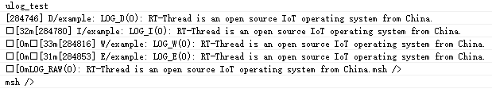
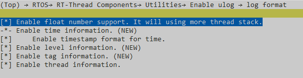
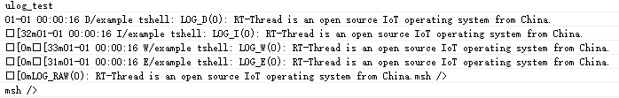
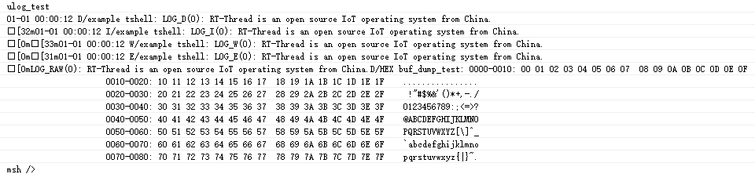
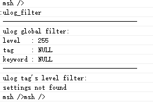

# 日志使用示例

## 支持的平台
例程可以运行在以下开发板.
- em-lb525
- em-lb587

## 概述
- 日志是将软件运行的状态、过程等信息，输出到不同的介质中（例如：文件、控制台、显示屏等），并进行显示和保存。为软件调试、维护过程中的问题追溯、性能分析、系统监控、故障预警等功能，提供参考依据。

## ulog 的功能配置
- ulog 配置选项说明如下所示，可以根据实际功能需求情况进行配置，一般情况下使用默认配置即可。在编译界面输入 `menuconfig` 进入,在 `RTOS→ RT-Thread Components→ Utilities` 下配置。
```
[*] Enable ulog                   /* 使能 ulog */
      The static output log level./* 选择静态的日志输出级别。选择完成后，比设定级别低的日志（这里特指使用 LOG_X API 的日志）将不会被编译到 ROM 中 */
[ ]   Enable ISR log.             /* 使能中断 ISR 日志，即在 ISR 中也可以使用日志输出 API */
[*]   Enable assert check.        /* 使能断言检查。关闭后，断言的日志将不会被编译到 ROM 中 */
(128) The log's max width.        /* 日志的最大长度。由于 ulog 的日志 API 按行作为单位，所以这个长度也代表一行日志的最大长度 */
[ ]   Enable async output mode.   /* 使能异步日志输出模式。开启这个模式后，日志不会立刻输出到后端，而是先缓存起来，然后交给日志输出线程（例如：idle 线程）去输出 */
      log format  --->            /* 配置日志的格式，例如：时间信息，颜色信息，线程信息，是否支持浮点等等 */
[*]   Enable console backend.     /* 使能控制台作为后端。使能后日志可以输出到控制台串口上。建议保持开启。 */
[ ]   Enable file backend.        /* ulog 的文件后端 */
[ ]   Enable runtime log filter.  /* 使能运行时的日志过滤器，即动态过滤。使能后，日志将支持按标签、关键词等方式，在系统运行时进行动态过滤。 */
[*]   Enable syslog format log and API.  /* 启用 syslog 格式日志和 API */
```
* 在编译界面输入 `menuconfig` 进入,在 `TOS → RT-Thread Components → Utilities → Enable ulog → log format` 下配置日志的格式（log format）选项描述如下所示：
```
[ ] Enable float number support. It will using more thread stack.   /* 浮点型数字的支持（传统的 rtdbg/rt_kprintf 均不支持浮点数日志） */
[*] Enable color log.                   /* 带颜色的日志 */
[*] Enable time information.            /* 时间信息 */
[ ]   Enable timestamp format for time. /* 包括时间戳 */
[*] Enable level information.           /* 级别信息 */
[*] Enable tag information.             /* 标签信息 */
[ ] Enable thread information.          /* 线程信息 */

```


## 使用示例
- 下面将以 ulog 例程进行介绍，定义 `LOG_TAG` 宏。
```c
#define LOG_TAG     "example"     // 该模块对应的标签。不定义时，默认：NO_TAG
#define LOG_LVL     LOG_LVL_DBG   // 该模块对应的日志输出级别。不定义时，默认：调试级别
#include <ulog.h>                 // 必须在 LOG_TAG 与 LOG_LVL 下面
```
在 `int ulog_test()` 函数中有使用 `LOG_X API` ，大致如下：
```c
/* output different level log by LOG_X API */
LOG_D("LOG_D(%d): RT-Thread is an open source IoT operating system from China.", count);
LOG_I("LOG_I(%d): RT-Thread is an open source IoT operating system from China.", count);
LOG_W("LOG_W(%d): RT-Thread is an open source IoT operating system from China.", count);
LOG_E("LOG_E(%d): RT-Thread is an open source IoT operating system from China.", count);
```
输入`ulog_test` 串口打印结果如下图所示：  
       

## 在中断ISR中使用
- 很多时候需要在中断 ISR 中输出日志，但是中断 ISR 可能会打断正在进行日志输出的线程。要保证中断日志与线程日志互不干涉，就得针对于中断情况进行特殊处理。
ulog 已集成中断日志的功能，但是默认没有开启，使用时打开 `Enable ISR log` 选项即可，日志的 API 与线程中使用的方式一致。

## 设置日志格式
- ulog 支持的日志格式可以在 `menuconfig` 中配置，位于  `RTOS → RT-Thread Components → Utilities → Enable ulog → log format`，具体配置如下 
        

- 分别可以配置：浮点型数字的支持、带颜色的日志、时间信息（包括时间戳）、级别信息、标签信息、线程信息。下面我们将这些选项全部选中，保存后重新编译再次运行 ulog 例程，看下实际的效果：  
       

## hexdump 输出使用
- `hexdump` 也是日志输出时较为常用的功能，通过 `hexdump` 可以将一段数据以 hex 格式输出出来，下面看下具体的使用方法及运行效果：
```c
/* 定义一个 128 个字节长度的数组 */
uint8_t i, buf[128];
/* 在数组内填充上数字 */
for (i = 0; i < sizeof(buf); i++)
{
    buf[i] = i;
}
/* 以 hex 格式 dump 数组内的数据，宽度为 16 */
ulog_hexdump("buf_dump_test", 16, buf, sizeof(buf));
```
- 再次运行 ulog 例程，看下实际的效果：    
       

## 日志动态过滤器
- 静态过滤有其优点比如：节省资源，但很多时候，用户需要在软件运行时动态调整日志的过滤方式，这就可以使用到 ulog 的动态过滤器功能。使用动态过滤器功能需在 `menuconfig` 中开启 `Enable runtime log filter`. 选项，该选项默认关闭。
ulog支持的动态过滤方式有以下四种。
- 按模块的级别过滤  

|参数 |描述    |   
|:---|:---| 
|tag |日志的标签  |   
| level|设定的日志级别  |  
|返回 |--   |   
|>=0| 成功 |    
|-5  |失败，没有足够的内存 |    
  -  命令格式：`ulog_tag_lvl <tag><level>`。     
这里指的模块代表一类具有相同标签属性的日志代码。有些时候需要在运行的时动态的修改一个模块的日志输出级别。    
参数level日志级别可取如下值： 

      |级别 |名称 |取值 |
      |:---|:---|:---|
      |LOG-LVL_ASSERT |断言 |0 |
      |LOG_LVL_ERROR |错误 |3 |
      |LOG_LVL_WARNING |警告   |4 |
      |LOG_LVL_INFO|信息|6|
      |LOG_LVL_DBG |调试 |7|
      |LOG_FILTER_LVL_SILENT |静默 |0|
      |LOG_FILTER_LVL_ALL |全部 | 7|

- 按标签全局过滤  
  - 命令格式：`ulog_tag [tag]`,tag为空时，则取消标签过滤。      
该过滤方式可以对所有日志执行按标签过滤，只有包含标签信息的日志才允许输出。    
例如：有`wifi.driveer`、`wifi.mgnt`、`aydio.driver` 3种标签的日志，当设定过滤标签为`wifi`时，只有标签为`wifi.driver`及`wifi.mgnt`的日志会输出。
- 按级别全局过滤  
  - 命令格式：`ulog_lvl <level>`,level取值参考上文。      
通过函数或者命令设定好的全局的过滤级别后，低于设定级别的日志都将停止输出。
- 按关键词全局过滤
  - 命令格式：`ulog_kw [keyword]`,keyword为空时，则取消关键词过滤。   
该过滤方式可以对所有日志执行按关键词过滤，包含关键词信息的日志才允许输出。    
- 查看过滤器信息  
在设定完过滤参数后，如果想要查看当前过滤信息，可以输入`ulog_filter`命令，大致效果如下图：   
    


## 参考文档
* 
## 更新记录
|版本 |日期   |发布说明 |
|:---|:---|:---|
|0.0.1 |1/2025 |初始版本 |
| | | |
